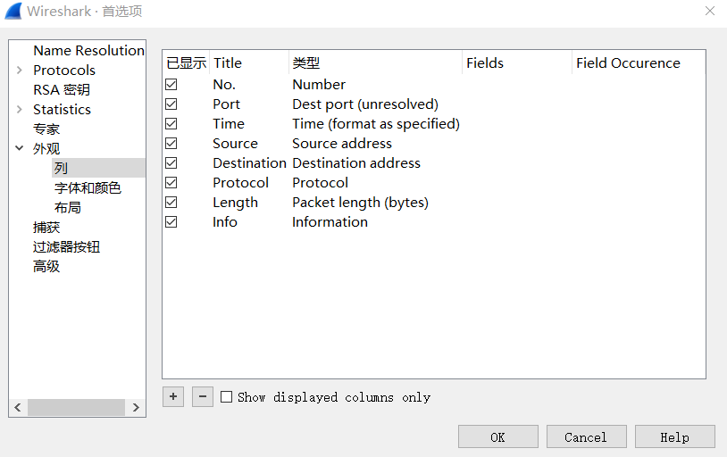
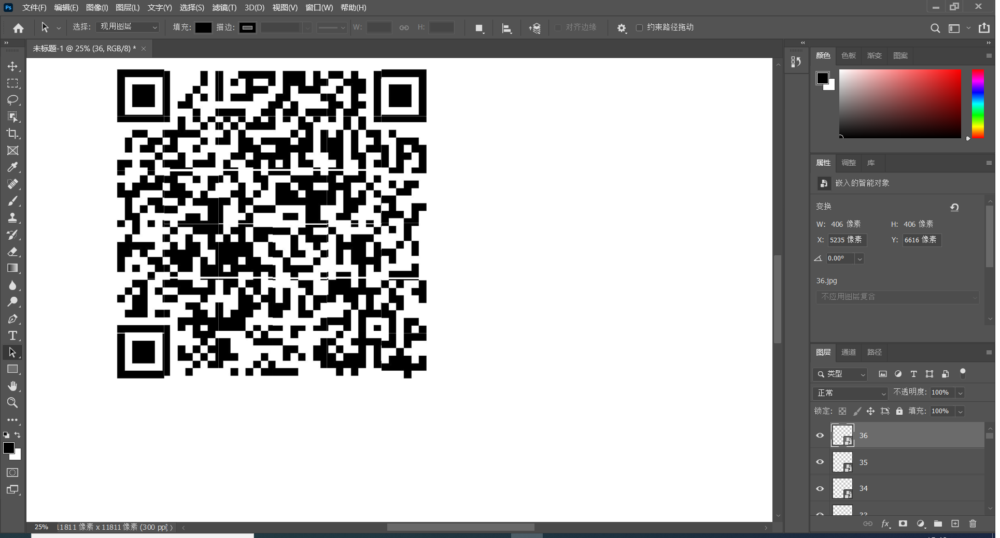
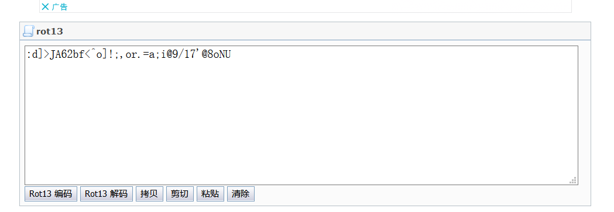
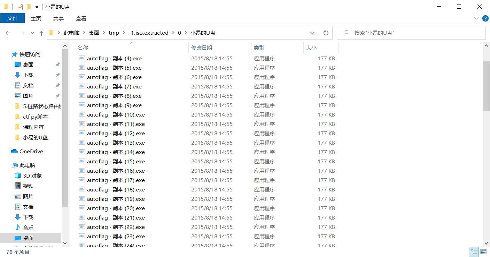
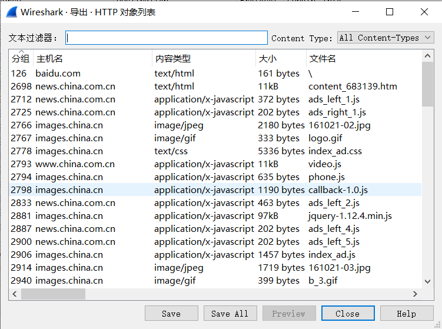
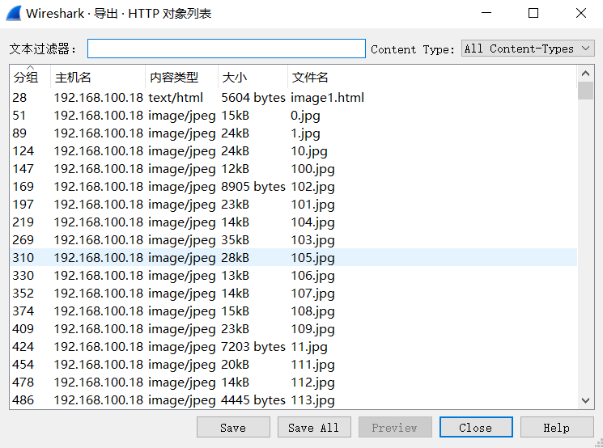
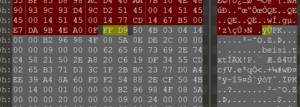
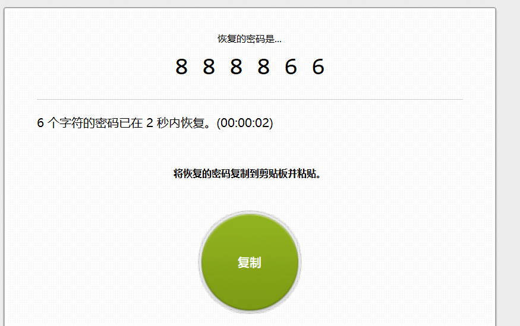
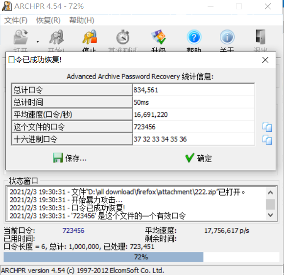
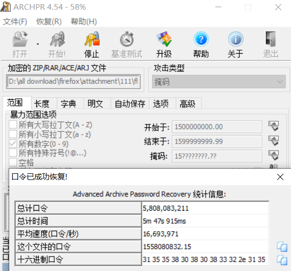

# BUUCTF-writeup

## misc

### 后门查杀

1. 解压下来是网站源码，上D盾扫描

   

2. 题目提示Webshell中的密码(md5)即为答案，右键打开文件`ctrl+f`搜索pass


3. 包上flag{}，`flag{6ac45fb83b3bc355c024f5034b947dd3}`


### 荷兰宽带数据泄露

1. 解压下来是一个路由器配置文件
2. 使用工具RouterPassView打开


3. ctrl+5搜索username或者password，这道题是username，套上flag即可`flag{053700357621}`

   


### 来首歌吧

1. 盲听歌有滴滴滴的声音，应该是摩斯密码，拉进audacity


```python
#手动打出来
..... -... -.-. ----. ..--- ..... -.... ....- ----. -.-. -... ----- .---- ---.. ---.. ..-. ..... ..--- . -.... .---- --... -.. --... ----- ----. ..--- ----. .---- ----. .---- -.-.
```

2. 转码拼接出来就好了`flag{5BC925649CB0188F52E617D70929191C}`


### 数据包中的线索

1. 拖进Wireshark，分析数据包


2. 发现一段流量，发了大量base64的数据，追踪TCP，/9j开头应该是jpg文件了

   

3. base64转Hex，手动拖进010editor转图片


4. 打开图片即可`flag{209acebf6324a09671abc31c869de72c}`

   


### 九连环

知识点：图片隐写，steghide，伪加密

1. 题目一开始给了一张图片：


2. 拿到winhex中去看，发现后面还有压缩包，于是丢到foremost中分离，果然分离出了一个压缩包，但是解压需要密码，我第一反应是这个图片的名字：


​	这长得多像一个密码啊但实际是并不是。

​	然后我手动分离了这个压缩包，（zip的文件头50 4B 03 04，结尾块标识50 4B 05 06）

 3. 尝试了一下伪加密，解压出来了，里面有一个图片和一个压缩包，第二个压缩包也是加密的

    

4. 老方法看了下binwalk，foremost无果，看了wp，知道了一个神器：steghide，它也可以隐藏数据、文件到图片里，当然也可以用来提取，用法如下：（来源：https://blog.csdn.net/Blood_Seeker/article/details/81837571）


kali下安装：

```
apt-get install steghide
```

这道题没有设置密码，使用steghide需要输入密码时直接回车就好。果然用了之后，在提取出的ko.txt中发现了密码，解压后既可获得flag：


### 面具下的flag

1. 解压拖进010editor，发现图片末尾有PK包提示

   

2. kali中分离下压缩包`foremost -T mianju.jpg`发现压缩包需要密码


3. 怀疑是zip伪加密，修改目录区加密标志位


4. 解压出来是一个虚拟机磁盘文件，因为是vmdk，扔进linux中的7z进行解压，会比windows多出几个文件，这个我也不知道为什么使用7z，先挖个坑找找资料。

   `7z x flag.vmdk`

   

5. Key_part_one打开后，是一个brainfuck解密，解密只有一半，那么应该下一个在Key_part_two中

   ```shell
   #Key_part_one
   +++++ +++++ [->++ +++++ +++<] >++.+ +++++ .<+++ [->-- -<]>- -.+++ +++.<
   ++++[ ->+++ +<]>+ +++.< +++++ +[->- ----- <]>-- ----- --.<+ +++[- >----
   <]>-- ----- .<+++ [->++ +<]>+ +++++ .<+++ +[->- ---<] >-.<+ +++++ [->++
   ++++< ]>+++ +++.< +++++ [->-- ---<] >---- -.+++ .<+++ [->-- -<]>- ----- .<
   
   #解码后
   flag{N7F5_AD5
   ```

6. Key_part_two打开有两个文档，第一个是假的，第二个打开是0ok!解密，同样的网址

   ```shell
   #Key_part_two
   Ook. Ook. Ook. Ook. Ook. Ook. Ook. Ook. Ook. Ook. Ook. Ook. Ook. Ook. Ook.
   Ook. Ook. Ook. Ook! Ook? Ook! Ook! Ook. Ook? Ook. Ook. Ook. Ook. Ook. Ook.
   Ook. Ook. Ook. Ook. Ook. Ook. Ook. Ook. Ook. Ook. Ook. Ook. Ook? Ook. Ook?
   Ook! Ook. Ook? Ook. Ook. Ook. Ook. Ook. Ook. Ook. Ook. Ook. Ook. Ook. Ook.
   Ook. Ook. Ook. Ook. Ook. Ook. Ook. Ook. Ook. Ook. Ook. Ook. Ook. Ook. Ook.
   Ook. Ook! Ook. Ook? Ook. Ook. Ook. Ook. Ook. Ook. Ook. Ook! Ook? Ook! Ook!
   Ook. Ook? Ook. Ook. Ook. Ook. Ook. Ook. Ook? Ook. Ook? Ook! Ook. Ook? Ook.
   Ook. Ook! Ook. Ook? Ook. Ook. Ook. Ook. Ook. Ook. Ook. Ook. Ook. Ook. Ook.
   Ook. Ook. Ook. Ook. Ook! Ook? Ook! Ook! Ook. Ook? Ook! Ook! Ook! Ook! Ook!
   Ook! Ook! Ook! Ook! Ook! Ook! Ook! Ook! Ook! Ook? Ook. Ook? Ook! Ook. Ook?
   Ook! Ook! Ook! Ook! Ook! Ook! Ook! Ook. Ook? Ook. Ook. Ook. Ook. Ook. Ook.
   Ook. Ook. Ook. Ook. Ook. Ook. Ook. Ook! Ook? Ook! Ook! Ook. Ook? Ook. Ook.
   Ook. Ook. Ook. Ook. Ook. Ook. Ook. Ook. Ook. Ook. Ook? Ook. Ook? Ook! Ook.
   Ook? Ook. Ook. Ook. Ook. Ook. Ook. Ook. Ook. Ook. Ook. Ook. Ook. Ook! Ook.
   Ook. Ook. Ook. Ook. Ook. Ook. Ook. Ook. Ook. Ook. Ook. Ook. Ook. Ook. Ook!
   Ook. Ook? Ook. Ook. Ook. Ook. Ook. Ook. Ook. Ook! Ook? Ook! Ook! Ook. Ook?
   Ook. Ook. Ook. Ook. Ook. Ook. Ook? Ook. Ook? Ook! Ook. Ook? Ook. Ook. Ook.
   Ook. Ook. Ook. Ook. Ook. Ook. Ook. Ook. Ook. Ook! Ook. Ook! Ook! Ook! Ook!
   Ook! Ook! Ook! Ook! Ook! Ook! Ook! Ook! Ook! Ook! Ook! Ook. Ook! Ook. Ook?
   Ook. Ook. Ook. Ook. Ook. Ook. Ook. Ook! Ook? Ook! Ook! Ook. Ook? Ook. Ook.
   Ook. Ook. Ook. Ook. Ook? Ook. Ook? Ook! Ook. Ook? Ook. Ook. Ook. Ook. Ook!
   Ook. Ook? Ook. Ook. Ook. Ook. Ook. Ook. Ook. Ook. Ook. Ook. Ook. Ook. Ook.
   Ook. Ook. Ook. Ook. Ook. Ook. Ook! Ook? Ook! Ook! Ook. Ook? Ook! Ook! Ook!
   Ook! Ook! Ook! Ook! Ook! Ook! Ook! Ook! Ook! Ook! Ook! Ook! Ook! Ook! Ook!
   Ook? Ook. Ook? Ook! Ook. Ook? Ook! Ook! Ook! Ook! Ook! Ook! Ook! Ook! Ook!
   Ook! Ook! Ook! Ook! Ook! Ook! Ook. Ook? Ook. Ook. Ook. Ook. Ook. Ook. Ook.
   Ook. Ook. Ook. Ook. Ook. Ook. Ook. Ook. Ook. Ook. Ook. Ook. Ook! Ook? Ook!
   Ook! Ook. Ook? Ook. Ook. Ook. Ook. Ook. Ook. Ook. Ook. Ook. Ook. Ook. Ook.
   Ook. Ook. Ook. Ook. Ook. Ook. Ook? Ook. Ook? Ook! Ook. Ook? Ook. Ook. Ook.
   Ook. Ook. Ook. Ook. Ook. Ook. Ook. Ook. Ook. Ook. Ook. Ook. Ook. Ook. Ook.
   Ook. Ook. Ook. Ook. Ook! Ook. Ook? Ook.
   
   #解码后
   _i5_funny!}
   ```

7. 拼接一下，`flag{N7F5_AD5_i5_funny!}`


### webshell后门

1. 使用D盾扫描一下

   

   2. 打开第一个文件，ctrl+f搜索一下pass，`flag{ba8e6c6f35a53933b871480bb9a9545c}`


### 被劫持的神秘礼物

1. 题目提示很明显，找到账号密码哈希一下即可


2. 直接打开Wireshark，一进来就有个post，追踪TCP流，账号密码就出来了，稍微拼接一下`adminaadminb`


3. 32位MD5一下`flag{1d240aafe21a86afc11f38a45b541a49}`


### 刷新过的图片

1. 这道题提醒的很明显使用F5-steganography解密，[F5-steganography项目](https://github.com/matthewgao/F5-steganography)，因为没找到有密码，直接使用输出`java Extract Misc.jpg`打开输出的output.txt

   

2. 根据文件头提醒是个压缩包，结果有密码，盲猜伪加密修改一下


3.解压即可`flag{96efd0a2037d06f34199e921079778ee}`


### snake

1. 解压下来是一条🐍的照片，拖入010末尾发现有PK标记


2. kali分离一下压缩包，解压出来

   

3. 因为不知道文件格式，先拖进010一个个看看，发现key文件是一串base64

   ```shell 
   #key文件
   V2hhdCBpcyBOaWNraSBNaW5haidzIGZhdm9yaXRlIHNvbmcgdGhhdCByZWZlcnMgdG8gc25ha2VzPwo=
   ```

   上py脚本

   ```python
   #base64 decrypt
   import base64
   a='V2hhdCBpcyBOaWNraSBNaW5haidzIGZhdm9yaXRlIHNvbmcgdGhhdCByZWZlcnMgdG8gc25ha2VzPwo='
   b=base64.b64decode(a)
   print(b)
   
   #解码
   What is Nicki Minaj's favorite song that refers to snakes?
   ```

4. 解码出来的字符串意思是Nicki Minaj的歌那首与蛇有关，度娘了一下anaconda是蛇的意思


5. 顺便百度了一下cipher的意思，是密钥，这应该是个解密题，而anaconda应该是密钥，解密这个文件，在密码学中serpent加密正好英文是蛇的意思🐛🐛，[在线serpent解密](http://serpent.online-domain-tools.com/)`CTF{who_knew_serpent_cipher_existed}`


### [BJDCTF 2nd]圣火昭昭-y1ng

1. 解压出来，图片属性详细信息中有新佛曰

   

2. 在线新佛曰解密，根据题目提示去掉最后三个字母`gemlove`

   

3. 应该是jpg加密隐写了，并且还有密码，试了一下是outguess加密

   ```shell
   outguess -k gemlove -r sheng_huo_zhao_zhao.jpg flag.txt
   cat flag.txt
   
   BJD{wdnmd_misc_1s_so_Fuck1ng_e@sy}
   ```

   


### 梅花香自苦寒来

1. 拖进010editor，发现最后一堆16进制数据

   

2. 上脚本16进制转string

   ```shell 
   with open('hex.txt','r') as h:
       h=h.read()
   tem=''
   for i in range(0,len(h),2):
       tem='0x'+h[i]+h[i+1]
       tem=int(tem,base=16)
       print(chr(tem),end='')
   ```


3. 这一看就是坐标点，处理下数据把括号删除，把逗号换成空格，扔进kali gnuplot转出来

   


4. 扫一下就出来了`flag{40fc0a979f759c8892f4dc045e28b820}`


### 菜刀666

1. 流量分析，先扔入kali分离文件，分离出一个压缩包


2. 使用Wireshark进行分析，过滤下http，发现了一个压缩包，应该是kali分离出来的压缩包，但是它提示需要压缩包密码，我们继续分析


3. 在上一组流量中目录对比中，发现多了一个666.jpg，应该上传了一张jpg，仔细观察有一段大段流量base64加密中出现了`FF D8`文件头标示，我们将他复制，导入到010editor中

   

4. 导入16进制，图片就出来了

   

5. 用上图密码，解压压缩包`flag{3OpWdJ-JP6FzK-koCMAK-VkfWBq-75Un2z}`


### 被偷走的文件

1. 经典流量分析题


2. 先不分析，拖入kali分离文件，分离一个压缩包

   

3. 打开Wireshark，过滤ftp，追踪流，发现下载了一个flag.rar，正是分离的压缩包

   

4. 打开压缩包，加密，尝试弱口令爆破`5790`

   

5. 打开即可获得`flag{6fe99a5d03fb01f833ec3caa80358fa3}`

   

### [BJDCTF2020]认真你就输了

1. Excel打不开，拖入010editor，发现PK头部，改为zip

2. 解压在charts有个flag.txt`flag{M9eVfi2Pcs#}`


### [BJDCTF2020]藏藏藏

1. 下载下来一个压缩包，解压后一张图片，一个没用的txt，老样子把图片拖入010editor，末尾有压缩包标记


2. kali 进行分离解压，一个doc文档，里面二维码扫描即可

   

   `flag{you are the best!}`

### 秘密文件

1. 经典流量分析题


2. 不想先分析，可以直接扔进kali分离一下，分离出一个压缩包

3. 使用wireshark,对流量分析，过滤下FTP，追踪TCP发现他们传输了一个压缩包


4. 我们打开我们分离的压缩包，发现需要密码，尝试弱口令爆破`1903`


5. 打开txt `flag{d72e5a671aa50fa5f400e5d10eedeaa5}`


###  [GXYCTF2019]佛系青年

1. 下载出来压缩包，解压时txt文档需要密码，怀疑为伪加密，拖进010editor，找到压缩源文件目录区将加密方式修改为`50 4B 01 02 1F 00 14 00 00 00`只要为偶数都可以

   

2. 正常解压，一个png，一个txt，txt末尾有加密

   ```shell
   佛曰：遮等諳勝能礙皤藐哆娑梵迦侄羅哆迦梵者梵楞蘇涅侄室實真缽朋能。奢怛俱道怯都諳怖梵尼怯一罰心缽謹缽薩苦奢夢怯帝梵遠朋陀諳陀穆諳所呐知涅侄以薩怯想夷奢醯數羅怯諸
   ```

3. 一看就是与佛论禅加密，直接在线一把嗦`flag{w0_fo_ci_Be1}`


### [BJDCTF2020]你猜我是个啥

1. 下载下来一个压缩包，但解压失败，怀疑文件头错误拖进010editor


2. 查看文件头是个png，往下翻，文件结尾就有`flag{i_am_fl@g}`

😂啊这


### [BJDCTF 2nd]EasyBaBa

1.下载下来是一个jpg图片，拖进010editor发现末尾有PK标志


2. 扔进kali分离压缩包`foremost -T ezbb.jpg`

3. 解压出来一个jpg，但是不能预览，怀疑文件头损坏，扔进010editor

   

4. 从文件头标示来看这是个avi，改一下后缀名，成功播放，在4秒之后有4个二维码

   

5. 拖进fcpx或者pr等视频剪辑软件，一帧一帧扫码即可，每个二维码扫出来是16进制

   

6. 将4个二维码的16进制拼接一下，转换成字符串，看样子并不像栅栏密码，稍微改一下顺序

   ```shell
   #16进制
   6167696E5F6C6F76655F59424A447B696D316E677D
   #字符串
   agin_love_YBJD{im1ng}
   #改改顺序
   BJD{imagin_love_Y1ng}
   ```

   

### [SWPU2019]神奇的二维码

1. 下载解压一个二维码，扫出来是个fake的


2. 拖入010editor，发现末尾有Rar标志，扔进kali分离压缩包


3. 分理出4个压缩包，一个一个来拆解

4. 第一个压缩包里面一个表情包，一个加密的rar，表情包里并没有找到有用的信息

5. 第二个压缩包一个被base64加密的txt，将第一个压缩包解出来后的图片也没有flag

   ```shell
   YXNkZmdoamtsMTIzNDU2Nzg5MA==
   #解码后
   asdfghjkl1234567890
   #这个为第一个加密rar的密码
   ```

6. 第三个压缩包解压后是个套娃base64，一直解码即可，`comEON_YOuAreSOSoS0great`


7. 第四个压缩包解压需要密码，我们把上一个密码输入，成功解压出一首MP3，听了一下就是嘀嘀嘀的声音，摩斯密码一把嗦`flag{morseisveryveryeasy} `


### 穿越时空的思念

1. 题目写了从曲子中听出了什么，所以应该是音乐隐写的题


2. 下载下来听了一下，有哔哔哔的声音，应该是摩斯密码，直接上audacity


3. 转换出来，解密一下

```shell
0010 11111 00111 11110 1000 100 10000 0010 00000 00000 01111 01111 00011 11110 0 0 100 0 1000 11100 0 00001 00000 01 01111 11000 00000 1000 11111 11000 11100 10000
#转换后
F029BD6F551139EEDEB8E45A175B0786
#转换为小写
flag{f029bd6f551139eedeb8e45a175b0786}
```

4. 还可以将左声道关闭，提取出右声道，扔进kali，使用Morse2ascii工具


### [BJDCTF2020]一叶障目

1. 下载下来一张图片，直接扔进010，发现crc报错，一看就是尺寸问题

   

2. 直接在模版找到IHDR，修改高16进制一把嗦 `xaflag{66666}`

   

   

   

### [BJDCTF2020]鸡你太美

1. 解压出来2张gif，另一张没有预览信息，估计文件头出错，扔进010editor


2.少了GIF头文件标示`47 49 36 38`添加上去


3. flag就出来了`flag{zhi_yin_you_are_beautiful}`经典下划线老坑了


### [BJDCTF2020]just_a_rar

1. 下载出来，文件名写的4位数，很明显让我们爆破


2. 上工具一把嗦，密码`2016`


3. 解压出来一张图片，经典属性详细信息flag`flag{Wadf_123}`


### [BJDCTF 2nd]Real_EasyBaBa

1. 下载下来的图片就是上一次EasyBaBa的改版，直接先导入010editor观察一下，红色的地方明显不对，火眼精金的人可以发现这是flag


2. 继续向后面看，可以发现后面有一串`50 4B FF FF`开头的16进制，怀疑是zip文件，看到最后`50 4B 05 06`确定为zip文件，稍微修改一下ZIP文件头

   

3. 将zip文件手动恢复提取出来

   

4. 解压出来一个hint，我们打开是一个二维码

   

5. 我们稍微缩小处理下，扫出来是一个`od -vtx1 ./draw.png | head -56 | tail -28`输出文件头和尾的命令。我们直接扔进kali 一把嗦

   

6. 复制出来，扔进010editor，把00替换成两个空格，flag就出来了


​           `BJD{572154976}`

### [GKCTF2020]Pokémon

1. 这是一个GBA模拟器游戏，百度下就可以下载模拟器，和绿宝石游戏教程，走到103号公路，路上的草就是flag


### [ACTF新生赛2020]outguess

[outguess安装使用教程](https://blog.csdn.net/weixin_43877387/article/details/103123858)

1. 下来一个压缩包里面一个图片，一个txt文档


2. txt文档和题目提示都很明显，用outguess解密，一般outguess解密时会附带密码，所以我们从图片上找一找有什么突破点，在详细信息中发现了核心价值观编码

   

3. 找个在线工具解码一下

   

4. 使用outguess工具，解出最后的flag

   ```shell
   outguess -k "abc" -r /home/s6/桌面/CTF/outguess-master/mmm.jpg -r flag.txt
   cat flag.txt
   ACTF{gue33_Gu3Ss!2020}
   ```

   

### [BJDCTF2020]纳尼

1. 下载出来一个压缩包，将其解压，一个GIF和一个hint，GIF打不开，怀疑文件头损坏，拖进010editor

   

2. 缺少GIF文件头标示，添加上去`47 49 46 38`，打开GIF，上面闪烁base64加密文字

3. 每一帧分析，一共四组，拼接一下`Q1RGe3dhbmdfYmFvX3FpYW5nX2lzX3NhZH0=`

4. Base64一把嗦`CTF{wang_bao_qiang_is_sad}`


### [SWPU2019]我有一只马里奥

1. 下载下来是一个马里奥exe，运行后会生成1.txt


2. ntfs提示很明显，ntfs流隐写，有两种方法可以使用cmd命令或者使用工具

3. 使用cmd命令`notepad 1.txt:flag.txt`

   


4. 或者使用ntfsstreamseditor工具一把嗦`swupctf{ddg_is_cute}`

   


### 谁赢了比赛？

1. 下载下来是一个棋谱，围棋看不懂，直接拖进010发现末尾有压缩包痕迹


2. Kali分离一下`binwalk -e 1.png`结果出了个rar压缩包，里面有一张被加密了的GIF图和txt。txt文档提示`where do you think the flag is?`尝试弱口令爆破，密码`1020`

3. 解压出GIF图片，分帧查看`convert 1.gif *.png`

   

4. 前面都是小图标，在309时出现一个大图片，查看一下，下面写着`do you know wher is the flag` 

   

5. 拖进stegsolve，看一下通道，发现red0通道有二维码，扫一下就出来了`flag{shanxiajingwu_won_the_game}`

   


### Mysterious

1. 根据题目介绍，应该是Reverse题


2. 打开程序，输入数字字符没有反应，应该是做了限制


3. 拖入ida，`shift+F12`打开字符串窗口

   

4. 点击进入，发现了疑似flag字符


5. 在`Functions Window`找到这个地址，点击，`F5`反汇编查看伪C代码


```shell
int __stdcall sub_401090(HWND hWnd, int a2, int a3, int a4)
{
  char v5; // [esp+50h] [ebp-310h]
  CHAR Text[4]; // [esp+154h] [ebp-20Ch]
  char v7; // [esp+159h] [ebp-207h]
  __int16 v8; // [esp+255h] [ebp-10Bh]
  char v9; // [esp+257h] [ebp-109h]
  int v10; // [esp+258h] [ebp-108h]
  CHAR String; // [esp+25Ch] [ebp-104h]
  char v12; // [esp+25Fh] [ebp-101h]
  char v13; // [esp+260h] [ebp-100h]
  char v14; // [esp+261h] [ebp-FFh]

  memset(&String, 0, 0x104u);
  v10 = 0;
  if ( a2 == 16 )
  {
    DestroyWindow(hWnd);
    PostQuitMessage(0);
  }
  else if ( a2 == 273 )
  {
    if ( a3 == 1000 )
    {
      GetDlgItemTextA(hWnd, 1002, &String, 260);
      strlen(&String);
      if ( strlen(&String) > 6 )
        ExitProcess(0);
      v10 = atoi(&String) + 1;
      if ( v10 == 123 && v12 == 120 && v14 == 122 && v13 == 121 )
      {
        strcpy(Text, "flag");
        memset(&v7, 0, 0xFCu);
        v8 = 0;
        v9 = 0;
        _itoa(v10, &v5, 10);
        strcat(Text, "{");
        strcat(Text, &v5);
        strcat(Text, "_");
        strcat(Text, "Buff3r_0v3rf|0w");
        strcat(Text, "}");
        MessageBoxA(0, Text, "well done", 0);
      }
      SetTimer(hWnd, 1u, 0x3E8u, TimerFunc);
    }
    if ( a3 == 1001 )
      KillTimer(hWnd, 1u);
  }
  return 0;
}
```

满足

```c
if ( v10 == 123 && v12 == 120 && v14 == 122 && v13 == 121 )
```

输入的字符长度不能大于`6`，否则结束程序，`v10`被`atoi()`函数转为数字整型并且`+1`，那么满足条件的`v10`应该为`122`，`v12`、`v13`、`v14`对应的Ascii字符为`xyz`，所以输入

```bash
122xyz
```

即可得到flag


`flag{123_Buff3r_0v3rf|0w}`


### sqltest

1. 打开Wireshark，发现流量包是sql盲注

   

2. 分析一下，注入时有两种页面，一个成功返回，一个失败返回的页面

   

   

3. 我们导出一下Http对象，发现最后面正在判断flag的ascii码，分析一下，发现正确的ascii基本出现两次，导出到txt中

   ```shel
   102
   108
   97
   103
   123
   52
   55
   101
   100
   98
   56
   51
   48
   48
   101
   100
   53
   102
   57
   98
   50
   56
   102
   99
   53
   52
   98
   48
   100
   48
   57
   101
   99
   100
   101
   102
   55
   125
   ```

4. 上脚本，将ascii码转换一下`flag{47edb8300ed5f9b28fc54b0d09ecdef7}`

   ```python
   f=open('test.txt','r').readlines()
   for i in f:
   	print(chr(int(i)),end="")
   ```


### [GXYCTF2019]gakki

1. 解压出来，一张gakki的图片，拖进010editor查看

   

2. rar标示，扔进kali分离一下，发现加密，弱口令爆破一波`8864`

   

   

3. 解压出来一个flag.txt，打开全是杂乱无章的文字

4. 上脚本，大量无特征、无规律字符，词频统计一下

```python
# -*- coding:utf-8 -*-
# 词频统计
alphabet = "abcdefghijklmnopqrstuvwxyzABCDEFGHIJKLMNOPQRSTUVWXYZ1234567890!@#$%^&*()_+- ={}[]"
f = open("flag.txt", "r")
data = f.read()
result = {d:0 for d in alphabet}
 
def sort_by_value(d):
    items = d.items()
    backitems = [[v[1],v[0]] for v in items]
    backitems.sort(reverse=True)
    return [ backitems[i][1] for i in range(0,len(backitems))]
 
for d in data:
    for alpha in alphabet:
        if d == alpha:
            result[alpha] = result[alpha] + 1
print(sort_by_value(result))
```

5. 拼接一下即得`GXY{gaki_IsMyw1fe}`


### [BJDCTF 2nd]TARGZ-y1ng

1. 题目提示不需要爆破密码，那密码应该就是文件名或者其他地方，尝试解压下来是文件名，解压出来里面一层又一层

   

2. 直接上py脚本，循环解压

   ```python
   import zipfile
   name = 'hW1ES89jF'
   while True:
       fz = zipfile.ZipFile(name + '.tar.gz', 'r')
       fz.extractall(pwd=bytes(name, 'utf-8'))
       name = fz.filelist[0].filename[0:9]
       print(name)
       fz.close()
   ```

3. 解到最后有个flag文件，打开即有`BJD{wow_you_can_rea11y_dance}`

   


### [HBNIS2018]excel破解

1. 老方法直接拖进010editor，搜索flag，下面几行就有`CTF{office_easy_cracked}`

   


### 喵喵喵

1. 解压出来是一张猫猫的图片，老样子我们拖进010editor

   

2. 并没有发现隐写压缩包内容等，我们考虑png的LSB隐写，直接上stegsolve

   

3. 发现red,green,blue的0通道上面有东西，导出16进制，preview一下发现了一张PNG

   

4. 导出是一张只有上半截的二维码

   

5. 拖入010看一下是不是改了尺寸，crc报错，修改高度

   

6. 扫描出来是个百度云网盘，下载解压出来一个txt，提示flag并不在这里

   

7. 因为解压的是txt，怀疑是NTFS流隐写，使用NTFSsteamseditor工具

   ⚠️**一定要使用WinRAR进行解压，不然使用其他软件解压可能出现找不到隐写的文件**


8. 导出是个pyc文件，在线反编译一下就行

   ```python
   #!/usr/bin/env python
   # encoding: utf-8
   # 如果觉得不错，可以推荐给你的朋友！http://tool.lu/pyc
   import base64
   def encode():
       flag = '*************'
       ciphertext = []
       for i in range(len(flag)):
           s = chr(i ^ ord(flag[i]))
           if i % 2 == 0:
               s = ord(s) + 10
           else:
               s = ord(s) - 10
           ciphertext.append(str(s))
       return ciphertext[::-1]
   ciphertext = ['96', '65', '93', '123', '91', '97', '22', '93', '70', '102',
                 '94', '132', '46', '112', '64', '97', '88', '80', '82', '137',
                 '90', '109', '99', '112']
   ```

9. 这段还是比较简单，我们制作一个解密脚本就行`flag{Y@e_Cl3veR_C1Ever!}`

   ```python
   import base64
   def decode():
       ciphertext = ['96', '65', '93', '123', '91', '97', '22', '93', '70', '102',
                 '94', '132', '46', '112', '64', '97', '88', '80', '82', '137',
                 '90', '109', '99', '112']
       ciphertext=ciphertext[::-1] #逆序输出
       flag=""
       for i in range (len(ciphertext)):
           if i%2==0:
               b=int(ciphertext[i])-10
           else:
               b=int(ciphertext[i])+10
           b = b^i
           flag+=chr(b)
       print(flag)
   decode()   
   ```

   

### [ACTF新生赛2020]base64

1. 解压出来一个txt，和一个二维码，文本中大量的base64，根据题目提示应该是base64隐写了

   

2. 直接上解密脚本`ACTF{6aseb4_f33!}`

   [base64隐写原理](https://blog.csdn.net/qq_44009311/article/details/102770083?utm_medium=distribute.pc_relevant.none-task-blog-BlogCommendFromMachineLearnPai2-5.control&depth_1-utm_source=distribute.pc_relevant.none-task-blog-BlogCommendFromMachineLearnPai2-5.control)

   ```python
   #base64隐写解密py
   base64chars = 'ABCDEFGHIJKLMNOPQRSTUVWXYZabcdefghijklmnopqrstuvwxyz0123456789+/'
   flag=''
   with open('1.txt','r') as f:
       for line in f.readlines():
           line=line[:-1]
           num=line.count('=')
           if num == 0 :
               continue
           lastchar = line[-(num+1)]
           
           #print(line,num,lastchar)
           myindex = base64chars.index(lastchar)
           #print(myindex)
           bin_str = bin(myindex)[2:].zfill(6)
           #print(bin_str)
           flag+=bin_str[6-2*num:]
           #print(bin_str[6-2*num:])
   print(''.join([chr(int(flag[i:i + 8], 2)) for i in range(0, len(flag), 8)]))
   ```

   

### [HBNIS2018]来题中等的吧

1. 解压出来一张图片

   

2. 排序很有规律，应该是摩斯密码，短线代表`.`长线代表`-`

   `.-/.-../.--./..../.-/.-../.-/-...`

   解码一下

   `alphalab`

   套上flag`flag{alphalab}`


### [SWPU2019]伟大的侦探

1. 解压压缩包，misc解压需要密码，txt有提示寻找对应的密码编码

   

2. 拖进010，每个编码试一下，发现是EBCDBIC，解压密码`wllm_is_the_best_team!`

   

3. 解压出来是一堆小人图片，应该是福尔摩斯小人密码

4. 百度下找对应的[解密表](http://www.tuilixy.net/thread-82619-1-1.html)，解出来`flag{iloveholmesandwllm}`


### 黑客帝国

1. 解压出来一个txt，里面数据是16进制，导入到010editor中


2. 发现是rar头，改为rar压缩包，发现被加密了，尝试弱口令爆破`3690`

   

3. 解压出来一个png文件，但是预览不出，怀疑文件头损坏，拖入010

   

4. 改为jpg文件头格式，`FF D8 FF E0`，正常打开图片即可

   


### [WUSTCTF2020]find_me

1. 下载出来是张图片，属性详细信息Exif写了信息

   

2. 盲文文本解密`wctf2020{y$0$u_f$1$n$d$_M$e$e$e$e$e}`


### 弱口令

1. 说实话这道题挺坑的，我从第一步就走错了，因为下载的是加密压缩包，并且题目提示弱口令，于是我就去爆破了，爆破无果，于是发现压缩包里有空白换行注释

   

2. 扔进sublimetext，发现是摩斯密码

   `.... . .-.. .-.. ----- ..-. --- .-. ..- --`


3. 在线转换出来`HELL0FORUM`，⚠️一般的摩斯密码题密码都是小写，而这道题却是大写，解压出来一张png图片

4. 老样子上010，stegsolve无果后，想到题目弱口令，应该是python lsb隐写，扔进kali一把嗦，密码是`123456`

   

   `flag{jsy09-wytg5-wius8}`


### [MRCTF2020]你能看懂音符吗

1. 解压压缩包，不能正常解压，应该是文件头出错了，拖进010editor

   

2. 文件头标示反了，改成`52 61`，正常解压一个word，打开提示`文档东西没了`

   

3. 还有许多换行符，应该是隐藏文字了，找到设置-显示-勾选隐藏文字


4. 打开后发现音乐符号，音乐符号解密一把嗦`MRCTF{thEse_n0tes_ArE_am@zing~}`


### john-in-the-middle

1. Wireshark打开数据包，分析可知，传输了五个png，导出所有对象

   

2. 010查看所有图片文件信息，没有发现，考虑PNG的LSB隐写，发现`falg{J0hn_th3_Sn1ff3r}`

   


### [GUET-CTF2019]KO

1. 打开txt，发现是0ok！加密编码，brainfuck网址在线解

   

2. 在套一下`flag{welcome to CTF}`


### zip

1. 解压出来又有加密的68个压缩包，拖进010看了下不是伪加密，打开压缩包发现都只有4个字节的txt文本

   

2. 考虑CRC爆破，找了个大佬的脚本

   ```python
   import zipfile
   import string
   import binascii
   
   def CrackCrc(crc):
   	for i in dic:
   		for j in dic:
   			for k in dic:
   				for h in dic:
   					s = i + j + k + h
   					if crc == (binascii.crc32(s.encode())):
   						f.write(s)
   						return
   
   def CrackZip():
   	for i in range(0,68):
   		file = 'out'+str(i)+'.zip'
   		crc = zipfile.ZipFile(file,'r').getinfo('data.txt').CRC
   		CrackCrc(crc)
   		print('\r'+"loading：{:%}".format(float((i+1)/68)),end='')
   
   dic = string.ascii_letters + string.digits + '+/='
   f = open('out.txt','w')
   print("\nCRC32begin")
   CrackZip()
   print("CRC32finished")
   f.close()
   ```

3. 解出来base64

   ```python
   z5BzAAANAAAAAAAAAKo+egCAIwBJAAAAVAAAAAKGNKv+a2MdSR0zAwABAAAAQ01UCRUUy91BT5UkSNPoj5hFEVFBRvefHSBCfG0ruGnKnygsMyj8SBaZHxsYHY84LEZ24cXtZ01y3k1K1YJ0vpK9HwqUzb6u9z8igEr3dCCQLQAdAAAAHQAAAAJi0efVT2MdSR0wCAAgAAAAZmxhZy50eHQAsDRpZmZpeCB0aGUgZmlsZSBhbmQgZ2V0IHRoZSBmbGFnxD17AEAHAA==
   ```

4. 在线解密解出来的文字格式有点像压缩包，导出16进制扔进010

5. 解码发现`c4 3d 7b 00 40 07 00`是rar文件尾，将Rar文件头`52 61 72 21 1a 07 00`补上


6. 打开压缩包就可以看到注释`flag{nev3r_enc0de_t00_sm4ll_fil3_w1th_zip}`

   


### [HBNIS2018]caesar

1. 打开txt，文本提示很明显凯撒密码

   

2. 位移一组解密`flag{flagiscaesar}`

   


### [SWPU2019]你有没有好好看网课?

1. 下载解压一气呵成，结果里面两个套娃压缩包，flag2压缩包有加密，查看了一下不是伪加密，flag3也是加密，但打开有注释6位数字，爆破压缩包密码`183792`

   

   

2. flag3中解压出一个word和影流之主视频mp4，应该是flag3中找到flag2压缩包的解压密码

   

   

3. 应该是内容隐写在了视频里，仔细看了下word，提示列文虎克应该是仔细看视频的意思，`5.20`和`7.11`应该是视频的时间区间，按照这个思路排查下，发现了一串敲击码和base64编码

   

   

4. 解码拼接一下`wllmup_up_up`

5. 尝试解一下flag2压缩包，成功解压出来图片，拖进010查看下，末尾就有flag`swpuctf{A2e_Y0u_Ok?}`


### [MRCTF2020]ezmisc

1. 解压图片，拖进010，crc检验报错，修改高度

   

2. 再打开图片，获得`MRCTF{1ts_vEryyyyy_ez!}`


### [HBNIS2018]低个头

1. 打开txt，发现字符毫无规律，题目提示低个头可能是键盘加密

   

2. 用红笔把轨迹画出来`flag{CTF}`

   


### [GXYCTF2019]SXMgdGhpcyBiYXNlPw==

1. 解压出来一个txt，里面是base64


2. base64隐写，脚本跑一下`GXY{fazhazhenhaoting}`

   ```python
   #base64隐写解密py
   base64chars = 'ABCDEFGHIJKLMNOPQRSTUVWXYZabcdefghijklmnopqrstuvwxyz0123456789+/'
   flag=''
   with open('flag.txt','r') as f:
       for line in f.readlines():
           line=line[:-1]
           num=line.count('=')
           if num == 0 :
               continue
           lastchar = line[-(num+1)]
           
           #print(line,num,lastchar)
           myindex = base64chars.index(lastchar)
           #print(myindex)
           bin_str = bin(myindex)[2:].zfill(6)
           #print(bin_str)
           flag+=bin_str[6-2*num:]
           #print(bin_str[6-2*num:])
   print(''.join([chr(int(flag[i:i + 8], 2)) for i in range(0, len(flag), 8)]))
   ```

   

### [RoarCTF2019]黄金6年

1. 下载解压出来一个视频，拖进010editor中，发现末尾有一串Base64

   

2. 解码出来有Rar压缩包标识，转成hex，导入010

   

3. 发现解压需要密码，应该是在视频里面有隐藏着密码，一帧一帧的观看，发现有二维码，将图片截取出来，调一下对比度和亮度就可以扫描了

   

   

   

4. 视频里一共有四个二维码，最后一个很难找，因为书本身就是黑色的，参考大佬可以拖进pr调一下RGB曲线


5. 4个二维码扫出来，解压密码是`iwantplayctf`
6. 解压，打开txt就可以了`roarctf{CTF-from-RuMen-to-RuYuan}`


### [ACTF新生赛2020]NTFS数据流

1. 解压出来499个txt文档，写着`flag is not here`

2. 题目提示NTFS数据流，那就是ntfs隐写了，直接ntfsstreamseditor扫描一波，导出隐写内容`ACTF{AAAds_nntfs_ffunn?}`

   

   

   


### 间谍启示录

1. 下载出来一个ISO，拖进kali，foremost一下

   `foremost -T ****.iso`

2. 分离出来一个几个文件，但是压缩包是重点

   

3. 打开压缩包发现一个flag.exe，解压出来

   

4. 运行flag.exe，发现生成了隐藏文件flag.txt

   `Flag{379:7b758:g7dfe7f19:9464f:4g9231}`


### 我吃三明治

1. 解压出来一张三明治图片，拖进010查看

   

2. 发现这里第一张图片`FF D9`末尾组合了一串类似Base家族的加密，和一张图片，我们将其手动分离开

   

3. 这里发现是全部大写，并带有数字，应该是base32加密，我们进行解密`flag{6f1797d4080b29b64da5897780463e30}`


### [V&N2020 公开赛]拉胯的三条命令

1. 下载解压是个zip，我们添加后缀名为1.zip，解压发现是流量分析

2. 解压出来txt文档提示`请将开放端口按由小到大顺序写入flag中 如：开放1、22、234端口flag{122234}`

3. 用wireshark打开，发现应该是端口扫描，我们在wireshark编辑-首选项中添加端口列

   

4. 添加完成后，我们对端口进行降序，寻找`ACK确认标志`，众所周知在`TCP三次握手`中，`[SYN]`标志表示建立连接，`[ACK]`表示响应，查看开放端口，肯定会返回`[ACK]`标志，红色的代表异常没有回应


5. 这里我们就找到了21号端口，继续向下手工寻找

   ```shell
   #手工查找的所有端口
   21
   22
   631
   801
   3306
   ```

6. 拼接一下`flag{21226318013306}`

7. 当然还有Linux下的方法，由于没有去做尝试，先不写，等后期实验后再进行更新


### [SUCTF2018]single dog

1. 下载解压出来一张图片，拖进010查看信息

2. 发现最后有`50 4B`的标识，拖进kali使用foremost工具分离一下

   

3. 分离出一个压缩包，解压出txt

   

4. 这是aaencode加密，[在线解密](http://www.atoolbox.net/Tool.php?Id=703)一下,`flag{happy double eleven}`

   


### [安洵杯 2019]吹着贝斯扫二维码

1. 下载解压出来很多个文件和一个flag.zip，先将前几个文件拖进010，发现都是`FF D8`开头，是JPG图片

   

2. 我们制作个bat，批量添加后缀名

   ```shell
   @echo off
   ren * *.jpg
   ```

3. 发现图片都是二维码的组成部分，应该是要把二维码拼起来，在010中发现图片末尾有编号。

   

4. 这里有2种方法，可以手工拼接，也可以做个py脚本，我这里是手工PS拼接的，后期在尝试写py脚本

   

6. 扫出来一串base的hint信息，应该是跟flag.zip压缩包密码有关

   

7. 我们打开flag.zip，发现有一行类似base32的(全部大写英文字母)注释

   

7. 我们base32解码出来一段hex，导入至010，发现一串密文

   

   

8. 意识到刚刚的二维码hint，发现解密的顺序和我正好是倒着的，base家族中好像没有base13，我尝试使用Rot13进行解密

   

9. 在根据他的顺序进行base85>base64>base85得到压缩包密码

   

10. 解压压缩包，打开文档`flag{Qr_Is_MeAn1nGfuL}`
11. 这道题手工拼接二维码需要花费大量时间，脚本应该更快


### 从娃娃抓起

```shell
那句话就是邓小平说的 '计算机要从娃娃抓起'

0086   1562   2535   5174             中文电码
 人      工     智     能
bnhn s wwy vffg vffg rrhy fhnv        五笔编码
也   要 从   娃   娃   抓   起

请将你得到的这句话转为md5提交，md5统一为32位小写。
flag{3b4b5dccd2c008fe7e2664bd1bc19292}
```


###  [DDCTF2018](╯°□°）╯︵ ┻━┻

1. 下载出来txt，打开

   ```shell
   (╯°□°）╯︵ ┻━┻
   50pt
   
   (╯°□°）╯︵ ┻━┻
   
   d4e8e1f4a0f7e1f3a0e6e1f3f4a1a0d4e8e5a0e6ece1e7a0e9f3baa0c4c4c3d4c6fbb9b2b2e1e2b9b9b7b4e1b4b7e3e4b3b2b2e3e6b4b3e2b5b0b6b1b0e6e1e5e1b5fd
   ```

2. 下面一串hex很亮眼，我们每隔2个分隔开转为10进制，发现都是200以上的，我们减去128转出字符串，好像有戏，做个脚本

   ```python
   def hex_str(str):
       hex_str_list=[]
       for i in range(0,len(str)-1,2):
           hex_str=str[i:i+2]
           hex_str_list.append(hex_str)
       print("hex列表：%s\n"%hex_str_list)
       hex_to_str(hex_str_list)
   def hex_to_str(hex_str_list):
       int_list=[]
       dec_list=[]
       flag=''
       for i in range(0,len(hex_str_list)):
           int_str=int('0x%s'%hex_str_list[i],16)
           int_list.append(int_str)
           dec_list.append(int_str-128)
       for i in range(0,len(dec_list)):
           flag += chr(dec_list[i])
           print("转化为十进制int列表：%s\n"%int_list)
           print("-128得到ASCII十进制dec列表：%s\n"%dec_list)
           print('最终答案：%s'%flag)
   if __name__ == "__main__":
       str = 'd4e8e1f4a0f7e1f3a0e6e1f3f4a1a0d4e8e5a0e6ece1e7a0e9f3baa0c4c4c3d4c6fbb9b2b2e1e2b9b9b7b4e1b4b7e3e4b3b2b2e3e6b4b3e2b5b0b6b1b0e6e1e5e1b5fd'
       print("字符串长度：%s"%len(str))
       hex_str(str)
   ```

3. 最终结果`That was fast! The flag is: DDCTF{922ab9974a47cd322cf43b50610faea5}`


### 小易的U盘

1. 下载下来是个ISO文件，拖进010，发现文件头是Rar压缩包，改为压缩包头

2. 打开压缩包预览有很多autoflag.exe，解压出来却没有了，应该是隐藏文件，显示-显示隐藏文件

   

3. 有个autorun.inf，配置文件，用记事本打开

   ```shell 
   [AutoRun]
   Open=autoflag - 副本 (32)
   ```

4. 找到副本32，打开却显示打开失败，扔进ida，找到main0主函数发现flag

   

`flag{29a0vkrlek3eu10ue89yug9y4r0wdu10}`


### [ACTF新生赛2020]swp


1. 下载解压出流量包，扔进wireshark

   

2. TCP流量太多，我们导出HTTP内容对象

   

3. 发现有个secret.zip和hint.html，打开zip发现是加密的，hint提示不需要`you don't need password`所以应该是伪加密

4. 修改文件加密位，解压出来一个flag文件和flag.swp，穷举法把swp拖进010发现flag`actf{c5558bcf-26da-4f8b-b181-b61f3850b9e5}`

   


### 百里挑一

1. 解压出来一个流量包，打开发现好像是传输图片，导出对象-HTTP



2. 发现很多壁纸图片，一个一个看不太现实，将图片复制到kali中使用`exitool`查看

   

3. 提示还有一半，这里看了下大佬的wp，在流量包中的tcp114流中，但是这个怎么找到的？很奇怪？

   

4. 还有一个大佬使用`strings -el results.pcap`查了一下-el这个还是不太懂，希望有大佬讲讲

   


`flag{ae58d0408e26e8f26a3c0589d23edeec}`


### [WUSTCTF2020]alison_likes_jojo

1. 解压压缩包，直到出现两个图片，拖进010发现第一张图片的`FF D9`后面有`PK`标识，手动分离出来压缩包

   

2. 发现压缩包加密了，尝试一下是不是伪加密，失败。看了下其他的信息，并没有提示，直接爆破。密码`888866`



3. 解压出来txt，里面是base64套娃，一直解码出来`killerqueen`，应该是另一张图片隐写的密码，穷举法发现是outguess隐写

   ```shell 
   outguess -k killerqueen -r jljy.jpg -t 1.txt
   cat 1.txt
   
   wctf2020{pretty_girl_alison_likes_jojo}
   ```

   


### [GUET-CTF2019]zips

1. 解压出来，套娃压缩包，第一个压缩包有加密，尝试了一下伪加密未果，直接爆破`723456`

   

2. 解压出来，还有一层压缩包，用010打开发现是伪加密，修改源文件目录区的全局加密位`00`

   

3. 解压出来，又一个加密压缩包和脚本文件，用sublime打开

   

4. 这个脚本大概意思是压缩包的密码是时间戳格式，我们在本机执行一下`python2 -c "print(__import__('time').time())"`发现是时间戳格式，精度为2位

   

5. 但是出题的时候的时间戳肯定和现在不一样，我们可以查看文件创建的时间是2019年，往前推一下应该是在`1500000000-1599999999`范围

   

6. 这里直接掩码爆破，掩码`15????????.??`一把梭

   

7. 打开文件就拿到了`flag{fkjabPqnLawhvuikfhgzyffj}`

   
### [安洵杯 2019]Attack

1. 首先下载下来是一个流量包，有两种方法，第一种拖进Wireshark分析流量，另一种是直接扔进kali进行分离，可以省去分离压缩包
   这里对流量进行分析，可以看到他在扫网站后台目录
   

2. 我们向后面继续分析，在一组流量中发现了php一句话木马上传

3. 既然上传了木马，应该会连接并读取本机信息，继续向下分析，一组流量中有个flag.txt，并且pk开头，我们把这段转为hex，稍微处理下扔到010editor中。
   
   

4. 解压需要密码，并且提示了，密码是administrator的秘密，应该是电脑用户的密码，我们继续对流量向下分析，发现了用户下载了lsass.dmp文件，我们将它导出
   

5. 扔进mimikatz分析密码，密码就出来了`W3lc0meToD0g3`
   
6. 压缩包密码带进去，文档最后flag就出来了`D0g3{3466b11de8894198af3636c5bd1efce2}`


   

   

