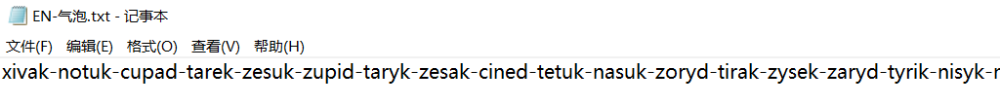
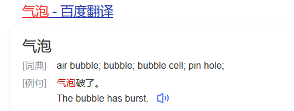
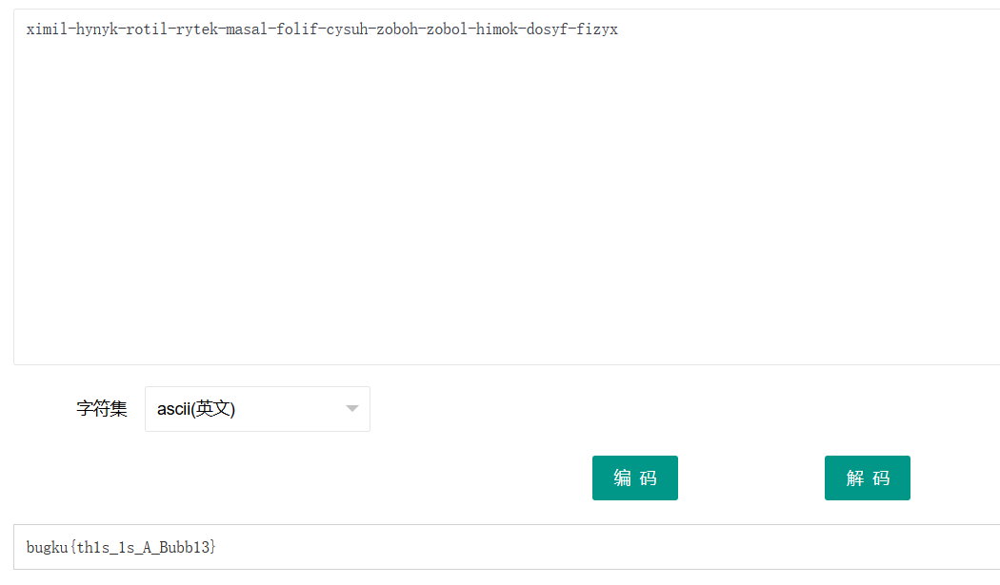

# Bugku-Crypto

## Crypto系列

### 抄错的字符

1. 题目详情，解密的文字有点像base64，但是base64又不是全部大写

   ```shell
   老师让小明抄写一段话，结果粗心的小明把部分数字抄成了字母，还因为强迫症把所有字母都换成大写。你能帮小明恢复并解开答案吗：QWIHBLGZZXJSXZNVBZW
   ```

2. 小明把数字抄成了字母，字母也全部改为了大写，那么应该就是base64解码了

   ```shell
   抄错的字母可能有
   I = 1
   Z = 2
   B = 8
   S = 5
   G = 9
   ```

3. 这里可以手撸出来，为了避免麻烦，借用南方大佬的代码tql

   ```python
   '''
   Author: dota_st
   Date: 2021-02-12 18:16:06
   blog: www.wlhhlc.top
   '''
   import base64
   
   def getallerrorPossible(S, e):
       err = e
       r = [""]
       for s in S:
           if s not in err:
               for i in range(len(r)):
                   r[i] += s
           else:
               for i in range(len(r)):
                   tmp = r[i]
                   if s == 'Z':
                       r[i] += s
                       r.append(tmp + '2')
                   elif s == 'S':
                       r[i] += s
                       r.append(tmp + '5')
                   elif s == 'B':
                       r[i] += s
                       r.append(tmp + '8')
                   elif s == 'G':
                       r[i] += s
                       r.append(tmp + '9')
                   elif s == 'I':
                       r[i] += s
                       r.append(tmp + 'l')
                       r.append(tmp + '1')
       return r
   
   def letterCasePermutation(S):
       res = [""]
       for s in S:
           if not s.isalpha():
               for i in range(len(res)):
                   res[i] += s
           else:
               for i in range(len(res)):
                   tmp = res[i]
                   res[i] += s.lower()
                   res.append(tmp + s.upper())
   
       return res
   
   def delete_fun(list, delete_list):
       return True if any(i in list for i in delete_list) else False
   
   def main():
       err = 'ZSBGI'
       s2 = 'QW1hbIGZZXJSXZNVBZW='
       ap = getallerrorPossible(s2, err)
       delete = ['/', '(', '<', 'œ']#剔除包含这些字符的情况
       res = []
       for s in ap:
           r = letterCasePermutation(s)
           for i in r:
               try:
                   f = base64.b64decode(i).decode('utf-8')
                   if f.isprintable() and not delete_fun(f, delete):
                       res.append(f)
               except:
                   pass
       for i in res:
           print(i)
       print("[*]一共解出{0}个".format(len(res)))
   
   
   if __name__ == '__main__':
       main()
   ```

4. `flag{Aman_very_cool}`

   

### EN-气泡

1. 打开txt，好的看不懂，关闭

   

2. 根据题目提示英文气泡，我们搜索一下，还有个`BubbleBabble加密算法`

   

3. 找了个解密网址[BubbleBabble在线](http://ctf.ssleye.com/bubble.html)，套娃解密下`bugku{th1s_1s_A_Bubb13}`

   

