# Bugku-misc

## misc系列

### 社工-进阶收集

1.题目详情，应该是从照片上确定位置找到小区

```shell
小明当年为了追求小美想尽办法获得小美的地址。直到有一天小美发了一条说说，小明觉得希望来了。 (实战改编题，难度降低了。)
flag{小美小区名字拼音}
```

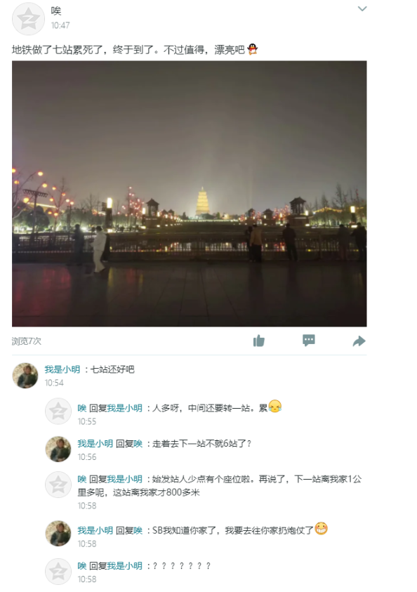

2. 提取图上的信息，首先图片确定地点，扔进搜狗识图发现是西安的大雁塔

3. 从他们的对话中我们可以总结一下

   ```shell
   小美坐了七站地铁，其中换乘一站，第一站是地铁始发站
   始发站距离小美家800米左右
   下一站距离小美家1000米左右
   ```

4. 这里我们调取西安地铁图，推演了一下发现是韦曲南地铁站附近

   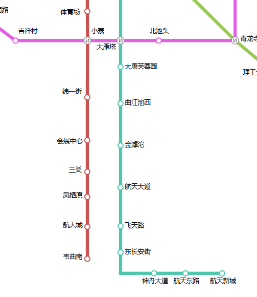

   5. 这里我们打开高德地图，以韦曲南为中心1000米(大约800米)画圆，然后利用测距功能，从上一站航天城与圆产生交点的小区进行逐步尝试，最终发现是兰乔国际城

      `flag{lanqiaoguojicheng}`

      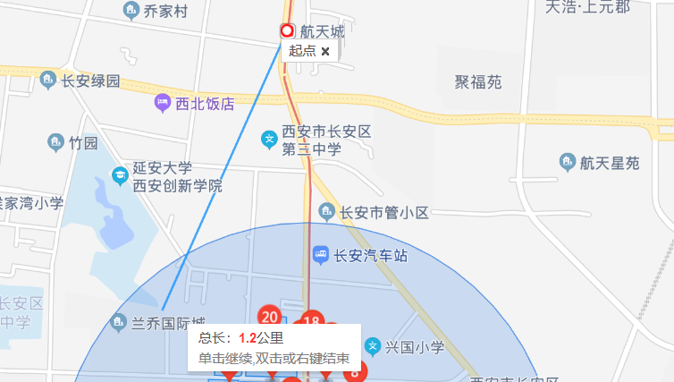


### 1和0的故事

1. 拿到题目，一看25行25列就是转二维码

   ```shell
   0000000001110010000000000
   0000000000011110100000000
   0000000001110001000000000
   0000000010111100000000000
   0000000010101010000000000
   0000000001100010100000000
   0000000010101010100000000
   0000000001000001100000000
   1100011101110110100011000
   0001000010110010010010100
   0100111101000011101110011
   0011110100101011001001001
   1000001001100001001101000
   1111000111111011100101000
   1011011111001101111110111
   1000110110010010101101100
   1000111100111111111110111
   0000000010110001100010100
   0000000010010100101010001
   0000000010101010100011001
   0000000000100111111110010
   0000000000011001011110111
   0000000001001100100100001
   0000000011000011011011001
   0000000011010000101110101
   ```

2. 套个py脚本，kali自带pillow库

   ```python
   from PIL import Image
   MAX = 25
   pic = Image.new("RGB",(MAX, MAX))
   str = "0000000001110010000000000000000000001111010000000000000000011100010000000000000000010111100000000000000000001010101000000000000000000011000101000000000000000010101010100000000000000000100000110000000011000111011101101000110000001000010110010010010100010011110100001110111001100111101001010110010010011000001001100001001101000111100011111101110010100010110111110011011111101111000110110010010101101100100011110011111111111011100000000101100011000101000000000010010100101010001000000001010101010001100100000000001001111111100100000000000011001011110111000000000100110010010000100000000110000110110110010000000011010000101110101"
   i=0
   for y in range (0,MAX):
       for x in range (0,MAX):
           if(str[i] == '1'):
               pic.putpixel([x,y],(0, 0, 0))
           else:
               pic.putpixel([x,y],(255,255,255))
           i = i+1
   pic.show()
   pic.save("flag.png")
   ```

3. 转出来二维码缺乏定位角，添加上去

   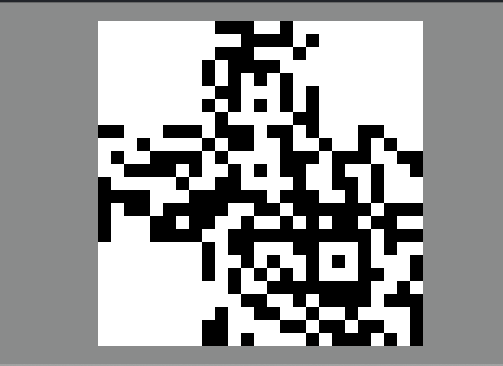

4. 修复扫码得到`flag{QR_c0de_1s_1nterest1n9}`

   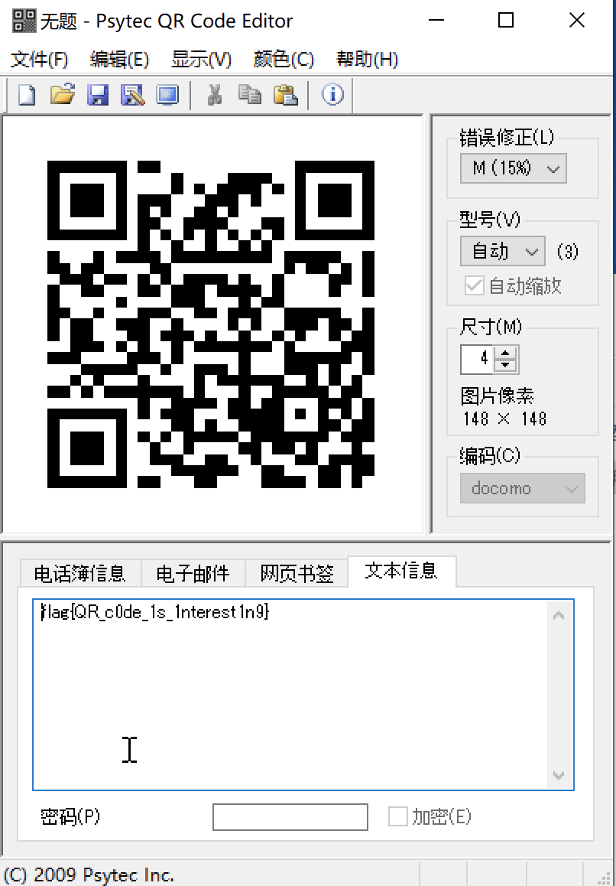

   

### ping

1. 解压出来流量包，扔进wireshark，发现是ping流量包

   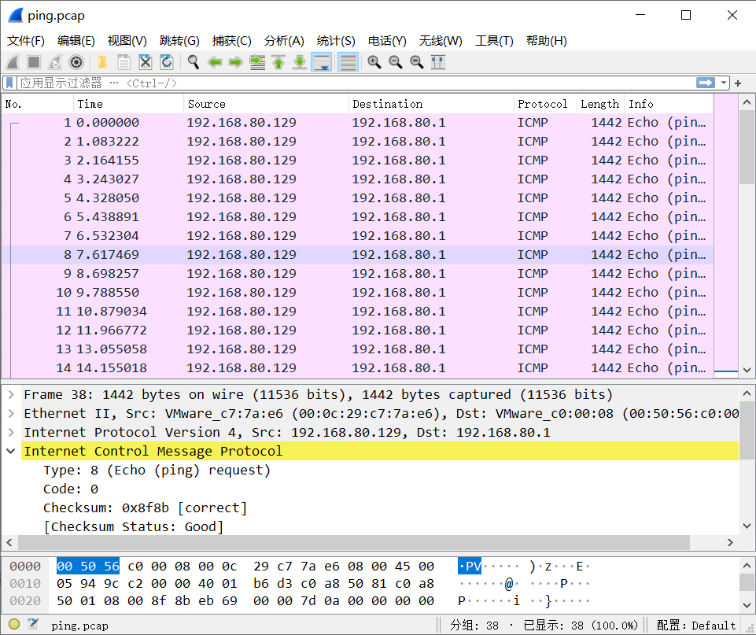

2. 发现每个流量包data附带一个字，前面四个包拼接起来就是`flag`，由于是icmp，没法用追踪功能，手撸`flag{dc76a1eee6e3822877ed627e0a04ab4a}`

   如果有其他更快方法，会在更新


### 赛博朋克

1. 解压出来有加密，但没给提示，怀疑是伪加密，拖进010修改原文件目录去全局加密位置

   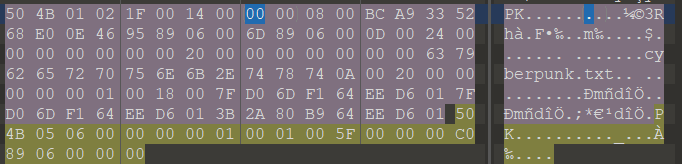

2. 解压出来txt，发现是png文件，拖进010转成图片png，发现末尾有hint

   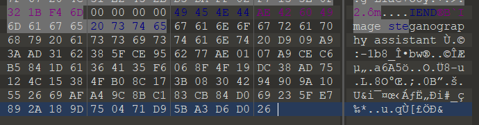

3. 找了几个软件，发现是中文的图片隐写助手，[下载地址](http://www.greenxf.com/soft/279692.html)

4. 后期复现了一下，这个是LSB隐写，用stegsolve也可以打开

   `flag{Hel1o_Wor1e}`

   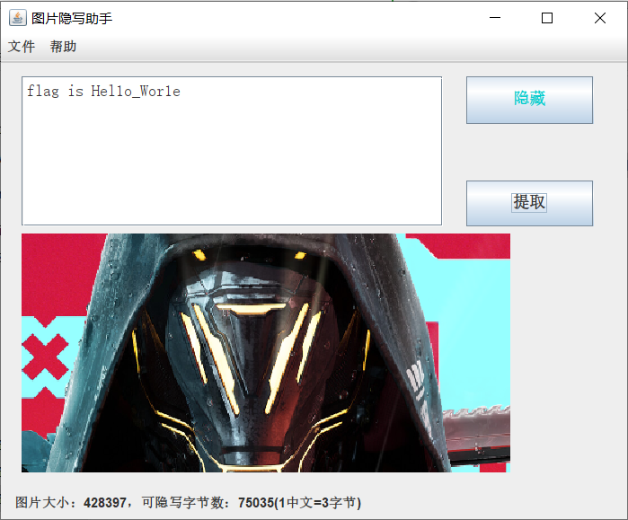


### 贝斯手

1. 解压出来，一个加密的压缩包一张图片和介绍.txt，应该要在外面找密码,打开txt文件，发现作者添加了换行，在最后有hint

   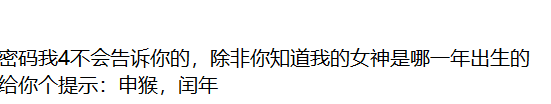

2. 这里可以有两种做法，密码是年份，只有四位，可以直接爆破，还有一种文档写了女主参加的电影和图片可以直接搜索出来，我直接爆破密码`1992`

3. 解压flag.txt出来

   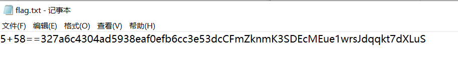

4. 前面数字应该对应某种加密方式，`cC`这里后面明显分成了两半，应该是两种加密方法相加组合而成

5. 前面一半类似hex，并且有32位，应该是MD5加密，后面类似base家族，`58`提示应该是base58

   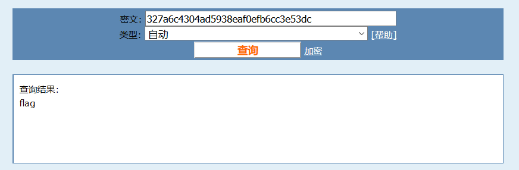

   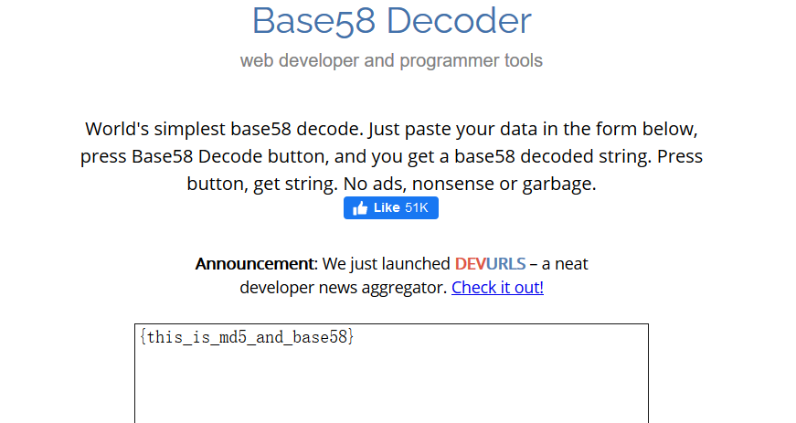

6. 拼接一下`flag{this_is_md5_and_base58}`

   

### 放松一下吧

1. 解压出来，两个压缩包，一个password压缩包和一个加密压缩包

2. 继续解压password压缩包，发现是经典游戏iwanna

3. 进入游戏会选择关卡，运行游戏时每个关卡都会留下save文件，把save文件拖进010观察

   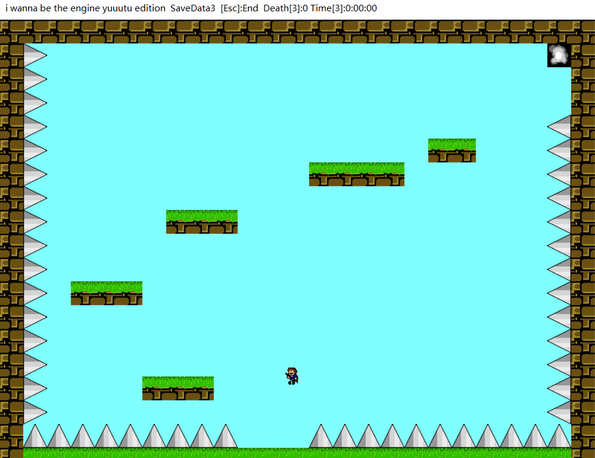

   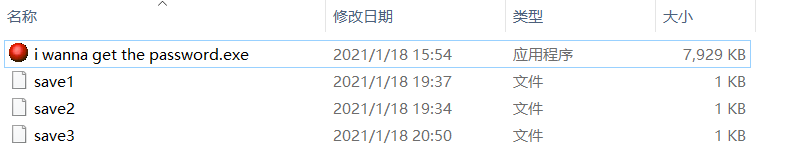

4. 通过第一关后发现在图中标记位变为了` 32`，应该时代表着关卡，每过一个关卡就会加一我们改为33，运行下一关`R`键重新载入就有password

   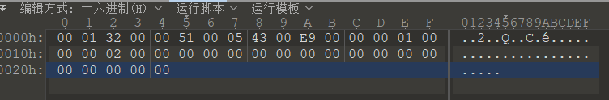

5. 我们改为33，原地去世，`R`键重新载入就有password

   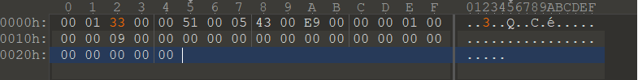

   

   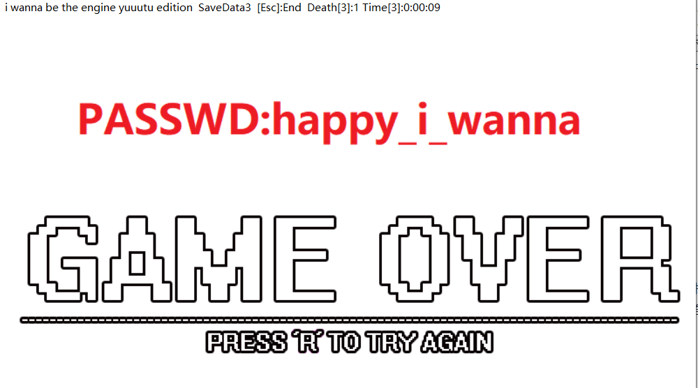

5. 解压另一个压缩包，刷新提示很明显，就是F5隐写，txt文档中的password的emoji就是base100，解密后`66666666`

   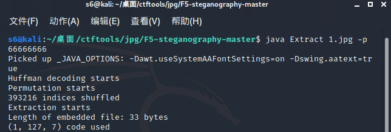

6. 打开提取的output.txt`bugku{F5_and_i_wanna_is_so_cool}`


### 被勒索了

1. 下载解压出来是个火绒的文件夹

2. 将文件夹拖进沙箱或者新建虚拟机(之前安装过，酒托不进去了)，放入`C:\ProgramData`目录下，此目录是火绒默认隔离区的目录

   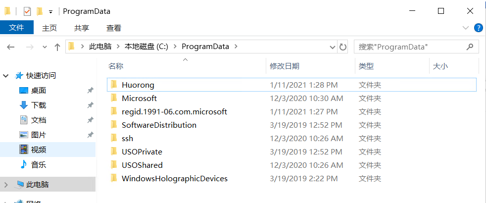

3. 安装火绒 ，完成后打开隔离区，发现flag

   

   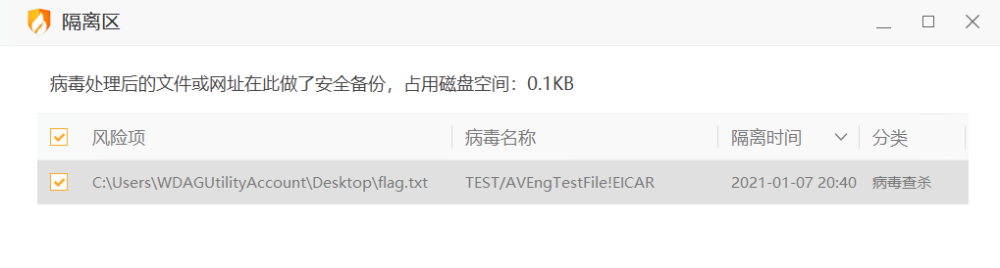

4. 导出flag文件`flag{Virus_traceability}`


### 做个游戏

1. 打开是个java的游戏，用`java Decompiler`反编译一下，源码里就有flag

   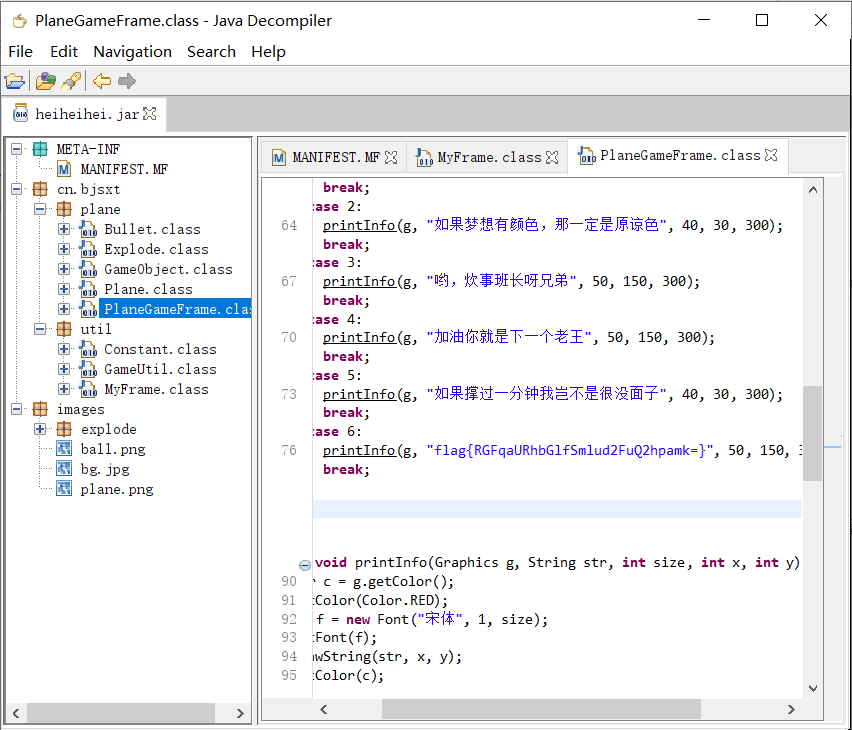

2. `flag{RGFqaURhbGlfSmlud2FuQ2hpamk=}` ，base64解码一下

   ```python
   import base64
   str="RGFqaURhbGlfSmlud2FuQ2hpamk="
   flag=base64.b64decode(str)
   print (flag)
   #DajiDali_JinwanChiji
   #拼接一下
   flag{DajiDali_JinwanChiji}
   ```


### 三色绘恋

1. 解压出来一张图片，拖进010发现`FF D9`末尾有`PK`压缩包标识，手动分离出来

   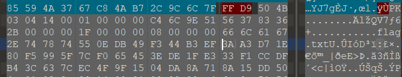

2. 提取的压缩包发现有加密，尝试伪加密失败，没有给hint，尝试修改图片高度，将图片属性中的高度宽度转为16进制`420=hex(01A4)`

   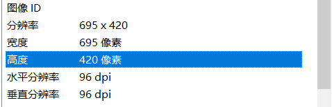

3. 010中`ctrl+f`搜索高度16进制，修改为`03 A4`，密码就出来了

   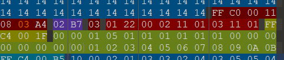

   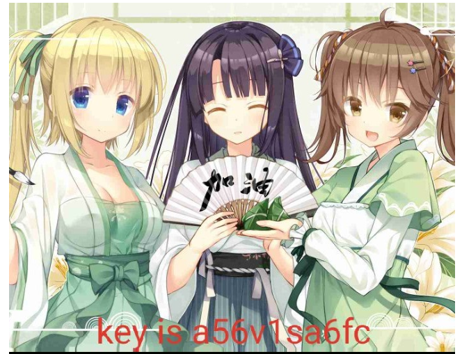

4. 密码`a56v1sa6fc`，解压出文档，拿下`fLag{M0_XIa0_Ju_T1an_XIa_Dl_1!}`


### 只有黑棋的棋盘

1. 题目提示动手修复，那应该是修复文件了，下载解压一个围棋的图片，一个flag.zip压缩包

   

2. 将图片拖进010，发现末尾有`50 4B`标识，应该是有压缩包隐写了，手动提取出来

   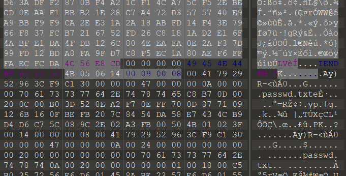

3. 打开提取的压缩包显示，没有分卷，在打开010，查看文件头发现是`50 4B 05 06`这是文件结束记录符，我们改为`50 4B 03 04`进行修复文件头，再将全局加密改为`00`，这样解压出来一个passwd.txt文档

   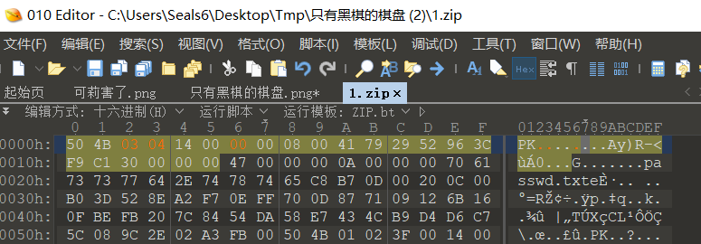

   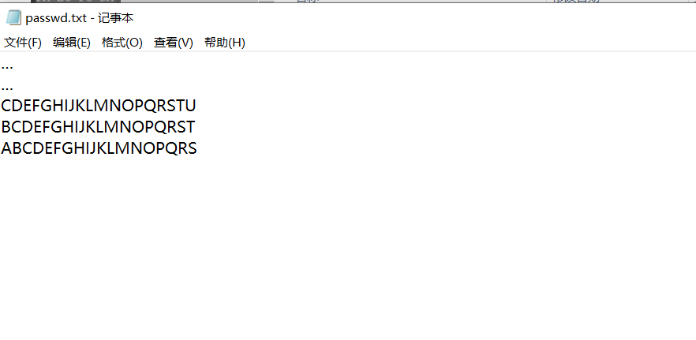

4. 打开文档，发现字母有序排列，并逐渐向前减一，我们将其补全，按照图片上黑棋坐标点，对应txt坐标写出来相应的字母，这里我横着读了一遍，竖着读了一遍，最终发现是竖着从下往上才能正确排列字母顺序，压缩包密码是大写`GOODGOPLAY`

   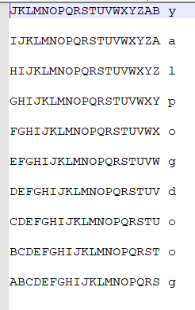

5. 解压flag.zip出来一张图片，拖进010，发现CRC报错，修改高度一把梭`flag{1t_1s_1nterest1n9}`

   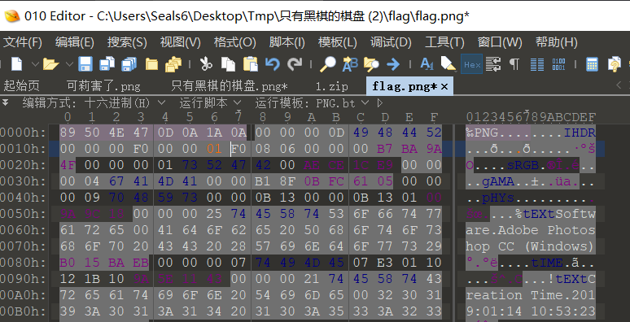

   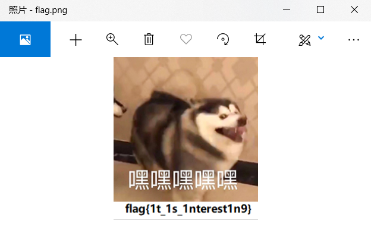

### baby_flag.txt

前言：又是棋王mumuzi师傅的题

1. 解压出来一个txt，打开`JFIF`标识，改为jpg拖进010

   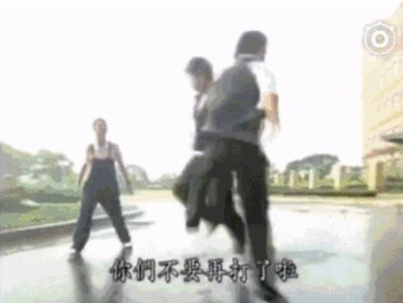

2. 发现末尾有`raR`开头标识，怀疑文件头被修改，手动分离出来

   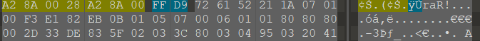

3. 修复Rar文件头`52 21 72 21`保存为rar文件，打开压缩包发现加密了

   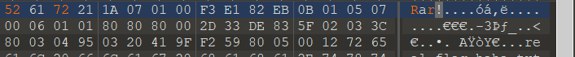

4. 在010中发现末尾有一串hex，解码后，base64再解一次发现并无卵用

   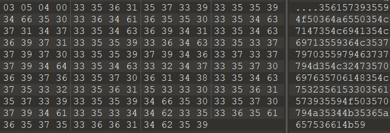

   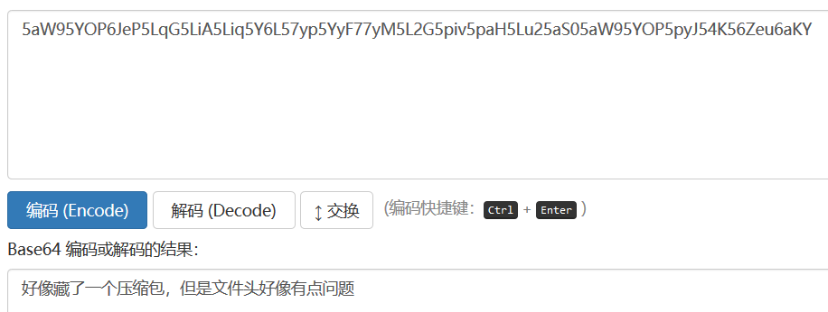

5. 这里想起bugku题目提示还可以再高一点，应该是还可以修改图片高度

   

6. 我们找到图片属性高度转为hex，在010中进行搜索对应位置，改高度

   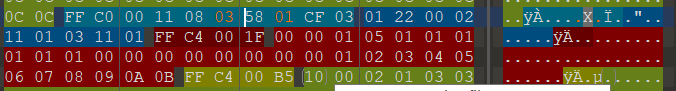

   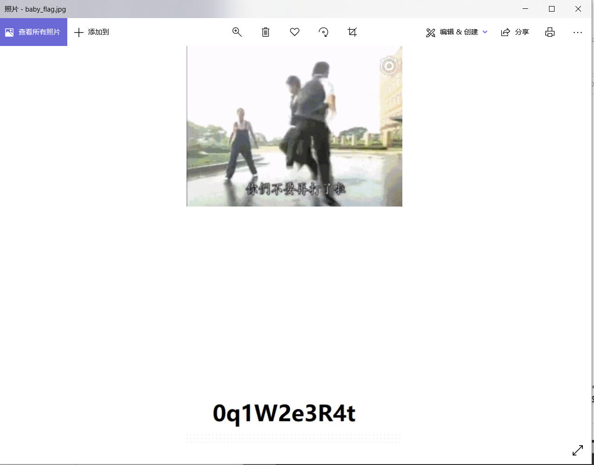
   
7. 密码`0q1W2e3R4t`，解压压缩包，打开txt
   
   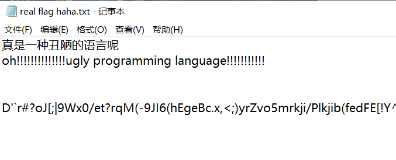

8. 这里提示`ugly programming language`应该是某种编程语言，google下，发现是`Malbolge`
   
   [Malbolge在线编译](https://malbolge.doleczek.pl/)
   
   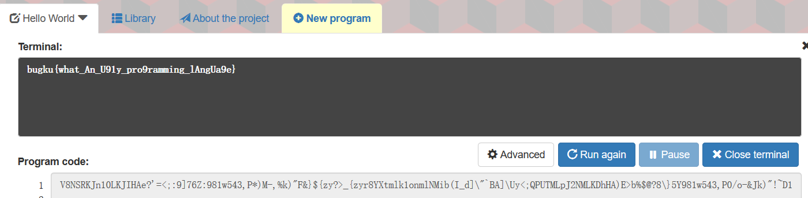
   
   
   
   `bugku{what_An_U91y_pro9ramming_lAngUa9e}`
   
   

### 善用工具

前言：这道题可把我给整蒙了，自己做的是非预期解法，后面问了出题人预期解法

我这里先说我的解法

1. 这里解压出来3个文件，一个hint.png，用word打开，里面给了一串没见过的字符串，我也不知道是啥`8:V5Y:7,Y,3MU=$8D:D%11&9O6BY .G,M`

   

2. 前面无解没思路，打开压缩包发现加密了，应该不是伪加密，还有一张图片，拖进010，发现末尾有base64

   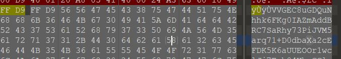

3. 我这里尝试进行base64解码，并不是常见的内容，根据题目善用工具，应该是某种工具加密了，这里我使用google对前六个字母进行搜索`VVGEC8`，发现了个类似的问题

   ps：别用百度，我试过了

   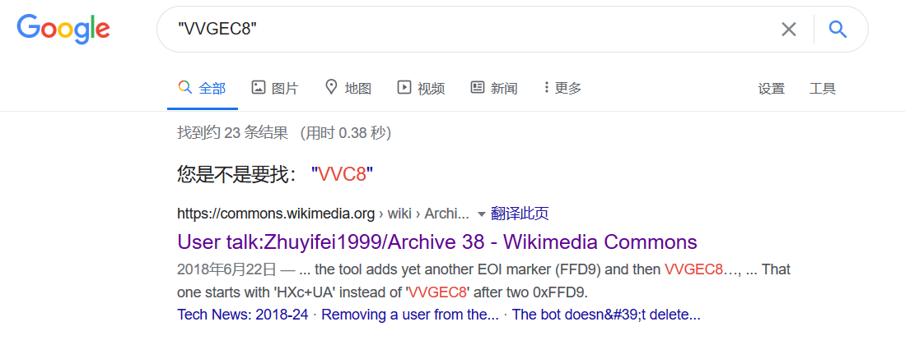

4. 这个问题是说图片结尾后面跟了base64字母与我搜索的`VVGEC8`一样，是个软件`Free File Camouflage`

   [下载地址](http://www.myportablesoftware.com/freefilecamouflage.aspx)

   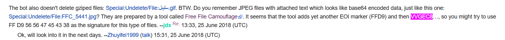

5. 有工具就好办了，选择解密一把梭

   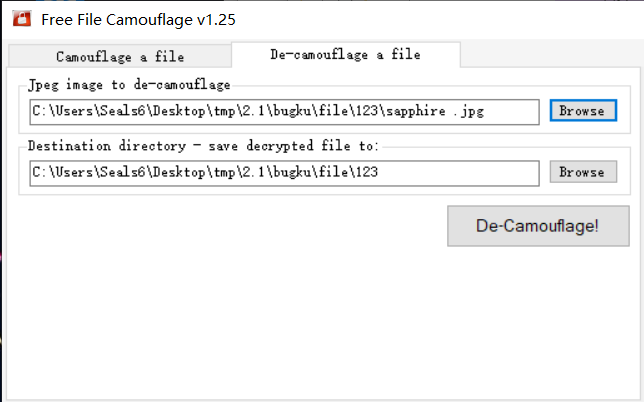

6. 打开解密出来的的doc，显示`远在天边近在眼前`但是却没有密码，应该是隐藏了文字，我们设置显示隐藏文字

   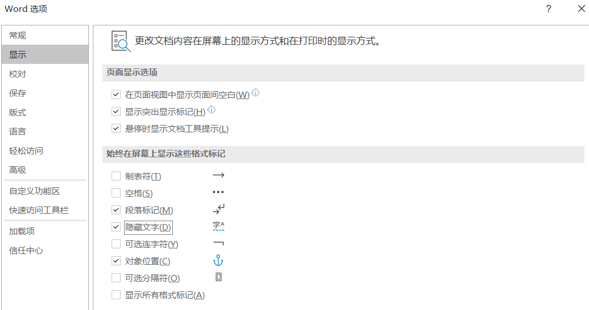

   

7. 解压压缩包，压缩包注释里提示是webp格式，图片填上后缀名

8. webp隐写，扔进kali使用stegpy工具

   ```shell
   stegpy csgo.webp
   bugku{rea1ly_miss_yoU}
   ```

   

   

   预期解法

   这里说一下预期解法，其实就是解出hint是啥，问了出题人，先用uuencode解码，在进行base85，这里我用py脚本解码时，总是某个字符报错，应该是编码的问题，google找了2个解码网站

   [UUencode](https://www.dcode.fr/uu-encoding)

   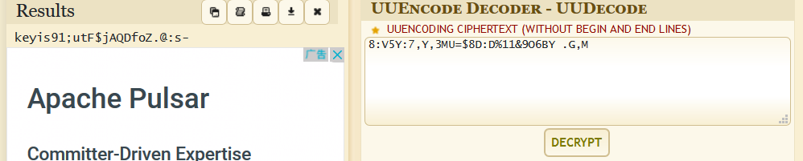

   [base85](https://www.better-converter.com/Encoders-Decoders/ASCII85-Decoder)

   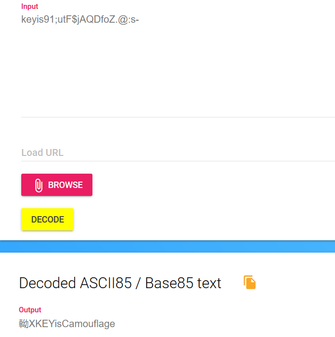


### 乌云邀请码

1. 解压出来一张图片，拉入010没有发现其他异常，考虑LSB隐写

   

2. stegsolve发现RGB 0通道上方有东西

   

3. 提取，调整调整一下顺序，preview一下`flag{Png_Lsb_Y0u_k0nw!}`

   


### Photo的自我修养

1. 题目提示flag好像隐藏在图片中，下载下来1个压缩包，解压出来一张图片还有加密的两个压缩包，图片明显下面还有东西，怀疑改了尺寸

   

2. 拖入010editor，crc直接报错，修改高一把嗦

   

3. 图片提示`B:One2021@`

   

4. 第二个压缩包伪加密，图片详细信息中的属性有第二个提示`A:Just`

   

5. 两个密码拼接一下`JustOne2021@`为第三个压缩包密码，解压即得`flag{Hello2021_Good}`

   


### 成果狗成果狗

⚠️这道题没十年脑血栓真的做不出来！

1. 解压文件，得到fl.jpg

2. 拖入010观察，发现有两段FFD8，将两个文件进行分离,得到两个图片

   

3. 继续分析1.jpg（原fl.jpg），文件尾部FFD9后面有一段加密文字，为base64加密

得到一段hex，将hex导入至FFD9之前，保存文件


4. 找到文件00C007-00C00A这段为文件的宽高，修改至宽高一样得到图片，

  

5. 很明显，图片显示不正常，但是图片下面显示关键词`Nice}`
6. 猜测，刚刚导入的hex为2.jpg中结尾，如上找到文件端00A003-00A006为图片宽高，修改成一致保存,得到正常图片

​      

6. 同理，在2.jpg后面也有段base64，解码导入010之后，修改宽高一致，得到图片

   

7. 稍微拼接一下`flag{JFIF_1s_very_Nice}`


### 开始也是结束

1. 解压出来一张图片，扔进010发现`FF D9`末尾有`PK`压缩包标识，手动分离出来

   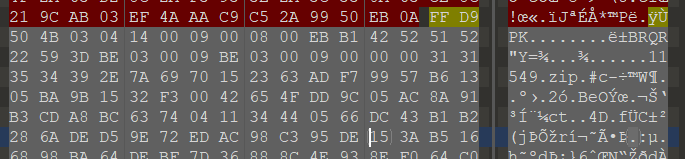

2. 提取分离出来的压缩包，再进行解压发现里面又套了一层加密压缩包，这里直接爆破，发现密码就是里面文件的名字

   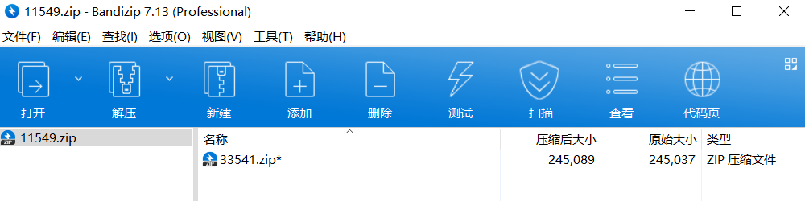

   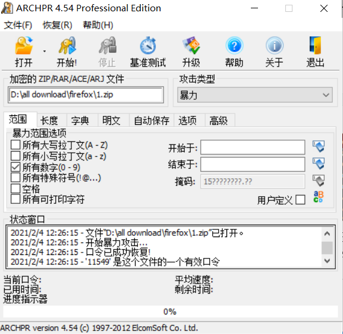

3. 这里再进行解压，发现又是套娃压缩包，直接上脚本一把梭

   ```python
   import zipfile
   name = '11549'
   while True:
       fz = zipfile.ZipFile(name + '.zip', 'r')
       name=fz.filelist[0].filename[0:-4]
       fz.extractall(pwd=bytes(name, 'utf-8'))
       print(name)
       fz.close()
   ```
   
4. 解出来，套了大概980多层，最后一个压缩包是`bugku.zip`，爆破无解，想起hint`rockyou文件`，直接扔进kali进行爆破

   ```shell
   fcrackzip -D -u -p /usr/share/wordlists/rockyou.txt bugku.zip 
   PASSWORD FOUND!!!!: pw == letsgetiton
   
   unzip -P letsgetition bugku.zip
   ```

5.  解压出来一张和原来开头一样的图片，真是和题目相对应呢，这里直接`strings`进行打印一下，也可以拖进010进行查找

   ```shell
   strings bugku.jpg | grep flag
   
   bugku_flag{miu_nian_da_ji}
   ```

6. 这道题有点像Y1ng师傅出的一道 `flag{miu_nian_da_ji}`


### 北有楠木

1. 解压出来，一张图片，拖进010，发现末尾有个压缩包`7z`的文件头标识，手动分离出来

   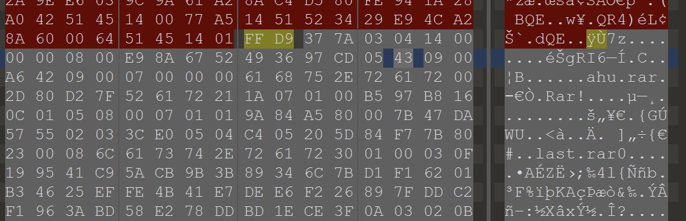

2. 保存出来`1.7z`，打开发现文件已损坏，再重新观察文件头，发现是`37 7A 03 04`有点像是`zip`的文件头`50 4B 03 04`，观察文件尾`37 7A 05 06`证实我的想法

   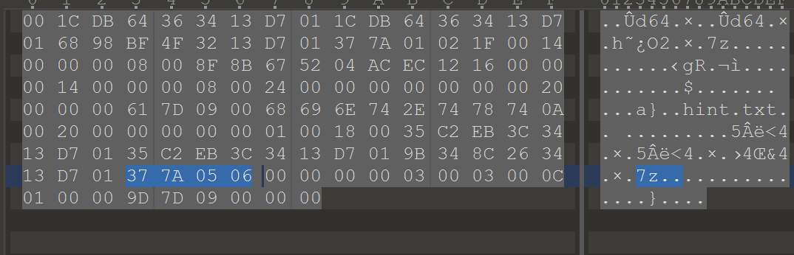
   
3. 观察一下，需要替换一共七个地方

   ```shell
   37 7A 03 04 / 50 4B 03 04
   37 7A 05 06 / 50 4B 05 06
   37 7A 01 02 / 50 4B 01 02
   ```

4. 替换出来成功解压，压缩包又是加密的，应该是套娃解密

   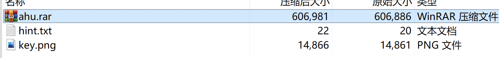

5. 打开`hint.txt`，进行base64解码

   ```shell
   5Y+k6ICB55qE5paH5a2X
   
   #base64解码
   
   古老的文字
   ```

6. 打开图片，上面的文字应该就是所说的古老的文字，因为有点像数字，想到了甲骨文中的数字，百度一下`14582978`

   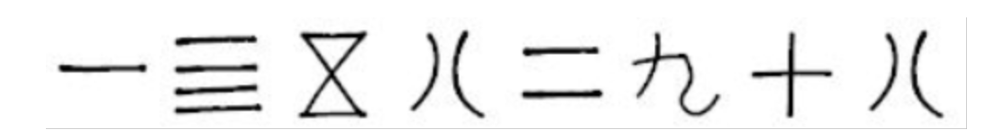

   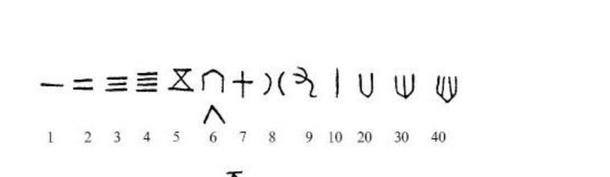

7. 输入`14582978`解开压缩包，发现里面又套了一层，图片和一个压缩包，因为图片是bmp，考虑`wbStego4open`，解出来`1.txt.jpg`

   
   
   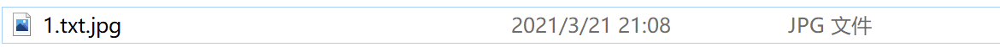
   
8. 这里打不开，用010打开，发现是乱码，这里问了问大佬，搜索`key`，会发现密码...我哭了出来😭`key:988%^&*cool`
   
   
   
9. 输入`988%^&*cool`解开压缩包，得到两个txt
   
   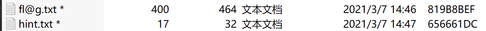
   
10. 打开hint.txt，提示是`aes256加密 密码99633`

    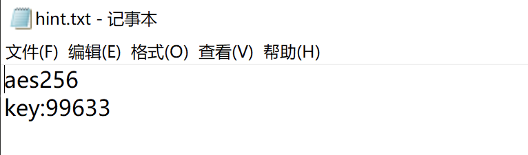

11. 我自己找了几个在线网站没转出来，看了下wp，用`openssl`

    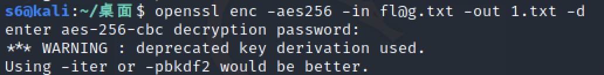

12. 打开1.txt，发现是音乐字符，直接音乐符号密码解密

    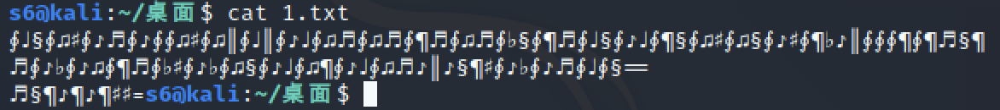

13. 但是直接解码是错误的，发现一共有两行，只有第二行可以解出来字符`cool`

    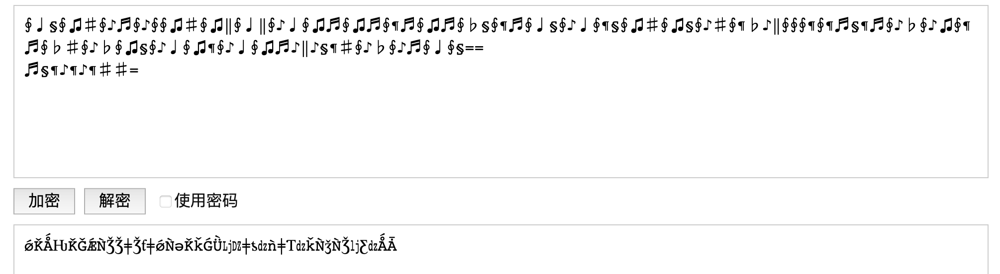

    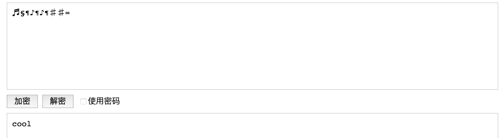

14. 用第二行的字符作为密码`cool`解第一行试试`bugku{aess_s0_be@utiFUl_#nd_1nteresT%ng}`

    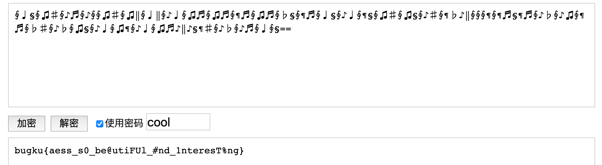


### 闹酒狂欢

1. 一个txt，里面套了一层`hex`

   ```shell
   EF81B5EF81B3EF81A9EF81AEEF81A7EF80A0EF8193EF81B9EF81B3EF81B4EF81A5EF81ADEF80BB0A0AEF81AEEF81A1EF81ADEF81A5EF81B3EF81B0EF81A1EF81A3EF81A5EF80A0EF8183EF81AFEF81AEEF81B3EF81AFEF81ACEF81A5EF8181EF81B0EF81B0EF80B10AEF81BB0AEF80A0EF80A0EF80A0EF80A0EF81A3EF81ACEF81A1EF81B3EF81B3EF80A0EF8190EF81B2EF81AFEF81A7EF81B2EF81A1EF81AD0AEF80A0EF80A0EF80A0EF80A0EF81BB0AEF80A0EF80A0EF80A0EF80A0EF80A0EF80A0EF80A0EF80A0EF81B3EF81B4EF81A1EF81B4EF81A9EF81A3EF80A0EF81B6EF81AFEF81A9EF81A4EF80A0EF818DEF81A1EF81A9EF81AEEF80A8EF81B3EF81B4EF81B2EF81A9EF81AEEF81A7EF819BEF819DEF80A0EF81A1EF81B2EF81A7EF81B3EF80A90AEF80A0EF80A0EF80A0EF80A0EF80A0EF80A0EF80A0EF80A0EF81BB0AEF80A0EF80A0EF80A0EF80A0EF80A0EF80A0EF80A0EF80A0EF80A0EF80A0EF80A0EF80A0EF8183EF81AFEF81AEEF81B3EF81AFEF81ACEF81A5EF80AEEF8197EF81B2EF81A9EF81B4EF81A5EF818CEF81A9EF81AEEF81A5EF80A8EF80A2EF8182EF81B5EF81A7EF81ABEF81B5EF81BBEF8197EF80B0EF81B2EF81A4EF819FEF80B1EF81B3EF819FEF81B4EF81A8EF81A5EF819FEF81A2EF81A5EF80B5EF81B4EF819FEF8189EF8184EF8185EF81BDEF80A1EF80A2EF80A9EF80BB0A0AEF80A0EF80A0EF80A0EF80A0EF80A0EF80A0EF80A0EF80A0EF81BD0AEF80A0EF80A0EF80A0EF80A0EF81BD0AEF81BD
   ```

2. 拿去解码发现看不到，应该是字体编码，后面才知道是题目的名字英文`wingdings`，用word换成相应字体编码打开

   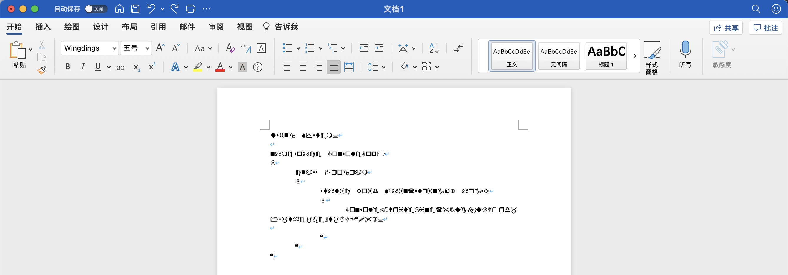

3. 据原wp，可直接转换其他文字格式或使用`qq`，但是可能我mac的原因这些方法都无法转换，虚拟机跑了一个qq，复制到聊天框`Bugku{W0rd_1s_the_be5t_IDE}`

   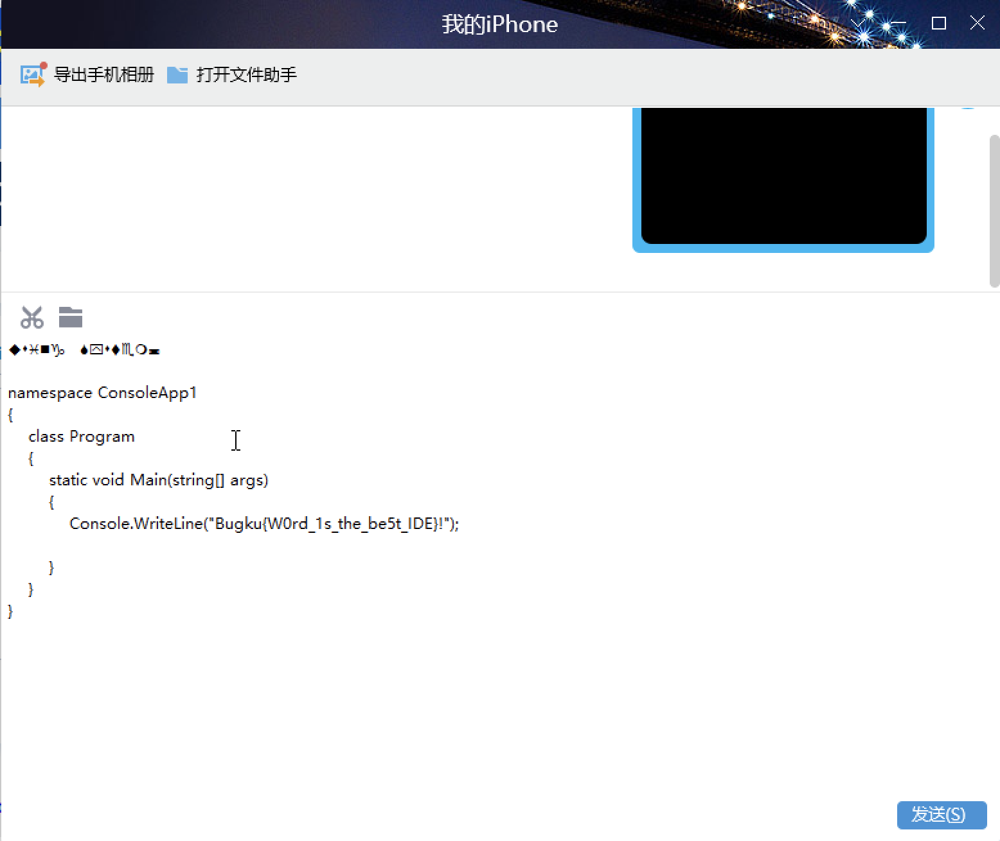

   


### 有黑白棋的棋盘

1. 下载出来一个压缩包，解压出来三个压缩包，就疯狂套娃呗

   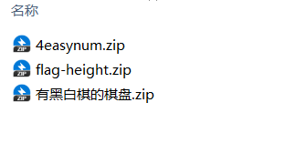

2. 第一个压缩包写了`4easynum`应该是爆破了，上工具密码`7760`

3. 解压出来一个图片和一个hint

   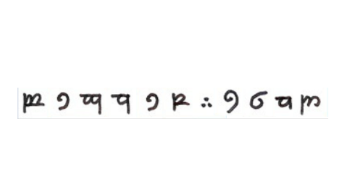

   

4. 拖进010，末尾有一串base64，解出来翻译出来意思是精灵，结合题目提示应该古精灵语

   

5. 解出来`bugkupasswd`，刚刚提示了这个密码是棋盘的压缩包，解压出来，一张围棋图片，拖进010，发现备注里又有一个hint，base58转一下，我确实没看懂

   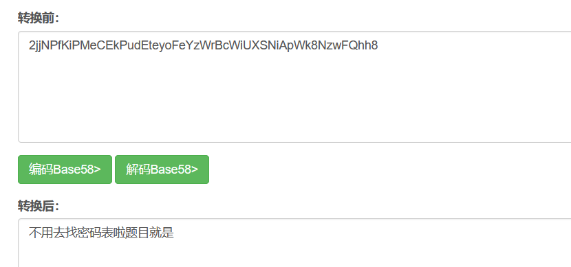

6. 问了出题人，意思是密码表在围棋中，这里因为图片前面很像`canyou???`以为是猜字符卡了很久，后面问了一血Tokeii大佬，说是图片中围棋的提子，吃了不会下围棋的亏解出来`goodctfer`

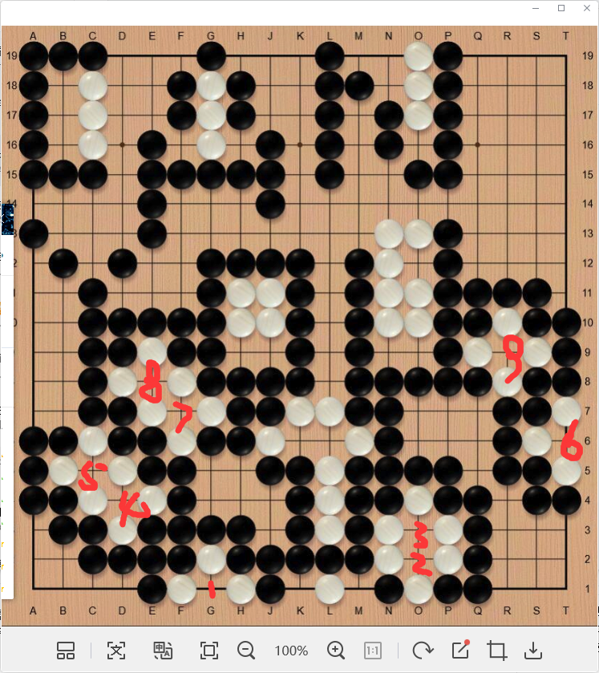

7. 解压出来一张图片，压缩包题目height提示很明显，应该是修改了高，拖进010修改一下高度`flag{new_bugku_is_very_cool}`

   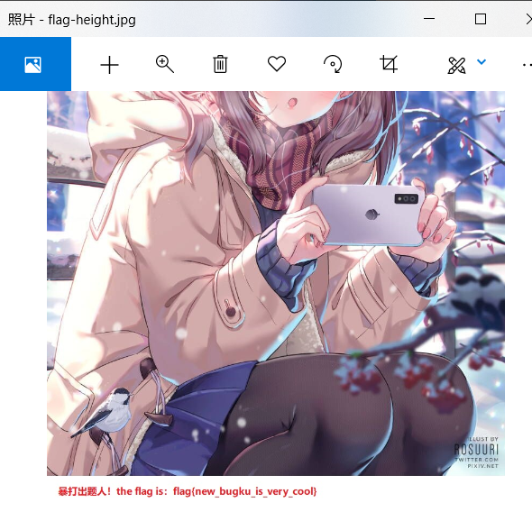

### baby_misc

1. 解压出来三个文件，一个加密压缩包，一个jpg，一个hint文档，我们打开txt

   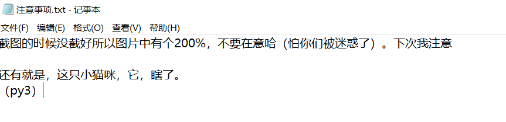

2. 我们打开jpg，发现无法预览，猜测文件头格式损坏，拖进010发现文件头是`FF D8`，文件尾是png格式，所以我们改为png文件头`89 50 4E 47 0D 0A 1A 0A 00 00 00 0D`

   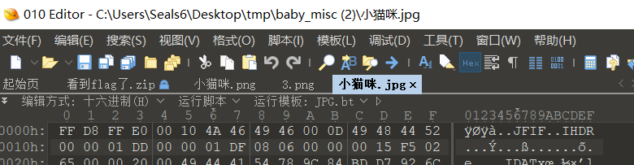

   

   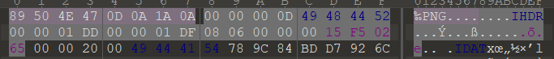

3. 发现图片能够正常预览，仔细观察文件格式发现里面还有一张png图片，手动分离出来

   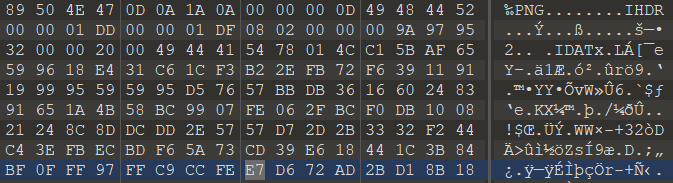

4. 于是发现是一摸一样的图片，结合py3提示应该是盲水印隐写

   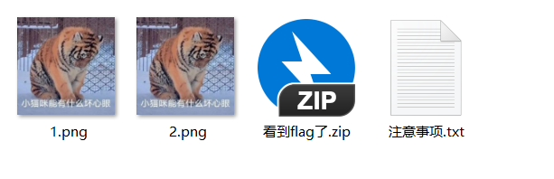

5. 扔进kali，跑一下脚本，得到flag.png

   ```shell
   python3 bwmforpy3.py decode 1.png 2.png flag.png
   ```

   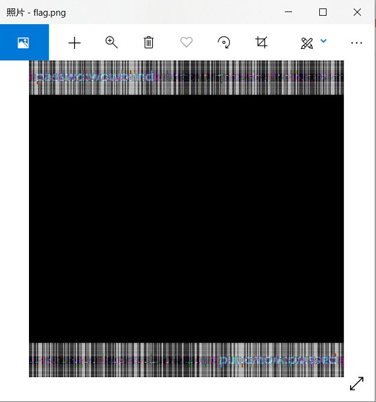

6. 需要放大仔细看得到密码`passwd:wowblind`，解压压缩包，得到一个加密的flag.zip和password.txt，打开txt

   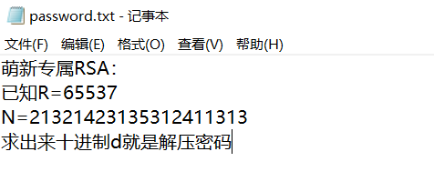

7. 出题人写错了应该e=65537，上RSA脚本

   ```python
   # 分解模数n
   def rsa_moder(n):
       base = 2
       while base < n:
           if n % base == 0:
               return base, n // base
           base += 1
   
   
   # 求欧拉函数f(n)
   def rsa_get_euler(prime1, prime2):
       return (prime1 - 1) * (prime2 - 1)
   
   
   # 求私钥
   def rsa_get_key(e, euler):
       k = 1
       while True:
           if (((euler * k) + 1) % e) == 0:
               return (euler * k + 1) // e
           k += 1
   
   
   # 根据n,e计算d(或根据n,d计算e)
   def get_rsa_e_d(n, e=None, d=None):
       if e is None and d is None:
           return
   
       arg = e
       if arg is None:
           arg = d
   
       primes = rsa_moder(n)
       p = primes[0]
       q = primes[1]
   
       d = rsa_get_key(arg, rsa_get_euler(p, q))
   
       return d
   
   
   def test():
       str_fmt = 'n: {:<10} e: {:<10} d: {:<10}'
   
       # 导入rsa库
       import rsa as rsa
       key = rsa.newkeys(24)
   
       # 产生rsa密钥对
       if isinstance(key[1], rsa.PrivateKey):
           print(str_fmt.format(key[1].n, key[1].e, key[1].d))
   
       n = 21321423135312411313
       e = 65537
       d = get_rsa_e_d(n, e, None)
       print(str_fmt.format(n, e, d))
   
   
   if __name__ == '__main__':
       test()
       
   #解出来 
   n: 21321423135312411313 e: 65537      
   d: 1653347504416359113
   ```
   
   解压密码就为`1653347504416359113`
   
8. 解压flag压缩包，得到一个flag.txt

   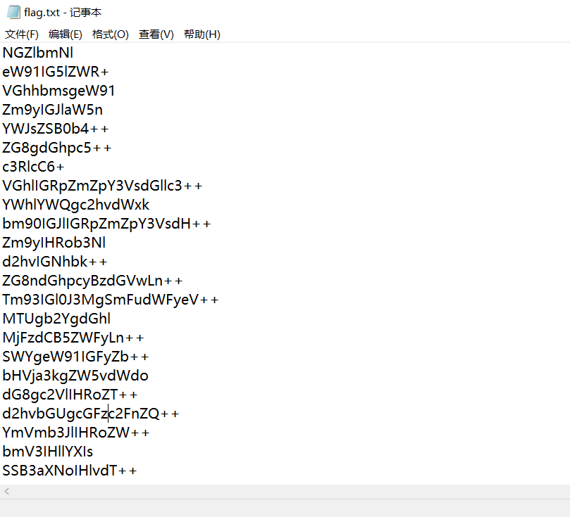

9. 这个应该是base64隐写，但是把等号转换为了加号，使用`ctrl+h`替换+号，上base64stego脚本

   ```shell
   #base64隐写解密py
   base64chars = 'ABCDEFGHIJKLMNOPQRSTUVWXYZabcdefghijklmnopqrstuvwxyz0123456789+/'
   flag=''
   with open('1.txt','r') as f:
       for line in f.readlines():
           line=line[:-1]
           num=line.count('=')
           if num == 0 :
               continue
           lastchar = line[-(num+1)]
           
           #print(line,num,lastchar)
           myindex = base64chars.index(lastchar)
           #print(myindex)
           bin_str = bin(myindex)[2:].zfill(6)
           #print(bin_str)
           flag+=bin_str[6-2*num:]
           #print(bin_str[6-2*num:])
   print(''.join([chr(int(flag[i:i + 8], 2)) for i in range(0, len(flag), 8)]))
   ```

10. 解出来`bgtu{0cfguo_3}kdr`，因为提交格式为`Bugku{}`应该是栅栏密码，普通型试过不对，应该是w型栅栏密码，成功`bugku{g0od_ctf3r}`提交时要把b改为大写

    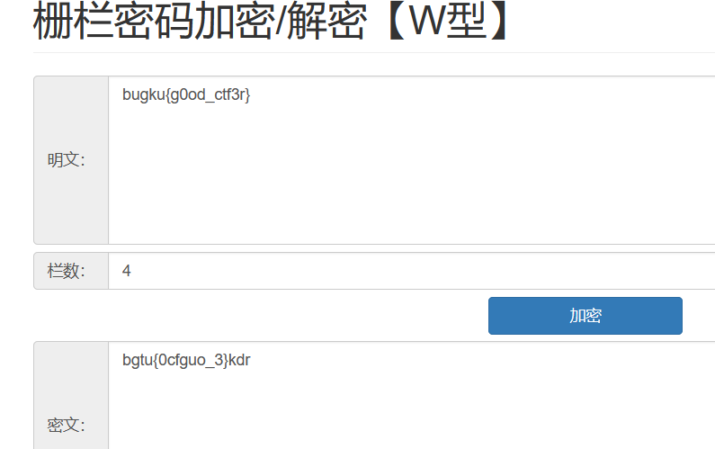

   

### 花点流量听听歌

1. 此题来自棋王Mumuzi，下载发现是一段MP3，快进听歌的时候发现最后声音有点不对，拖进au查看频谱发现`Beaufort Cipher` 上网搜了一下是个加密方式

   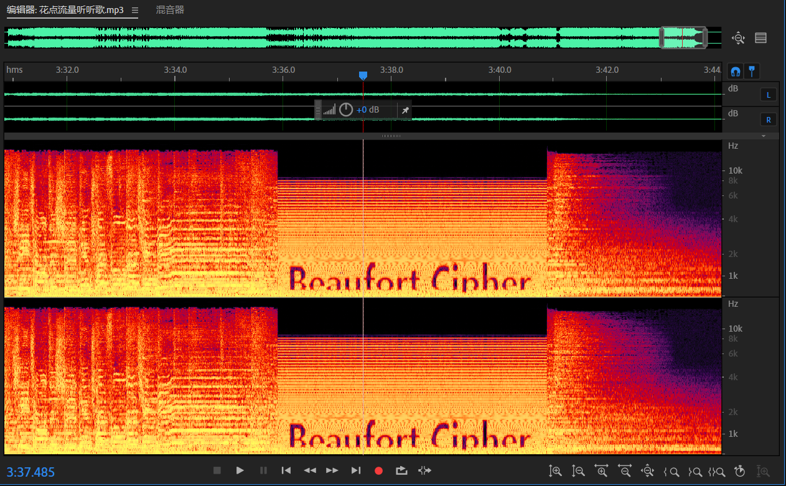

2. 我们将音乐拖入010中，发现末尾有`PK`标识，手动分离压缩包，发现末尾还有一段hint`pay attention,After encryption is fsjcwymauudmwogqbdrsd` 意思是这个是密文，要去找key才能解出明文

   

   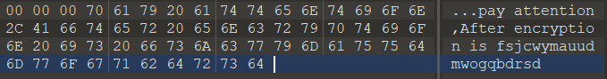

3. 我们将压缩包解压出来，打开flag发现加密了，应该是要找密码，密码应该与上面的hint明文有关

   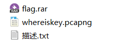

4. 用wireshark打开流量包，发现是USB流量

   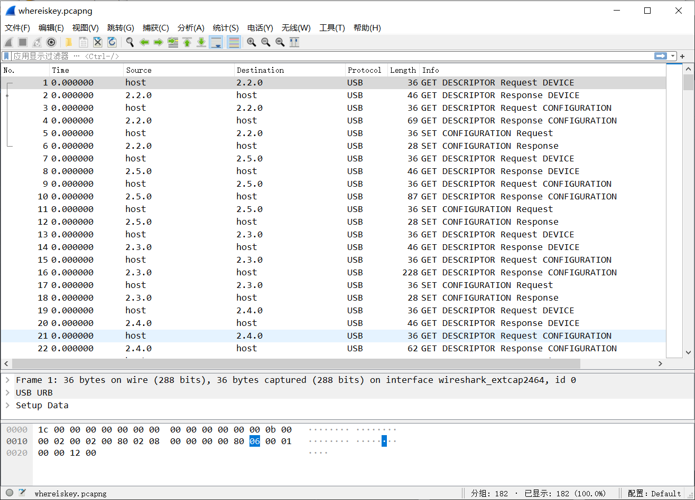

5. 根据HID发现，键盘数据包的数据长度为8个字节，敲击键盘信息在第3个字节，应该是键盘的流量包

   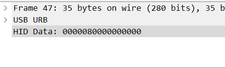

6. 这里可以对照官方的文档进行手动翻译，我嫌麻烦，这里采用的南方大佬的脚本来做的，先将流量包扔进kali ，将数据导出成1.txt

   ```shell
   tshark -r whereiskey.pcapng -T fields -e usb.capdata > 1.txt
   ```

   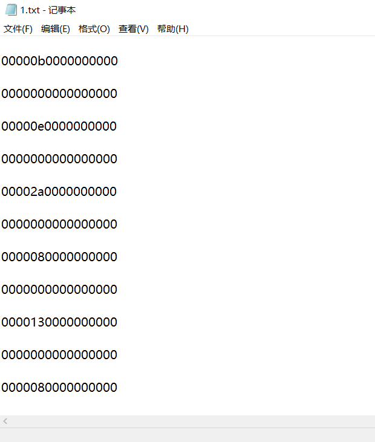

7. 编写脚本,将键盘上的数据读取出来

   ```PYTHON
   import os
   normalKeys = {"04":"a", "05":"b", "06":"c", "07":"d", "08":"e", "09":"f", "0a":"g", "0b":"h", "0c":"i", "0d":"j", "0e":"k", "0f":"l", "10":"m", "11":"n", "12":"o", "13":"p", "14":"q", "15":"r", "16":"s", "17":"t", "18":"u", "19":"v", "1a":"w", "1b":"x", "1c":"y", "1d":"z","1e":"1", "1f":"2", "20":"3", "21":"4", "22":"5", "23":"6","24":"7","25":"8","26":"9","27":"0","28":"<RET>","29":"<ESC>","2a":"<DEL>", "2b":"\t","2c":"<SPACE>","2d":"-","2e":"=","2f":"[","30":"]","31":"\\","32":"<NON>","33":";","34":"'","35":"<GA>","36":",","37":".","38":"/","39":"<CAP>","3a":"<F1>","3b":"<F2>", "3c":"<F3>","3d":"<F4>","3e":"<F5>","3f":"<F6>","40":"<F7>","41":"<F8>","42":"<F9>","43":"<F10>","44":"<F11>","45":"<F12>"}
   
   shiftKeys = {"04":"A", "05":"B", "06":"C", "07":"D", "08":"E", "09":"F", "0a":"G", "0b":"H", "0c":"I", "0d":"J", "0e":"K", "0f":"L", "10":"M", "11":"N", "12":"O", "13":"P", "14":"Q", "15":"R", "16":"S", "17":"T", "18":"U", "19":"V", "1a":"W", "1b":"X", "1c":"Y", "1d":"Z","1e":"!", "1f":"@", "20":"#", "21":"$", "22":"%", "23":"^","24":"&","25":"*","26":"(","27":")","28":"<RET>","29":"<ESC>","2a":"<DEL>", "2b":"\t","2c":"<SPACE>","2d":"_","2e":"+","2f":"{","30":"}","31":"|","32":"<NON>","33":"\"","34":":","35":"<GA>","36":"<","37":">","38":"?","39":"<CAP>","3a":"<F1>","3b":"<F2>", "3c":"<F3>","3d":"<F4>","3e":"<F5>","3f":"<F6>","40":"<F7>","41":"<F8>","42":"<F9>","43":"<F10>","44":"<F11>","45":"<F12>"}
   
   nums = []
   keys = open('usbdata.txt')
   for line in keys:
       if len(line)!=17: #首先过滤掉鼠标等其他设备的USB流量
            continue
       nums.append(line[0:2]+line[4:6]) #取一、三字节
   keys.close()
   output = ""
   for n in nums:
       if n[2:4] == "00" :
           continue
   
       if n[2:4] in normalKeys:
           if n[0:2]=="02": #表示按下了shift
               output += shiftKeys [n[2:4]]
           else :
               output += normalKeys [n[2:4]]
       else:
           output += '[unknown]'
   print('output :n' + output)
   ```

   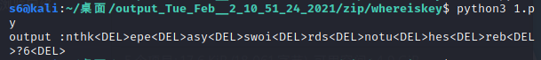

8. 这样看好像看不出来是什么,`<del>`删除的意思,我们试着把文字拼接起来

   ```shell
   nthk<DEL>epe<DEL>asy<DEL>swoi<DEL>rds<DEL>notu<DEL>hes<DEL>reb<DEL>?6<DEL>
   #按照顺序将字母删除
   nthepasswordnothere?
   ```

9. 密码不在这里?这就很迷惑了,我们打开还有个文档,最后一句`最后失去的`应该说的是我们删除的字母

   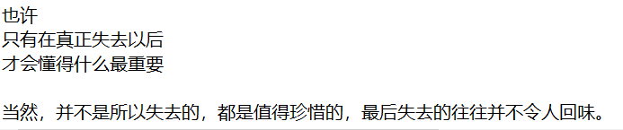

10. 我们将删除的字母拼接起来,发现这就是加密的KEY

    ```shell
    nthk<DEL>epe<DEL>asy<DEL>swoi<DEL>rds<DEL>notu<DEL>hes<DEL>reb<DEL>?6<DEL>
    #删除的字母
    keyisusb6
    ```

11. 解密一波,[解密网址](https://www.dcode.fr/beaufort-cipher),压缩包密码`happyeveryday`

    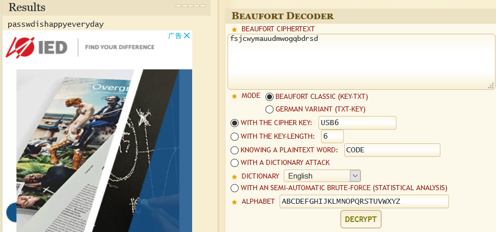

12. 打开文档,flag就出来了`bugku{What_a_enjoyable_music}`

    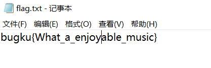